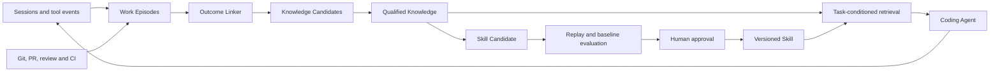

# ProvenLoop

> Turn proven experience into reusable intelligence.

ProvenLoop is a local learning layer for coding agents. It observes real software
work across sessions, connects actions to later outcomes, and turns verified
experience into narrowly scoped knowledge and reusable skills.

It is not another chat client, session viewer, or generic memory database. Its
core job is to answer:

> What did the agent try, what happened afterward, what was actually learned,
> and when should that learning be used again?

## Product goals

The product is intended to make these improvements measurable, not assumed:

- developers repeat less project context;
- agents repeat fewer known mistakes;
- user corrections and failed retries decrease;
- useful workflows become reusable without silently changing behavior;
- every learned rule remains explainable, reversible, and bounded in scope.

## Learning loop



The default product of learning is a **Knowledge Card**. A **Skill** is a rare,
versioned artifact promoted only after repeated evidence and evaluation.

## Initial integration

The first supported agent is GitHub Copilot CLI. The preview integration contains:

- a session event extension that feeds an asynchronous local queue;
- a local MCP server for scoped context retrieval and feedback;
- a leased worker that builds episodes and qualifies explicitly bound evidence;
- MCP initialization instructions and a plugin skill that request relevant context.

Users continue launching Copilot normally. ProvenLoop does not require a wrapper
command or an additional model API key for ordinary deterministic operation.
Installed capabilities and retained field evidence are separate: installation
does not itself constitute release approval or proof of learning benefit.

**Version boundary (2026-09-07):** `0.1.0-alpha.0.11` is the Windows Design
Partner Preview evidence candidate. It includes Knowledge review commands,
automatic local observations, the native SDK proof bridge, trusted live-session
feedback controls, and bounded current-session reconciliation. See the
[release notes](docs/releases/0.1.0-alpha.0.11.md) and
[First useful workflow](#first-useful-workflow).
This is not M0/MVP approval; `0.1.0-alpha.1` remains an unapproved quality-release
target. Automatic reconciliation requires matching SDK Session/workspace
metadata; missing metadata produces a diagnostic, not guessed history backfill.
Capture is best effort, not lossless archival or full historical ingestion.
Automated delayed Outcome linking, retrospective analysis, and Playbooks remain
M3-M5 targets; the diagram above is the long-term learning loop.

**First-product requirement (2026-09-07):** ordinary natural-language corrections
must automatically produce source-backed proposals, qualify supported low-risk
rules, and enable later-task reuse without manual remember/retrieve instructions.
This is required M2 work, not deferred retrospective. The published 0.11 runtime
does not implement this path yet; see the [automatic-learning design](docs/architecture.md#361-automatic-extraction-in-the-existing-worker)
and [implementation blocker](docs/implementation-blockers.md#m2-auto-automatic-natural-language-rule-production).

## Repository structure

```text
ProvenLoop/
  README.md
  package.json
  packages/
    contracts/
    domain/
    platform-windows/
    storage-sqlite/
    retrieval/
    evaluation/
    copilot-adapter/
    host/
    cli/
    testkit/
  tests/
    unit/
    integration/
  spikes/
    f0/
  docs/
    product-design.md
    product-validation.md
    architecture.md
    copilot-event-capture-design.md
    roadmap.md
    implementation-checklist.md
    research/
      competitive-analysis.md
      self-improving-agents.md
```

## Development

Development was initially verified with Node.js 22.18.0 and npm 11. The declared
runtime range is Node.js `>=22.16.0` and npm `>=11`, without artificial upper
bounds. The installer also checks the required SQLite APIs. `.nvmrc` and
`packageManager` pin the reproducible development baseline, not runtime ceilings.

```powershell
npm ci
npm run lint
npm run typecheck
npm test
npm run test:integration
npm run build
```

Build and smoke-test the self-contained Alpha package from its tarball:

```powershell
npm run package:verify
```

Create the publishable `@provenloop/cli` tarball:

```powershell
npm run package:pack
```

See [Alpha installation and operations](docs/alpha-installation.md) for the
supported environment, installation, upgrade, Doctor, capability controls,
acceptance evidence, uninstall, purge, and rollback procedures.

For the Microsoft-internal Design Partner preview, install the exact
GitHub Release tarball rather than resolving the package through an npm
registry:

```powershell
irm https://raw.githubusercontent.com/cubika/ProvenLoop/v0.1.0-alpha.0.11/install.ps1 | iex
```

The installer downloads and verifies the exact GitHub Release tarball, then
uses npm only as the local package installer. It does not contact
`registry.npmjs.org`, `packagefeedproxy.microsoft.io`, or an Azure Artifacts
feed for the ProvenLoop package. This preview is not being published to the
public npm registry.

Run a built-in evaluation fixture:

```powershell
npm run build
.\node_modules\.bin\provenloop.cmd eval run `
  --suite valid-supported-event `
  --out .provenloop\eval
```

Negative fixtures return the product gate exit code instead of converting the
failure into an infrastructure error:

```powershell
.\node_modules\.bin\provenloop.cmd eval run `
  --suite false-completion `
  --out .provenloop\eval
```

Regenerate the Markdown view from a run's stable JSON report:

```powershell
.\node_modules\.bin\provenloop.cmd eval report --run <run-id-or-directory>
```

Run the M1 Branch Continuation synthetic regression gate:

```powershell
.\node_modules\.bin\provenloop.cmd eval m1 --out .provenloop\eval
```

Add `--stable` to enforce the 1% Wrong Injection threshold instead of the 2%
research threshold.

Run the M2 Correction Recurrence synthetic regression gate:

```powershell
.\node_modules\.bin\provenloop.cmd eval m2 --out .provenloop\eval
```

The gate replays 24 synthetic baseline/context trace pairs and derives their
Correction Opportunities through the production builder. It also runs direct
counterevidence, scope-mismatch, and unverified negative cases. Add `--stable`
to enforce the 1% Wrong Injection threshold.

Run the aggregate M1 + M2 MVP Go/No-Go gate:

```powershell
.\node_modules\.bin\provenloop.cmd eval mvp `
  --out .provenloop\eval `
  --evidence .provenloop\release-evidence.json `
  --stable
```

Start from
`packages\evaluation\fixtures\mvp-release-evidence-template-v1.json`, then
replace every placeholder with the code version, dataset versions, and
runtime/subgate evidence digests from the evidence-free run's
`evaluationBinding` plus retained review, Shadow, observation-window, and Git
rollback evidence. Omitting `--evidence`, leaving evidence incomplete, or
retaining an M0 blocker produces an explicit `No-Go`. The 0.10 aggregate
also keeps `field-effect-evidence` blocked: synthetic fixtures, observational
exports, and maintainer attestations cannot establish controlled user benefit.
Consequently, neither Go nor Conditional Go is currently attainable through
those inputs alone.

Both `--out` and `--evidence` must resolve outside the Git worktree or beneath
an ignored directory such as `.provenloop`; the gate fails if the worktree
changes while its subgates are running.

Enable correction learning before capturing explicit corrections:

```powershell
.\node_modules\.bin\provenloop.cmd enable correction_learning
```

An explicit correction user message requires these labels:

```text
Violated Constraint: Inspect package scripts before choosing a test runner
Expected Behavior: Run the targeted Vitest command
Trigger: package validation
Task Family: testing
Subsystem: test-runner
Scope: repository
```

`Task Family`, `Subsystem`, and `Scope` are optional. The default is repository
scope; missing trusted repository identity produces an unresolved-scope error,
not a fallback to personal Knowledge. Personal scope requires an explicit choice.
Correction-based Knowledge requires a successful trusted verification with a
`VerificationBinding` naming the correction and captured operation, matching
Session/repository/worktree identity, ordered parent evidence, and a complete
command target. Same-Episode membership or an unrelated successful command
is not sufficient.

## First useful workflow

**Current 0.11 diagnostic/manual path:** the commands below check rule storage,
retrieval and user controls. They do not satisfy the first-product automatic
natural-language learning requirement.

The existing `remember` path creates a user-confirmed rule. From its repository,
for example:

```powershell
provenloop remember `
  --content "Use the repository package scripts to run targeted tests." `
  --when "running repository tests" `
  --scope repository
```

Enable retrieval with `provenloop enable retrieval` if it is disabled. Open a
**new** Copilot Session in that repository and ask it to call
`provenloop_context` before a relevant testing task, then `provenloop_explain`
for the returned item. Inspect the rule, scope, applicability, and source.

In `0.1.0-alpha.0.11`, inspect and maintain rules explicitly:

```powershell
provenloop knowledge list --scope repository
provenloop knowledge show <knowledge-id> --scope repository
provenloop knowledge confirm <knowledge-id> --expect <review-digest> --confirm
provenloop knowledge replace <knowledge-id> `
  --content "Use package scripts and the narrowest applicable test target." `
  --expect <review-digest> --confirm
provenloop knowledge revoke <knowledge-id> --expect <review-digest> --confirm
```

Use the latest `expectedDigest` from `knowledge show` before **each** mutation;
these are alternative actions, not a sequence using one digest. Review pending
counterevidence and, only if you intend to resolve it, pass
`--resolve "evidence-id-1,evidence-id-2"` to confirm or replace. Old approval
does not clear newer evidence. Revoke archives the rule; `provenloop forget
<knowledge-id>` deletes it. Non-repository rules require their matching
`--scope` (and `--workflow` for workflow scope, matching the live SDK workflow
and workspace; the flag alone does not authorize that scope).
Workflow-scoped commands require an active trusted host Session, a matching
`SESSION_ID` locator, and matching `--cwd`; they are unavailable from a standalone
invocation without that live context. Setting the locator alone is not authority.

For feedback in Copilot, request `provenloop_feedback` for the returned item.
The server first proposes a confirmation code; approve the exact
action yourself with `confirm PL-<code>` as shown by the tool, then let Copilot
retry the unchanged request. The agent must not approve on your behalf.
Report adoption explicitly only if you actually used the guidance:
“helpful” alone is not adoption. A returned rule is not proof of adoption,
successful work, or benefit.

This first-use path creates **user-confirmed** Knowledge. It is deliberately
different from automatically qualifying a correction using external evidence.
The latter requires a related verification with a complete, repository-bound
proof chain; a successful unrelated command is not sufficient.

Inspect automatically collected local observations:

```powershell
provenloop observations show
provenloop observations show --date 2026-09-06 --session <session-id>
provenloop observations export --date 2026-09-06 |
  Set-Content -Encoding utf8 .\provenloop-observations.json
```

Dates are UTC; the default is today. Export writes a privacy-minimized JSON
manifest to stdout, restricted to the current code version, with keyed
Session/repository digests rather than raw identifiers. Review it before sharing.
No records means no observations, not zero errors or zero benefit.

Ordinary observation and maintainer acceptance serve different purposes.
Summaries distinguish context offered, explicitly reported adoption, feedback,
and unknown outcomes. They cannot measure controlled benefit or task duration.
The explicit `provenloop acceptance start` and `provenloop acceptance complete` commands
remain available for bounded acceptance experiments. Synthetic replay results
are regression evidence, not measurements of a user's actual productivity.

## Canonical documents

- [Product design](docs/product-design.md)
- [Product validation and quality evaluation](docs/product-validation.md)
- [General correction-learning test catalog](docs/general-learning-test-catalog.md)
- [Technical architecture](docs/architecture.md)
- [Copilot event capture design](docs/copilot-event-capture-design.md)
- [Implementation roadmap](docs/roadmap.md)
- [Executable implementation checklist](docs/implementation-checklist.md)
- [0.1.0 Alpha release plan](docs/release-0.1-alpha-plan.md)
- [Competitive and Copilot investigation](docs/research/competitive-analysis.md)
- [Self-improving agent research](docs/research/self-improving-agents.md)

## Current product decisions

- Local-first and private by default.
- GitHub Copilot CLI first; adapters may support other coding agents later.
- Work Episode, not Session, is the unit of learning.
- External outcomes outrank model self-assessment.
- Context retrieval has a hard token budget.
- Knowledge is scoped to personal, workflow, repository, or branch context.
- Skill candidates are never enabled automatically in the MVP.
- Every memory and skill has evidence, lifecycle, version, and rollback.
- ProvenLoop owns engineering evidence and evaluation data.
- Generic memory/search is accessed through a replaceable `KnowledgeBackend`.

## Status

| Area | Current boundary |
|---|---|
| Preview candidate | `0.1.0-alpha.0.11`, an evidence-collection prerelease, not M0/MVP approval |
| M0 implementation | Bounded SDK capture and current-session recovery, two-pass persistence redaction, leased worker, canonical SQLite, deterministic Episodes, deletion gates |
| M1 implementation | Branch Context, English/Chinese retrieval with canonical rechecks, at most three items/1,200 rendered tokens, Explain and explicitly approved feedback |
| M2 implementation | Strictly bound correction proofs, counterevidence-aware lifecycle, user-confirmed rule review, and local observational summaries |
| Regression evidence | 24 Episode association pairs, 32 Branch Continuation pairs, and 24 Correction Recurrence pairs are synthetic fixtures, not field-effect measurements |
| Release evidence | Windows/platform, latency, provider-degradation, remote-upgrade, and controlled-effect qualifications remain separate open gates |
| Future M3-M6 | Delayed Outcome linking, Retrospective, evaluated Playbooks, and additional Agent adapters |

ProvenLoop remains one packaged modular monolith, with Extension, MCP, and
worker process boundaries—not a new local microservice system. SQLite owns
domain state; FTS and observations are rebuildable projections.
For batch-level implementation and outstanding validation, see the
[implementation checklist](docs/implementation-checklist.md) and
[blockers](docs/implementation-blockers.md). Prior source regression results do
not certify the versioned 0.10 artifacts; their validation and publication must
be verified separately.
