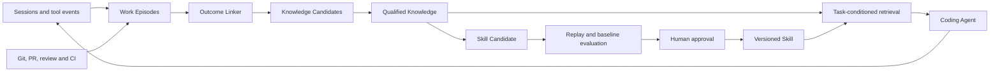

# ProvenLoop

> Turn proven experience into reusable intelligence.

ProvenLoop is a local learning layer for coding agents. It observes real software
work across sessions, connects actions to later outcomes, and turns verified
experience into narrowly scoped knowledge and reusable skills.

It is not another chat client, session viewer, or generic memory database. Its
core job is to answer:

> What did the agent try, what happened afterward, what was actually learned,
> and when should that learning be used again?

## Product promise

As ProvenLoop accumulates evidence:

- developers repeat less project context;
- agents repeat fewer known mistakes;
- user corrections and failed retries decrease;
- useful workflows become reusable without silently changing behavior;
- every learned rule remains explainable, reversible, and bounded in scope.

## Learning loop



The default product of learning is a **Knowledge Card**. A **Skill** is a rare,
versioned artifact promoted only after repeated evidence and evaluation.

## Initial integration

The first supported agent is GitHub Copilot CLI. The proposed plugin shape,
pending the F0 Extension gate, contains:

- a session event extension that feeds an asynchronous local queue;
- a local MCP server for scoped context retrieval and feedback;
- a background worker that builds episodes and links outcomes;
- a small runtime instruction that asks Copilot to retrieve relevant context.

Users continue launching Copilot normally. ProvenLoop must not require a wrapper
command or an additional model API key for ordinary use.

## Repository structure

```text
ProvenLoop/
  README.md
  package.json
  packages/
    contracts/
    domain/
    platform-windows/
    storage-sqlite/
    evaluation/
    copilot-adapter/
    host/
    cli/
    testkit/
  tests/
    unit/
    integration/
  spikes/
    f0/
  docs/
    product-design.md
    product-validation.md
    architecture.md
    copilot-event-capture-design.md
    roadmap.md
    implementation-checklist.md
    research/
      competitive-analysis.md
      self-improving-agents.md
```

## Development

The workspace requires Node.js 22.18 and npm 11.

```powershell
npm ci
npm run lint
npm run typecheck
npm test
npm run test:integration
npm run build
```

Run a built-in evaluation fixture:

```powershell
npm run build
.\node_modules\.bin\provenloop.cmd eval run `
  --suite valid-supported-event `
  --out .provenloop\eval
```

Negative fixtures return the product gate exit code instead of converting the
failure into an infrastructure error:

```powershell
.\node_modules\.bin\provenloop.cmd eval run `
  --suite false-completion `
  --out .provenloop\eval
```

Regenerate the Markdown view from a run's stable JSON report:

```powershell
.\node_modules\.bin\provenloop.cmd eval report --run <run-id-or-directory>
```

Run the M1 Branch Continuation research gate:

```powershell
.\node_modules\.bin\provenloop.cmd eval m1 --out .provenloop\eval
```

Add `--stable` to enforce the 1% Wrong Injection threshold instead of the 2%
research threshold.

Run the M2 Correction Recurrence gate:

```powershell
.\node_modules\.bin\provenloop.cmd eval m2 --out .provenloop\eval
```

The gate replays 24 independent baseline/context trace pairs and derives their
Correction Opportunities through the production builder. It also runs direct
counterevidence, scope-mismatch, and unverified negative cases. Add `--stable`
to enforce the 1% Wrong Injection threshold.

Run the aggregate M1 + M2 MVP Go/No-Go gate:

```powershell
.\node_modules\.bin\provenloop.cmd eval mvp `
  --out .provenloop\eval `
  --evidence .provenloop\release-evidence.json `
  --stable
```

Start from
`packages\evaluation\fixtures\mvp-release-evidence-template-v1.json`, then
replace every placeholder with the code version, dataset versions, and
runtime/subgate evidence digests from the evidence-free run's
`evaluationBinding` plus retained review, Shadow, observation-window, and Git
rollback evidence. Omitting `--evidence`, leaving evidence incomplete, or
retaining an M0 blocker produces an explicit `No-Go`; research thresholds can
produce only an expiring Conditional Go restricted to named repository or
design-partner targets.

Both `--out` and `--evidence` must resolve outside the Git worktree or beneath
an ignored directory such as `.provenloop`; the gate fails if the worktree
changes while its subgates are running.

Enable correction learning before capturing explicit corrections:

```powershell
.\node_modules\.bin\provenloop.cmd enable correction_learning
```

An explicit correction user message requires these labels:

```text
Violated Constraint: Inspect package scripts before choosing a test runner
Expected Behavior: Run the targeted Vitest command
Trigger: package validation
Task Family: testing
Subsystem: test-runner
Scope: repository
```

`Task Family`, `Subsystem`, and `Scope` are optional. Repository scope is used
when trusted repository identity is available; otherwise the default is
personal. Correction-based Knowledge remains ineligible for automatic
retrieval until a later successful test, build, or verification event in the
same Work Episode.

## Canonical documents

- [Product design](docs/product-design.md)
- [Product validation and quality evaluation](docs/product-validation.md)
- [Technical architecture](docs/architecture.md)
- [Copilot event capture design](docs/copilot-event-capture-design.md)
- [Implementation roadmap](docs/roadmap.md)
- [Executable implementation checklist](docs/implementation-checklist.md)
- [Competitive and Copilot investigation](docs/research/competitive-analysis.md)
- [Self-improving agent research](docs/research/self-improving-agents.md)

## Current product decisions

- Local-first and private by default.
- GitHub Copilot CLI first; adapters may support other coding agents later.
- Work Episode, not Session, is the unit of learning.
- External outcomes outrank model self-assessment.
- Context retrieval has a hard token budget.
- Knowledge is scoped to personal, workflow, repository, or branch context.
- Skill candidates are never enabled automatically in the MVP.
- Every memory and skill has evidence, lifecycle, version, and rollback.
- ProvenLoop owns engineering evidence and evaluation data.
- Generic memory/search is accessed through a replaceable `KnowledgeBackend`.

## Status

The local TypeScript/Node.js MVP is under implementation. Shared contracts and
the evaluation spine are complete. Batch 3 now includes deterministic capture
envelopes, write-time redaction, the Windows durable queue, supported Copilot
event mapping, bounded buffering, asynchronous persistence, and explicit
capture-gap reporting. Recovery now streams supported Copilot Session files,
rejects unknown versions explicitly, and replays only source events absent from
both the queue and canonical watermark. Batch 4 adds the transactional
canonical SQLite store and a leased, bounded worker that commits before queue
acknowledgement. The worker now has resource-pressure admission, SQLite
upgrade/backup/restore validation, and an end-to-end canonical Ledger Gate.
Batch 5 now adds the shared `AgentAdapter` lifecycle contract and operational
CLI commands for install, status, doctor, capability enable/disable, and
uninstall. The Copilot adapter generates and registers a local marketplace with
the capture Extension and MCP process, preserves JSONC user settings, resolves
Git and Session identity, reports incompatible Copilot versions explicitly,
and preserves local data unless uninstall is combined with `--purge`.
The shared worker can now be enabled independently and drained on demand with
`provenloop worker run`; each batch rechecks persisted capability state and
writes a health heartbeat.
M1 now starts with a rebuildable Branch Context projection. Material changes
produce short-lived repo/branch/HEAD-bound context, while browsing-only
Sessions produce no context and stale or mismatched HEADs fail closed.
The `@provenloop/retrieval` package now defines the backend-neutral Knowledge
boundary and a SQLite FTS5/BM25 implementation. Search hits are always
rechecked against canonical lifecycle, evidence tier, scope, expiry, and
deletion state before retrieval.
The local MCP server now exposes `provenloop_context`, `provenloop_explain`,
and deterministic `provenloop_feedback`. Context is repository-safe, limited
to three items and 1,200 rendered tokens, deduplicated per Session, and fails
closed when the interruptible SQLite read path exceeds its deadline or reports
degradation. Repository, Session, and workflow identities are host-bound rather
than accepted from model-controlled tool arguments.
M1 user control now adds deterministic CLI commands for remember, correct,
mute, forget, and purge. Forget removes canonical and projected Knowledge plus
its usage and feedback records, while dependent Knowledge is archived instead
of silently remaining active.
The executable M1 gate now replays 32 frozen Branch Continuation pairs through
the real retrieval service and canonical SQLite store. It retains JSON,
Markdown, and replay database evidence for repeated Context Token reduction,
TTV, Precision@3, Wrong Injection, Outcome Success, token budget, and P95
latency decisions.
M2 correction capture now maps explicitly structured user corrections into
stable Correction Keys, associates later successful verification evidence,
and records future Correction Opportunities at Episode start before their
outcomes are known. SQLite v6 stores both projections, deletion propagation
removes their dependencies, and canonical retrieval rejects active Knowledge
that references an unverified Correction Key.
The M2 Knowledge lifecycle now groups correction evidence by stable topic and
keeps distinct behavior versions only for explainable supersession. Inferred
items remain candidates, verified items become active, repeated evidence
raises the Evidence Tier, and direct failures or repeated corrections dispute
the applicable version before the FTS projection is rebuilt. Automatic state
is reconstructed from canonical evidence and append-only feedback, while
manual Knowledge remains independent and forgotten automatic Knowledge cannot
be regenerated.
M2 admission now requires a complete same-Episode correction and trusted
verification proof chain before automatic activation. Model or user
self-assessment, recalled Knowledge references, missing applicability, and
implicit scope broadening fail closed. Admission is rechecked against canonical
evidence at retrieval, while explicit user scope changes and the full
applicability, conflict, and supersession explanation remain preserved.
SQLite v7 adds indexed candidate-scoped admission lookups so retrieval does not
scan the complete evidence and context-use history. Work Episode projection
also binds context-use records to one unambiguous Session/time Episode, allowing
later self-reinforcing verification to be rejected on the production path.
The executable M2 gate now replays 24 frozen baseline/context held-out traces
through real Context use recording and the Correction builder, deriving rather
than fixture-filling each Opportunity's recurrence and application fields. It
retains RCR, provenance completeness, Evidence Tier accuracy,
direct-counterevidence, all-card Wrong Injection, case-level results, and both
replay databases for research and stable release decisions.
The aggregate MVP release gate now runs M0, M1, and M2 against one code version,
retains every subgate report, and combines them with explicit worst-case review,
zero-harm/leakage claims, Shadow, observation-window, and rollback evidence.
It publishes an atomic Go, Conditional Go, or No-Go report; the current
built-in run remains No-Go while M0 blockers and real release evidence remain
open.
Batch 6 has started with a deterministic Work Episode builder. It groups
canonical Session evidence repository-first, retains low-confidence links as
candidates, applies explicit merge/split corrections, avoids bridge merges with
complete-link clustering, and atomically rebuilds explainable Episode and
association projections in SQLite. Canonical Git parent metadata now feeds a
repository-scoped ancestry graph, and `provenloop eval episodes` runs the
versioned 24-pair quality dataset with distinct precision, recall, wrong-merge,
wrong-split, candidate, and ambiguous-case metrics.
The M0 release gate is now executable through
`provenloop eval m0 --out <directory>`. It retains all suite reports and
Ledgers, the Episode dataset result, code provenance, and known blockers.
`provenloop delete` now removes source, Session, or Episode evidence across the
canonical store and durable queue, rebuilds dependent Episode projections, and
reports success only after persisted deletion-propagation evidence passes.
Current M0 output is intentionally `blocked` until the remaining Windows
latency, provider-degradation, remote-upgrade, and operational
capability evidence is completed.
