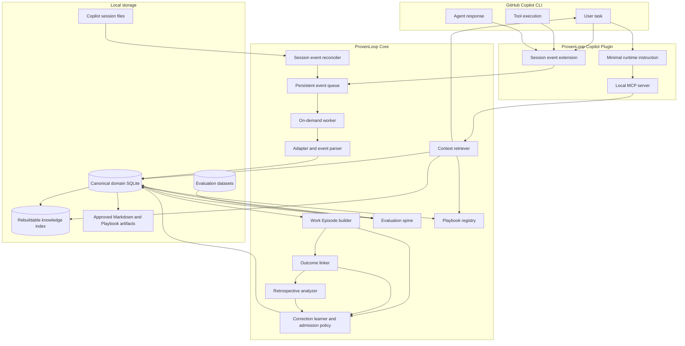

# ProvenLoop Technical Architecture

**Status:** 0.1.0-alpha.0.12 preview architecture with explicitly deferred capabilities

**Updated:** 2026-09-08

This document describes both the executable near-term architecture and the
long-term logical architecture. They use the same event, evidence, domain, and
evaluation contracts. Later milestones enable additional consumers and state
transitions; they do not introduce a second architecture.

The [2026-09-11 scalability review](scalability-review.md) records measured
growth failures and proposes incremental processing, indexed evidence checks,
and scoped retrieval. The first implementation pass is recorded there; sustained acceptance remains open.

Current implementation descriptions apply to the `0.1.0-alpha.0.12` Windows
Design Partner Preview evidence candidate. M3-M6 consumers remain targets.
Synthetic regression coverage is not native-host acceptance, controlled benefit
evidence, or M0/MVP approval; `0.1.0-alpha.1` remains an unapproved quality-release
target. New-version artifact validation must be retained separately.

**First-product requirement update (2026-09-07):** automatic extraction from
ordinary natural-language corrections is mandatory for the first complete M1+M2
product. Sections 2.2 and 3.6.1-3.6.5 specify its architecture. The 0.12 source
implements bounded user/agent extraction and narrow recovery qualification;
installed-host acceptance remains open. Manual rule creation is a control and
diagnostic path.

## 1. Architecture goals

The system must:

- add negligible latency to interactive Copilot use;
- survive CLI and session-format changes;
- keep engineering evidence auditable;
- isolate repositories and personal knowledge;
- bound runtime context regardless of database size;
- support correction, supersession, evaluation, and rollback;
- avoid dependence on a single memory backend;
- run locally without an additional model API key for standard operation;
- install once, then reuse the user's supported Copilot sign-in for background
  model-assisted work without per-call prompts;
- allow capture, retrieval, learning, retrospective, and Playbook capabilities
  to be disabled independently;
- keep M0-M2 implementation small while preserving compatible M3-M6 extension
  points;
- make product claims executable through one versioned evaluation spine.

## 2. System overview



The diagram is the target logical architecture, not the first implementation
backlog. The executable M0-M2 slice is:

```text
SDK producer -> Extension mapper -> bounded buffer -> async writer -> Queue
Session files -> bounded Reconciler -> same mapper/writer ----------^
Queue -> leased Worker -> redaction + classification -> canonical SQLite
                                            |
                                            +-> basic Work Episode
                                            +-> Correction Key and admission policy
                                            +-> Branch Context / Knowledge projection

MCP -> Retriever -> canonical state + FTS projection -> bounded Context

Requirement Manifest -> Replay Spec -> Runner
  -> Evidence Ledger -> Deterministic Gate -> JSON/Markdown report + exit code
```

### 2.1 Capability activation by milestone

| Milestone | Newly active capability | Shared contract retained |
|---|---|---|
| M0 | Copilot adapter, Extension events, queue, parser, canonical events, basic Episode builder, evaluation spine | Event identity, evidence references, deletion, Gate result |
| M1 | Branch Context, scoped retrieval, FTS projection, Explain and Feedback | Repository/branch identity, token budget, usage records |
| M2 | Automatic natural-language correction extraction, Correction Key, evidence-backed Knowledge, deterministic admission and dispute handling | Evidence tier, scope, trigger, provenance, product metrics |
| M3 | Automated delayed Outcome linking and observation-window qualification | Existing Episode and evidence relations |
| M4 | Deep Retrospective, evidence expansion, Insight Candidate | Existing evidence, admission, and evaluation contracts |
| M5 | Playbook evaluation, approval, Shadow, Canary, registry, rollback | Existing Knowledge, artifact, and Gate contracts |
| M6 | Additional Reader/Observer adapters and cross-Agent deduplication | Existing adapter capability and identity contracts |

An event type may be captured before its consuming milestone is active. For
example, M0 can persist a directly observed revert, and M2 can stop Knowledge
when explicit counterevidence is already linked. M3 adds automated discovery
and delayed association of Review, CI, Fix, Bug, and Revert evidence.

### 2.2 First-use product boundary

The first complete product requires automatic inference over a bounded,
source-backed correction window. A user corrects an ordinary tool operation in
natural language; the background runtime extracts a proposal, deterministic
admission checks the actual recovery evidence, and a later relevant task can
reuse qualified guidance without another instruction to remember or retrieve it.
The originating Session need not be closed.

Explicitly remembering and retrieving a rule remains useful for diagnosis and
user control. That produces `user_confirmed` Knowledge, but does not satisfy
the automatic-learning requirement. The 0.11 runtime still has this gap.

The production acceptance path crosses the actual adapter, queue, worker,
canonical store, MCP entry point, and subsequent Session. Constructing a
`test.completed` event directly in a domain fixture does not prove that a real
tool result reaches the learner. Registering an MCP tool does not prove the
host calls it, and returning context does not prove that it was used.

The addition preserves the modular monolith, existing capture path, Worker,
canonical store, and retriever. Bounded correction extraction is an M2 consumer,
not M4 retrospective, another local service, or a new user-invoked MCP tool.
Recovery, source isolation, and deletion guarantees apply to model inputs,
jobs, proposals, verification receipts, and retrieved rules.

## 3. Component responsibilities

### 3.1 Copilot adapter

Responsibilities:

- install, enable, disable, upgrade, and uninstall plugin assets;
- register the capture Extension and MCP;
- map Copilot Session events into the canonical event schema;
- identify current session and workspace;
- report which lifecycle, tool, Git, and external outcome signals are actually
  available in the installed Copilot version;
- detect internal ProvenLoop sessions and prevent recursion;
- tolerate unknown event versions without breaking Copilot.

The MVP implements only the Copilot adapter. Future adapters use the same
contract and declare missing capabilities instead of fabricating events:

```ts
interface AgentAdapter {
  install(): Promise<AdapterOperationResult>;
  status(): Promise<AdapterStatus>;
  enable(capability: ProvenLoopCapability): Promise<AdapterOperationResult>;
  disable(capability: ProvenLoopCapability): Promise<AdapterOperationResult>;
  uninstall(options: { purge: boolean }): Promise<AdapterOperationResult>;
  doctor(): Promise<AdapterHealth>;
  capabilities(): Promise<AdapterCapabilityMatrix>;
  normalizeEvent(
    input: unknown,
    context: RuntimeContext,
  ): NormalizedEventResult;
  resolveSession(context: RuntimeContext): Promise<SessionIdentity>;
  registerCaptureExtension(): Promise<AdapterOperationResult>;
  registerContextTools(): Promise<AdapterOperationResult>;
}
```

The F0 compatibility baseline supports Copilot CLI `>=1.0.71` without an
artificial upper bound. Installation probes the required Plugin Marketplace and
plugin commands before changing Copilot configuration. Copilot CLI `1.0.82-0`
and `1.0.83-4` are verified; compatible versions without ProvenLoop evidence
remain visible to Doctor as unverified. Production plugin installation uses a
marketplace because direct path installs are deprecated and cannot be disabled
through the normal lifecycle commands.
Installed releases use the release-pinned remote marketplace; isolated
development can generate a local marketplace containing the capture Extension
and stdio MCP registration. Both use Copilot's normal marketplace and plugin
lifecycle commands. Adapter state records the detected version,
capability switches, last explicit errors, and whether ProvenLoop changed the
user's Extension opt-in setting so that disable and uninstall can restore it.
The data root carries a path-bound ownership marker before mutable state is
written, and purge requires both that marker and valid adapter state. Internal
Session registrations use one atomic file per Session so concurrent background
calls cannot overwrite each other's recursion guards.

### 3.2 Event capture and persistent queue

The primary capture path is the Copilot CLI Extension event stream. Extension
callbacks perform only bounded memory work:

1. read event identity and adapter metadata;
2. reject internal ProvenLoop sessions;
3. copy allowed fields into a bounded memory buffer;
4. schedule the asynchronous writer;
5. return control immediately.

Callbacks do not:

- call an LLM;
- scan prior sessions;
- build Work Episodes;
- update Knowledge Cards;
- perform synchronous file, network, Git, or database I/O.

The writer performs redaction and one-file-per-event atomic queue writes outside
the callback. A bounded Reconciler reads supported versions of Copilot Session
files after gaps or restarts. Metadata-only OpenTelemetry may provide another
reconciliation signal after its overhead and failure behavior pass F0 tests.

The Reconciler reads `events.jsonl` as a stream with an explicit per-line size
limit. It validates the first `session.start` record before reading later
content, then rejects unknown Copilot or Session-file versions without guessing
compatibility. A partial final line is treated as an interrupted write, while
malformed and oversized complete records remain observable issues.

Before replay, reconciliation loads both active queue source identities and the
required canonical capture watermark. Missing canonical state is an explicit
failure, not an empty-success fallback. Live capture and recovery share an
atomic source-identity index in the queue so concurrent writers cannot normally
create duplicate queue items. Internal Session IDs stop parsing immediately
after the header, before content-bearing records are read.

Explicit acceptance completion invokes reconciliation. The 0.10
installed Extension also wires `reconcileCurrentSessionCapture` into its
existing background observation loop. `runInstalledCopilotExtension` uses the
actually joined SDK Session's `sessionId` and public `workspacePath`. Automatic
reconciliation requires a matching `SESSION_ID` and an absolute workspace
directory whose basename equals that Session ID. Its parent is the trusted
Session-state root; the join observation time becomes `minimumTimestamp`.
Missing or mismatched SDK workspace metadata produces a diagnostic and skips
automatic reconciliation, never a guessed path or history enumeration.

The loop runs worker/admission first. After a completed worker run, current-
Session reconciliation is due every 30 seconds, followed by observation
collection. Newly queued/enriched data or exhausted reconciliation budgets
schedule two-second catch-up; idle or pending repairs without progress retain
the 30-second interval. Each pass remains bounded to 8 MiB, 500 events, and
1,500 ms, with the helper's capability, internal-Session, worker-lease, and
path/link checks. Actual runtime `onStopped` or `SIGTERM` stops the loop.
No foreground callback I/O or additional service is introduced.

Built integration coverage invokes the real Extension entry with SDK/command-
runner fixtures and a real queue, worker, and store: it verifies one join,
automatic missing-argument enrichment, unchanged original envelopes, and
exclusion of pre-observation records. This is regression evidence, not native
SDK-host field observation, controlled benefit, or release approval.

Command and HTTP lifecycle Hooks are not used for normal capture. F0 found both
paths too slow. The complete design and acceptance gate are defined in
[Copilot event capture design](copilot-event-capture-design.md).

Queue requirements:

- append-safe;
- retryable;
- idempotent event ingestion;
- stable item IDs and deduplication keys;
- explicit claim, acknowledge, retry, and dead-letter states;
- crash recovery;
- bounded retention after successful processing;
- dead-letter state with explicit errors.

The durable queue has no total byte/item capacity limit. The worker's
`maxQueueDepth: 10_000` is a pressure signal, not a storage quota. The installed
worker defaults to 100 items per batch and prunes acknowledged items older than
seven days after acquiring its worker lease. This pruning does not remove aged
pending/dead-letter items or canonical raw events; pausing the worker can still
allow disk backlog to grow. Per-item read safety is bounded to 2 MiB. These are
implementation defaults, not additional CLI flags.

The Batch 3 persistence boundary uses a versioned `CaptureEnvelope` containing
the stable source identity, deterministic deduplication key, redacted
`RawEvent`, bounded content, and the applied redaction rule version. Queue state
is stored in a versioned `CaptureQueueItem`. Each item uses one JSON file whose
content is flushed and atomically replaced for state transitions, so a crash
cannot expose a partially written item. Queue item identity remains separate
from event identity because at-least-once delivery may enqueue the same source
event more than once.

The Extension runtime maps supported SDK events synchronously into bounded
copies, then submits them to a count-and-byte-limited FIFO. User and assistant
text is copied up to an explicit character limit. Tool arguments use bounded
allowlisted fields for supported operations; arbitrary objects are never
recursively enumerated in the callback. Omitted or truncated evidence must
remain distinguishable from a complete empty value. Queue I/O starts on a
later event-loop turn.

The native SDK producer bridge retains `captureQuality` (omitted/truncated
field paths and original lengths), `repositoryState`, and allowlisted
`CaptureEvidence`. It connects supported tool starts/completions and explicit
exit evidence to domain verification rather than inferring success from tool
transport completion. Writer and worker redaction both cover these structured
fields, command targets, and content. Missing, omitted, or truncated proof
fields cannot be substituted with complete-looking defaults.

When pressure prevents a full event from fitting, the buffer first retains
metadata plus a content digest; if even metadata cannot fit, it drops the event
and aggregates the missing range. The writer persists that range as a
`capture_gap` after normal queue writes resume. Gap bookkeeping has independent
byte and context-count limits. If those limits are reached across workspace
changes, the remaining range is marked `contextMixed` rather than attributed
to the first repository. Low-level constructors expose buffer/gap limits; the
installed entry uses fixed defaults, not user-facing CLI flags. Current defaults
and recovery budgets are listed in the
[capture design](copilot-event-capture-design.md#52-memory-buffer).
This is best-effort capture: a crash before durable enqueue can lose buffered
events or gaps. Neither an absent gap record nor an incomplete reconciliation
pass proves lossless archival.

The runtime accepts `joinSession` and workspace-refresh providers at its
boundary. This keeps the bundled Copilot SDK and asynchronous Git inspection
outside event callbacks. A `session.context_changed` event updates the snapshot
immediately, while completed tools schedule a non-blocking refresh.
`session.shutdown` and `SIGTERM` both trigger the same deadline-bounded drain.

### 3.3 Shared worker

The worker starts on demand when queue work exists. A lock prevents duplicate
workers. It processes events in batches and yields to interactive workloads.
Queue items remain durable while a consumer is paused or unavailable.

The canonical store uses Node.js's built-in SQLite behind the `storage-sqlite`
package. Its shared loader suppresses only the SQLite experimental notice during
module loading and immediately restores normal warning handling. The FTS backend
and its reader Worker use the same loader; other warnings and errors propagate.
Startup enables WAL, foreign keys, and a bounded busy timeout.
The 0.10 schema is **10**. Ordinary opens reject an existing older schema
with a migration-required error, and reject schemas newer than the runtime.
Only explicit maintenance permits contiguous migrations under `BEGIN IMMEDIATE`;
new empty databases can initialize normally.
The initial migration creates canonical raw-event, parser-error, identity,
queue-processing, Episode, evidence, process-claim, feedback, deletion,
metric, and evaluation-run tables. Search projections remain outside these
domain tables.

Each worker processing unit is ordered as:

```text
queue claim
  -> second persistence redaction
  -> adapter/event classification
  -> one SQLite transaction
  -> queue acknowledge or explicit dead-letter
```

The raw-event deduplication key is unique in SQLite. If the process stops after
commit but before acknowledgement, replay increments delivery count and then
acknowledges without creating another canonical fact. Queue-transition failures
after commit use a separate retry path that cannot consume the event-processing
attempt budget.

Before every lease and dequeue, the worker can evaluate CPU, memory, free disk,
provider-error streak, and queue-depth pressure. An open circuit returns the
explicit reasons and leaves pending work untouched. The check repeats within a
batch so newly interactive or resource-constrained conditions stop additional
low-priority work.
Queue-only pressure is treated specially: the worker may continue draining
within its configured batch budget, rechecking capability and other resource
pressure before each claim. A large backlog cannot permanently block its only
consumer, while CPU/memory/disk pressure can still pause it.

`provenloop upgrade` acquires worker/projection/observation
maintenance leases, requests Extension shutdown, and creates a verified
pre-migration snapshot at `data\backups\pre-upgrade-<id>.db`. The snapshot has
`.deletion.key` and `.manifest.json` companions and, when available,
`.runtime.json` locator metadata. It then migrates and replaces integration
assets. Failed replacement may restore the snapshot only if canonical data
still matches the post-migration fingerprint; intervening writes are preserved
and automatic rollback is refused with capabilities paused for recovery.

SQLite backup/restore uses the online backup protocol. Validation checks
integrity, the source version's declared migration ledger and exact schema
objects, and supported runtime compatibility—not just a matching `user_version`.
Restore verifies supplied backup manifests and deletion-key integrity, rejects
incomplete deletion operations, and requires every completed installed
tombstone to exist unchanged in the source. It does not silently merge away
or discard deletion history. A restore barrier, recovery journal, verified
previous snapshot, and generation checks protect against interrupted restore
and stale writers. Unknown writes or incomplete recovery preserve the journal
and require explicit review. Backup/restore APIs are internal; there is no
documented public restore command.
New backup manifests include optional caller-supplied `runtimeVersion` metadata;
it is not independently inferred executable provenance. Restore also supports
structurally validated legacy backups without a manifest, and missing keys only
where deletion safety permits. The storage constructor does not create an
automatic pre-migration snapshot; the maintenance upgrade orchestrates that step.

The M0 capture Gate binds the complete canonical `CaptureEnvelope` to an
Evidence Ledger entry by run, Ledger ID, event ID, timestamp, SHA-256 digest,
and deterministic event identity. Changing content or redaction metadata
invalidates the Gate, not only changes to the inner `RawEvent`.

The initial deployment is one packaged modular monolith, not one OS process.
Copilot hosts Extension and stdio MCP processes; the operational CLI and
on-demand worker share the same packages and local data. OS-owned leases
serialize worker and maintenance ownership. These are process and module
boundaries, not independently deployed local microservices.

The Windows implementation uses a named pipe as an OS-owned process lease, not
an unbounded stale lock file. The platform boundary owns data-root resolution,
startup registration, process hosting, and interprocess locking; the domain
and evaluation code do not depend on Windows APIs.

Internal background Copilot calls are marked:

```text
PROVENLOOP_INTERNAL=1
```

The capture Extension ignores those Session IDs to prevent recursive learning.

Model-assisted consumers use a narrow inference boundary:

```ts
interface InferenceProvider {
  availability(): Promise<InferenceAvailability>;
  run(request: InferenceRequest): Promise<InferenceResult>;
}
```

Installation performs the one-time Copilot integration. Subsequent supported
background calls reuse the user's existing Copilot sign-in without copying or
persisting credentials, without an additional API key, and without per-call
authentication prompts. The unreleased automatic-default policy derives learning
eligibility from installation, capture, worker, and correction-learning state.
Explicit disable takes precedence; missing legacy preferences use the default.
Installer output discloses bounded excerpt transmission and model usage. Historical
consent metadata is preserved without creating a new acknowledgement. The shared
resolver is used by scheduling, notifications, hook eligibility, CLI status, Doctor,
and the viewer; it never writes state during a read. Repository hook permissions,
Knowledge activation, persistent feedback approval, scope changes, destructive
controls, and Playbook execution retain their own checks. Published 0.14 used
separate learning consent.
F0 must verify authentication reuse through a
supported integration path for the declared Copilot version.

If Copilot is signed out, rate-limited, incompatible, or unavailable,
model-assisted consumers pause with explicit state. Captured work is retained,
deterministic processing continues where possible, and foreground Copilot use
is never blocked. Internal concurrency, retry, backlog, and resource circuit
breakers protect interactive work; these are safety controls, not a user-facing
quota product.

Capability switches include:

```text
capture
worker
retrieval
correction_learning
outcome_learning
retrospective
playbook
external_research
```

Disabling a capability stops its consumers and side effects without corrupting
the queue or changing unrelated state. Global disable stops capture, injection,
and background inference but preserves data until an explicit delete or purge.

### 3.4 Event parser

The parser converts adapter-specific events to a stable model. Parsing failure
is recorded explicitly and does not fabricate a valid event.

```ts
type EventType =
  | "session.started"
  | "session.ended"
  | "prompt.submitted"
  | "tool.started"
  | "tool.completed"
  | "file.changed"
  | "test.completed"
  | "build.completed"
  | "git.commit"
  | "pull_request.updated"
  | "review.received"
  | "issue.linked"
  | "change.reverted"
  | "user.corrected"
  | "feedback.recorded"
  | "claim.declared"
  | "delegate.requested"
  | "delegate.completed"
  | "verification.completed";
```

Unsupported source events are recorded through an explicit compatibility or
error path. A declared adapter capability and a successfully observed event
are separate facts.

### 3.5 Work Episode builder

The builder groups events representing one real engineering objective.

Signals:

- repository ID;
- branch and commit ancestry;
- PR and issue references;
- changed-file overlap;
- test names and errors;
- task semantics;
- temporal proximity;
- explicit links and user feedback.

Associations receive confidence and evidence rather than becoming irreversible
foreign-key facts. Low-confidence associations remain candidates.

M0 implements enough deterministic grouping to measure precision, recall,
wrong merge, and wrong split. M1 adds cross-session and Branch Context behavior.
Incorrect merges are treated as more harmful than conservative splits.

An Episode association organizes history; it is not a verification claim.
Sharing a branch, being close in time, or appearing in the same Session must
not allow an unrelated test to certify a correction. Observing a new HEAD is
also distinct from proving that the current task created that commit.

### 3.6 Correction learner and admission policy

The M2 correction learner:

- must extract candidate rules from ordinary user corrections automatically;
- normalizes source-backed corrections into stable Correction Keys;
- requires a verified result before qualifying correction-based Knowledge;
- records opportunities where an existing correction could have applied;
- separates candidate generation from deterministic state transitions;
- immediately disputes applicable Knowledge when valid counterevidence appears.

The admission policy, not a model response, decides whether Knowledge is
candidate, active, disputed, superseded, or archived. Candidate, inferred,
disputed, uncertain, and scope-incompatible content is never silently injected.
Numeric model scores may rank candidates for review but cannot activate,
supersede, or broaden Knowledge.

The following is the shipped command-verification path. The proposed extraction
and typed MCP-recovery additions below must preserve, not bypass, its guarantees.
Correction Knowledge admission is deterministic and fail closed. The policy
requires the user-trusted correction, a later successful `tool` or `system`
test/build/verification event bound to that correction and its operation,
matching repository, workspace, scope and applicability, and a complete
canonical proof chain. Same-Episode membership alone is insufficient.
`VerificationBinding` contains `correctionEventId` and `operationEventId`.
The operation must be a captured trusted `tool.started` with a usable command,
matching operation and Session identity, and an ordered parent chain back to
the correction in the same repository/worktree. Missing parents, an unrelated
turn, incomplete target capture, unknown repository identity, or contradictory
completion evidence fail closed.
Repeated evidence requires independent verification rather than counting the
same successful invocation once per correction. Context-use records and
recalled Knowledge IDs are never accepted as supporting evidence. Automatic
scope feedback cannot broaden Knowledge; only an explicit user `set_scope`
event may change its scope. The same policy runs before lifecycle persistence
and again when canonical search hits are rechecked. Its decision retains the
applies-when and non-applicability conditions, source Episode and evidence
references, conflicts, and supersession relation.

Verification, counterevidence, and feedback retain their event-time ordering.
An old confirmation cannot resolve a newer failure. A current user resolution
must identify the counterevidence it resolves via `resolvesEvidenceIds`;
ordinary confirmation does not erase unreviewed or later counterevidence.
Missing repository identity
means the scope is unresolved, not that repository content becomes personal
Knowledge. A personal scope requires an explicit user choice.

#### 3.6.1 Automatic extraction in the existing worker

The [agent experience contract](agent-experience-learning.md) extends this worker with a separate agent-origin path. Agent windows are anchored to a captured summary and task closure; proposals retain agent/tool quotations and recovery receipts use `agentEventId`. User-origin records retain `userSource` and `userEventId`. Research findings remain candidates, while supported self-directed recoveries use native proof. SQLite schema 14 marks the persisted-format boundary.

**Required design, not yet implemented.** The Extension callback remains a bounded
event copier. After durable ingestion, a `LearningCoordinator` in `host` creates
versioned learning windows from trusted user turns and their causally related
operations. Tool completion/failure and idle events advance a window; shutdown
is only a final bounded scheduling/drain opportunity, not the primary trigger.
Missing English labels or correction keywords must not prevent analysis of an
otherwise eligible window.

```text
SDK events -> durable queue -> canonical events / Work Episodes
                                      |
                                      v
                          LearningWindow + durable LearningJob
                                      |
                                      v
                       bounded Copilot InferenceProvider call
                                      |
                                      v
                          immutable RuleProposal + source spans
                                      |
                                      v
                     deterministic verification / admission
                                      |
                                      v
                         Knowledge lifecycle -> FTS -> Context
```

The existing Extension background loop dispatches this consumer after canonical
ingestion. It must not await a model while holding the ingestion, projection,
maintenance, or deletion lease. Model work uses a separate OS-owned per-data-root
lease; committing a result reacquires the appropriate short-lived lease and
rechecks source existence/digests, consent, capability state, scope, cancellation,
and current counterevidence. Slow inference cannot stop event ingestion.

Responsibilities remain in current packages:

| Package | Required addition |
|---|---|
| `contracts` | Versioned window, job, proposal, source-span and typed-verification contracts |
| `copilot-adapter` | Native MCP call provenance and a bounded `CopilotInferenceProvider` |
| `host` | Window scheduling, deduplication, job lifecycle, result validation and projection coordination |
| `domain` | Pure proposal validation, Correction Key normalization and evidence-specific admission |
| `storage-sqlite` | Canonical jobs/proposals/receipts, compare-and-set transitions and deletion dependencies |
| `cli` | Installed-loop dispatch, learning controls and diagnostics |
| `retrieval` | Existing scoped canonical recheck and Explain, extended for the new proof types |
| `evaluation` | Real-trigger replay, provider-bound extraction evaluation and native installed acceptance |

The current joined-session abstraction only exposes event subscription and
disconnect; no model-request method is implemented there. The reusable mechanism
is the existing bounded Copilot CLI provider probe, not an invented SDK method.
The new provider must use a supported no-tools invocation, isolated working
directory, disabled custom instructions, existing sign-in, and
`PROVENLOOP_INTERNAL=1`. It must prove that plugins/MCP tools cannot execute and
that inference Sessions cannot enter capture, reconciliation, observations or
learning. Merely setting one environment variable is not the acceptance test.

Input is a redacted data document, not executable instructions from a captured
message. Do not send the repository, full Session history, credential files,
unrelated events or recalled Knowledge as fresh evidence. Output is schema-
validated JSON containing zero or more proposals; malformed/truncated output,
unknown source IDs or mismatched source quotations are explicit failures.
Model self-ratings do not confer evidence or lifecycle authority.

Initial implementation budgets are proposed defaults, not existing CLI flags:
one inference request in flight per data root, at most 32 events / 32 KiB after
redaction per request, at most three proposals / 16 KiB per response, a 60-second
request deadline, at most three attempts per window, and a configurable default
of 200 attempted requests per UTC day. Failed attempts consume budget. Related
events are debounced and unchanged windows are not resubmitted. A small budget
is not a correctness shortcut: excess work remains visibly pending/paused rather
than silently lost, and the user can raise the configured daily limit.

#### 3.6.2 Provenance and recoverable state

Development update (schema 15): proposals may carry retention kind, lifetime,
target scope assessment, supporting quotations, and a concept key. Existing
records remain readable. Source references and user conventions retain inferred
evidence, and admission rechecks their sources before retrieval. References use
captured tool excerpts and an unverified research finding at a matching worktree.
The captured and current revisions are compared; changed revisions require
revalidation and receive a lower rank. Long research tasks stream their captured
events and select at most 32 original sources before bounded model input is
prepared. Job completion is separate
from rule verification. Episode and Branch Context records distinguish last
activity, explicit closure, source session, and the current task's goal anchor.

A `LearningWindow` identifies the actual Session/repository/worktree, exact source
event IDs and digests, source order, capture completeness, and window revision.
A `LearningJob` binds that revision to code, prompt, schema and extractor versions,
provider/model identity, attempt count, lease/deadline, usage and error state.
A `RuleProposal` carries the inferred rule, applicability/non-applicability,
quoted user-source spans, relevant failed/retried operations and verification
references. These are new derived artifacts, not rewritten `RawEvent` records.

The model cannot mint a `user.corrected` event with `trust: user`, a verification
event, a confirmation code or `user_confirmed` evidence. Original ordinary user
messages remain ordinary source events. Extending admission to proposals must
validate their original user sources and derived provenance explicitly, instead
of converting an inference into supposedly native evidence.

Persist a state machine such as `pending -> running -> extracted -> evaluated`,
with explicit `waiting_evidence`, `paused`, `failed` and `cancelled` dispositions.
Zero proposals is a successful analysis with no rule, not a provider failure.
Extraction success is not activation. Lease expiry permits bounded retry after
a crash; the same window revision cannot create duplicate rules or independent
support. New verification may reevaluate a stored proposal without a new model call.

Canonical migrations, source dependency indexes, crash recovery, and purge/
source/session/Knowledge deletion must include these artifacts before rollout.
A deleted or revoked source cannot be resurrected by an in-flight model result,
queue replay, prompt-version change or projection rebuild. Keep only bounded
redacted inputs/results needed for provenance; diagnostic exports must not include
raw model prompts, source text or tool payloads.

#### 3.6.3 Typed verification for MCP recovery

Preserve MCP server/tool identity, call IDs, complete relevant argument fields,
structured failure, response error indicators and causal parent ordering from
the native event source. An MCP tool named `powershell` is still an MCP tool;
it must never gain built-in shell verification authority.

Add a typed MCP recovery receipt rather than fabricating `test.completed` or a
shell exit code. The receipt must bind the original failure, real user correction,
actual retry, exact changed parameter/operation and an independently checkable
postcondition. Validators declare what they prove, such as conformance to the
tool's input schema or an absolute-path argument requirement. A recovered
invocation contract does not prove the semantic truth of the returned data.

Automatic activation supports a finite set of typed rule predicates. Bind any
tool contract to an adapter-supplied identity/version/digest; the model cannot
supply its own authoritative schema. The operative guidance must be rendered
from the validated predicate and exact applicability, not from unchecked model
prose. For example, a successful absolute-path retry may support a narrowly
scoped preferred argument form, not a claim that every relative path is invalid.
Unrepresentable generalizations remain candidates.

Tool-transport success, `success: true`, a plausible response body or a model's
claim that the retry worked is insufficient by itself. Missing provenance,
truncation, ambiguous retry pairing, conflicting error indicators or an unsupported
postcondition leaves a proposal waiting for evidence. Generic MCP conversations
can still produce reviewable candidates without being labeled externally verified.

Qualified low-risk repository/tool-scoped rules can activate without another
user confirmation when the deterministic evidence policy passes. Inferred-only,
high-impact, disputed or scope-expanding proposals do not. Natural-language
extraction never weakens existing secret, deletion, counterevidence or scope checks.

#### 3.6.4 Reuse and first-product acceptance

Use the current Context/Explain surfaces; do not require a new user-driven
extraction tool. Source-to-proposal, proposal-to-admission and admission-to-
retrieval links must be visible, including why a rule is still not usable.

The shipped task-start mechanism is MCP instructions plus the plugin Skill.
It is not a guaranteed host hook. Native acceptance must therefore observe an
actual later task retrieving and receiving the newly qualified rule without a
user instruction to call a ProvenLoop tool. If the supported host cannot do this
reliably, that remains a release blocker; a declared SDK API or registered Skill
alone cannot satisfy it. Providing context and the Agent following it are separate
observations, and neither establishes controlled benefit.

The automatic-learning acceptance trace must include an open original Session,
an ordinary correction without labels, actual model extraction, native operation
recovery, durable qualification, and a later relevant task. It must not preseed
Knowledge, call `remember`, manually fabricate correction/verification events,
or ask the user to start a learner. Unsupported evidence and negative scenarios
must remain candidates or no-match rather than being forced through the positive gate.

Context retrieval records the trusted Session immediately. The deterministic
Work Episode projection subsequently associates each context-use record only
when exactly one Episode contains that Session and timestamp. Admission can
then reject a verification when the same Knowledge was returned after the
paired correction and before that verification; ambiguous Episode associations
remain unset and cannot create a self-strengthening edge.

Canonical retrieval loads admission evidence only for the current search hits.
The migration introduced in SQLite schema v7 indexes raw event identity,
context-use Episode identity, and feedback target identity. It also maintains an indexed
`correction_key_sources` mapping rebuilt from canonical Correction Keys, so
admission cost does not grow as a JavaScript or JSON virtual-table scan of the
complete local history.

The M2 release gate uses a frozen synthetic Correction Recurrence dataset with
24 baseline/context held-out trace pairs. Each case rebuilds training
Correction Keys and Knowledge, retrieves Context through the production
service, records application feedback, projects the Context use into the
held-out Episode, and lets `CorrectionCaptureBuilder` derive both Opportunities.
RCR is computed from those generated records rather than copied from fixture
metric fields. Separate counterevidence, scope-mismatch, and unverified cases
measure fail-closed behavior without inflating the RCR denominator; every
returned Knowledge ID is checked so an unexpected card is a Wrong Injection in
positive or negative cases. The retained report contains case-level results,
both replay databases, code provenance, research or stable thresholds, and
explicit input/product/infrastructure exit codes. The gate writes the complete
run into a hidden staging directory and atomically renames that directory only
after both JSON and Markdown reports are complete, so readers never observe a
partially published report pair. These fixtures test production logic; their
RCR, timing, and outcome inputs do not measure real users' gains.

The MVP aggregate release gate runs M0, M1, and M2 in parallel against one
frozen code version and retains their complete reports under one staged run
directory. Automated replay cannot manufacture release approval: a Go decision
also requires retained evidence that the worst cases were reviewed, safety
counts are zero, Shadow passed, the configured outcome window completed, and a
Git rollback target was verified to exist and differ from the evaluated commit.
The evidence is bound to the exact code version, dataset versions, and stable
M0/M1/M2 evidence digests. When the built CLI is running, the binding also
hashes every executed package `dist` JavaScript artifact so stale compiled code
cannot inherit a source-only approval. Research thresholds can produce only an
expiring Conditional Go restricted to named repository or design-partner targets
under the release policy. The 0.10 evaluator additionally keeps
`field-effect-evidence` blocked: neither synthetic replay, an observational
manifest, nor maintainer attestation establishes controlled field benefit.
Thus the current inputs cannot yield Go or Conditional Go.
Missing or stale evidence, any blocked subgate, or any safety/data-correctness
failure produces No-Go.
The output and evidence locations must be outside the repository or ignored by
Git. Provenance is recomputed after the subgates and immediately before atomic
publication; a concurrent worktree mutation invalidates the run with
infrastructure exit code 3.

#### 3.6.5 Learning coverage and noise control

This is required first-product work. Discovery, admission and delivery have
separate decisions and evaluation denominators. Extraction should find reusable
corrections across ordinary wording; it may return no proposal for temporary
requests, questions, quotations or generic advice with no concrete behavior change.
Record rejection reasons without creating permanent Knowledge for every message.
Source text expressing a continuing constraint is evidence of intent, not approval
of the model's paraphrase. Existing admission and confirmation rules still apply.

Proposals must describe a trigger, a concrete change in behavior, exclusions and
sources. Use existing topic keys and compare scope, tool/contract version, trigger
and operation semantics before merging. Model similarity is only a merge proposal.
Equivalent evidence can attach to one rule; overlapping but incompatible rules
retain the conflict and enter the current dispute policy. Merging cannot broaden
scope or resolve counterevidence. Replays, window revisions and retries in the
same causal operation chain do not create independent support.

Persist candidate expiry and its supporting source identity. The proposed default
is 30 days after the latest independent supporting evidence, or creation when
there is no later support. Expiry archives an inactive candidate and stops automatic
analysis and review reminders. Model retries and prompt changes cannot extend it.
New independent evidence or an explicit user action can request reevaluation;
revocation, deletion, current evidence and capability checks still apply. This is
logical archival, not physical deletion or a change to active-rule expiry.

Ordinary Context excludes candidates and inferred-only guidance. Check exact
scope, tool/version and applicability before ranking, and preserve current Top-k
and token bounds. Suppress equivalent guidance already supplied for the task or
known to be present in project instructions. A material task/workspace change
permits fresh retrieval with new applicability checks. Host visibility into current
instructions/context must be declared; missing visibility cannot be reported as
successful duplicate suppression.

Native-host checks must exercise task-start delivery before expanding extraction
coverage. Use one native-command recovery and one MCP recovery through the full
installed path, plus temporary requests, duplicates, conflicts and unrelated tasks.
Report discovery misses, eligible rules left inactive, missed delivery and wrong
delivery separately under `M2-AUTO-007`; user-visible feedback is `M2-AUTO-008`.

### 3.7 Outcome linker

The linker detects later evidence that strengthens or weakens earlier learning:

- successful tests or CI;
- review acceptance or correction;
- user approval or rejection;
- follow-up fix;
- revert;
- regression;
- repeated success in another episode.

It must distinguish immediate completion from delayed failure. A task that
passed locally but was later reverted is not a successful training example.

M2 may consume explicit or already-linked direct counterevidence. M3 adds
automatic delayed association with strengths:

```text
direct
plausible
uncertain
unrelated
```

`uncertain` evidence cannot independently activate, weaken, dispute, or
supersede Knowledge. Episodes remain censored until the configured observation
window ends or qualifying external outcome evidence arrives.

### 3.8 Retrospective analyzer

Input:

- selected episode timeline;
- relevant diffs and outcome evidence;
- prior applicable knowledge;
- contradictory evidence.

Structured output:

```text
earlier_assumption
missing_check_or_invariant
later_evidence
generalized_lesson
applicability
non_applicability
counterevidence
confidence
recommended_action
```

Recommended actions:

```text
discard
create_candidate
merge_candidate
strengthen
weaken
dispute
supersede
propose_playbook
```

The analyzer produces an Insight Candidate. It cannot mutate Knowledge state or
activate a Playbook. M4 enables evidence expansion and counterexample search;
earlier milestones do not require this consumer to run.

### 3.9 Context retriever

The retriever accepts:

```ts
interface ContextRequest {
  prompt: string;
  cwd: string;
  sessionId: string;
  repoId?: string;
  branch?: string;
  fileHints?: string[];
  tokenBudget: number;
}
```

Ranking combines:

- scope compatibility;
- lexical or semantic relevance;
- trigger match;
- evidence quality;
- evidence tier;
- freshness;
- previous utility;
- contradiction and stale penalties.

The retriever enforces a token ceiling after rendering, not only before.

### 3.10 Evaluation spine and Playbook registry

The evaluation runner exists from the observation foundation. Its first
version is intentionally small:

- versioned Requirement Manifests and Replay Specs;
- an append-only Evidence Ledger over raw events and artifact digests;
- deterministic verifiers for process, scope, secret, command, and deletion
  facts;
- stable JSON and Markdown reports;
- stable exit codes for pass, gate failure, invalid input, and infrastructure
  failure.

The fixed exit codes are `0`, `1`, `2`, and `3` respectively. Detection that a
participant or tool is available is not completion evidence; the Ledger must
contain a successful invocation and resolved identity before a process claim
can pass.

M0-M2 use fixture and event-trace replay. Full repository sandbox execution,
automated canary orchestration, and Playbook comparison extend this runner in
later phases; they do not replace it.

The evaluator compares:

- no Knowledge and no Playbook;
- relevant Knowledge only;
- current approved Playbook;
- candidate Playbook.

Reports distinguish synthetic regression, field observation, and controlled
comparison. Fixture-supplied timing, recurrence, or outcome values do not
measure actual user benefit. Field summaries retain unknown outcomes and
unmeasured safety values as unknown rather than zero. Context exposure,
explicit feedback about use, and independent outcome evidence are separate
observations; none is silently substituted for another.

Evaluation uses held-out episodes and negative trigger examples. A candidate
cannot be tested only on the episodes from which it was derived.

The Playbook registry is an M5 capability. Its contract guarantees:

- stable Playbook key;
- immutable versions;
- artifact hash;
- approval record;
- canary percentage;
- active version pointer;
- instant rollback;
- full source and metric history.

## 4. Domain model

Every Batch 1 persisted contract implemented in sections 4.1-4.6 and
4.9-4.12 includes `schemaVersion: 1`. The current version is registered by
schema name. Unsupported versions are rejected through an explicit
compatibility result until a versioned migration is added. Later Insight and
Playbook schemas receive the same treatment when their milestones begin.

### 4.1 RawEvent

```ts
interface RawEvent {
  schemaVersion: 1;
  eventId: string;
  parentEventId?: string;
  adapter: string;
  adapterVersion: string;
  eventType: string;
  sessionId?: string;
  repoId?: string;
  branch?: string;
  worktree?: string;
  commitSha?: string;
  toolName?: string;
  operationId?: string;
  actorId?: string;
  participantId?: string;
  requestedProvider?: string;
  requestedModel?: string;
  resolvedProvider?: string;
  resolvedModel?: string;
  protocol?: string;
  protocolVersion?: string;
  claimId?: string;
  redactedArguments?: unknown;
  resultDigest?: string;
  repositoryState?: "known_repo" | "known_outside_repo" | "unknown";
  captureQuality?: CaptureQuality;
  evidence?: CaptureEvidence;
  verificationBinding?: {
    correctionEventId: string;
    operationEventId: string;
  };
  exitCode?: number;
  completionStatus?: "requested" | "running" | "succeeded" | "failed" | "cancelled";
  timestamp: string;
  trust: "user" | "system" | "tool" | "external-content" | "model";
}
```

`CaptureQuality` and `CaptureEvidence` are versioned, bounded contracts in
`packages\contracts\src\capture-metadata.ts`, not arbitrary metadata bags.

Source identity, original event facts, and redaction provenance are immutable
during normal retention and are never injected directly into model context.
Controlled late enrichment may fill missing content, redacted arguments, or
result digests from a supported Session-file source. It retains source and
original-envelope digests in an append-only enrichment table; already recorded
facts and all event metadata, including `captureQuality`, stay unchanged.
Newly derived verification is separate evidence, not reclassification of the
original event. Enrichment cannot rewrite workspace, parent, time, trust,
status, or content to create a proof.
Source Delete and Purge are explicit exceptions:
they physically remove in-scope payloads and dependent data according to the
deletion workflow in section 5.

### 4.2 WorkEpisode

```ts
interface WorkEpisode {
  schemaVersion: 1;
  episodeId: string;
  goal: string;
  repoId?: string;
  branches: string[];
  sessionIds: string[];
  commitIds: string[];
  pullRequestIds: string[];
  issueIds: string[];
  startedAt: string;
  finishedAt?: string;
  outcome: "unknown" | "success" | "partial" | "failure" | "reverted";
  outcomeQualification: "open" | "censored" | "qualified";
  observationWindowEndsAt?: string;
  outcomeQualifiedAt?: string;
  outcomeEvidenceIds: string[];
  correctionEventIds: string[];
  associationConfidence: number;
  associationEvidenceIds: string[];
  sourceEventIds: string[];
}
```

`outcome: "success"` is not sufficient for training or product metrics while
`outcomeQualification` is `open` or `censored`.
The M0 builder stores pairwise associated, candidate, and rejected Session
relations with concrete repository, branch, commit, PR, issue, file, test/error,
task-token, temporal, and explicit-correction evidence. Confirmed Episodes use
complete-link clustering so a weak bridge cannot merge otherwise unrelated
work. The projector replaces Episode and association rows in one SQLite
transaction from the ordered canonical capture envelopes.
Commit ancestry is reconstructed from parent metadata on canonical
`git.commit` events. Ancestry is a corroborating signal rather than sufficient
evidence by itself. The versioned 24-pair dataset is available through
`provenloop eval episodes`; its report separates precision, recall, wrong
merges, wrong splits, candidates, and ambiguous cases.

`provenloop eval m0 --out <directory>` runs the frozen deterministic suites and
Episode dataset as one aggregate release decision. It binds each requested
suite to its exact expected Gate profile and schema-valid Ledger evidence,
records a clean commit or deterministic dirty-tree digest, reserves artifacts
without overwrite, and reports unavailable field evidence as `blocked` rather
than success.

### 4.3 BranchContext

```ts
interface BranchContext {
  schemaVersion: 1;
  branchContextId: string;
  repoId: string;
  branch: string;
  headSha: string;
  goal?: string;
  acceptedDecisions: string[];
  explicitConstraints: string[];
  implementationState: string[];
  unfinishedItems: string[];
  recentVerificationEvidenceIds: string[];
  sourceEpisodeIds: string[];
  sourceEventIds: string[];
  updatedAt: string;
  expiresAt?: string;
}
```

Branch Context is a short-lived projection. Retrieval verifies repository,
branch, and HEAD before use. It is not a replacement for raw evidence or the
Work Episode.

The first deterministic builder only accepts explicit `Decision:`,
`Constraint:`, `Next:`, `TODO:`, or `Unfinished:` markers plus concrete file,
commit, build, test, and error events. Browsing-only Sessions do not create a
projection. Worker batches rebuild the complete projection from canonical
events and Work Episodes; SQLite replaces it transactionally.

### 4.4 CorrectionKey

```ts
interface CorrectionKey {
  schemaVersion: 1;
  correctionKeyId: string;
  scope: "personal" | "workflow" | "repository" | "branch";
  scopeId?: string;
  violatedConstraint: string;
  expectedBehavior: string;
  trigger: string;
  taskFamily?: string;
  subsystem?: string;
  sourceCorrectionEventIds: string[];
  verificationEvidenceIds: string[];
  createdAt: string;
}
```

The key is frozen before measuring a later opportunity. It is not redefined
after observing whether the future task succeeded.

The first deterministic capture format recognizes user-trusted messages with
`Violated Constraint:`, `Expected Behavior:`, and `Trigger:` labels.
`Task Family:`, `Subsystem:`, and `Scope:` are optional. Repository and branch
scope IDs come from trusted adapter identity; workflow scope additionally
requires an explicit `Workflow:` value.

Repeated messages with the same normalized semantics produce one stable key.
Only successful trusted `test.completed`, `build.completed`, or
`verification.completed` events satisfying the complete `VerificationBinding`
and canonical proof requirements in section 3.6 extend verification evidence.
Correction-based Knowledge that references a key with no verification evidence
fails the canonical retrieval recheck even if an FTS projection still contains
it.

Correction Opportunities use the Episode start timestamp and initial prompt,
so applicability is fixed before later correction and outcome events are
observed. Rebuilds may update `correctionRepeated`, `outcomeKnown`, and whether
available Knowledge was applied without redefining the original opportunity.

### 4.5 OutcomeEvidenceLink

```ts
interface OutcomeEvidenceLink {
  schemaVersion: 1;
  linkId: string;
  episodeId: string;
  evidenceId: string;
  kind: "test" | "build" | "ci" | "review" | "fix" | "bug" | "revert" | "user";
  strength: "direct" | "plausible" | "uncertain" | "unrelated";
  supportingEvidenceIds: string[];
  state: "candidate" | "accepted" | "rejected";
  createdAt: string;
  decidedAt?: string;
}
```

### 4.6 KnowledgeCandidate

```ts
type EvidenceMark =
  | "user_confirmed"
  | "externally_verified"
  | "repeated_evidence";

type EvidenceTier =
  | "inferred"
  | "user_confirmed"
  | "externally_verified"
  | "repeated_evidence"
  | "disputed"
  | "locked_preference";
```

```ts
interface KnowledgeCandidate {
  schemaVersion: 1;
  knowledgeId: string;
  topicKey: string;
  kind: "episodic" | "semantic" | "procedural";
  scope: "personal" | "workflow" | "repository" | "branch";
  scopeId?: string;
  content: string;
  appliesWhen: string[];
  nonApplicability: string[];
  sourceEpisodeIds: string[];
  sourceEvidenceIds: string[];
  evidenceMarks: EvidenceMark[];
  evidenceTier: EvidenceTier;
  importance: number;
  utility: {
    applied: number;
    helpful: number;
    harmful: number;
  };
  coverage: {
    applicableOpportunities: number;
    observedOutcomes: number;
  };
  state: "candidate" | "active" | "disputed" | "superseded" | "archived";
  conflictsWith: string[];
  supersedes?: string;
  createdAt: string;
  validatedAt?: string;
  expiresAt?: string;
}
```

A Knowledge item may carry multiple evidence marks. `evidenceTier` is the
current explainable product behavior, not a model-provided probability.
Relevance and other numeric ranking signals are computed for a request; they do
not independently change `state`, `scope`, or `evidenceTier`.

Correction-derived Knowledge uses a stable topic over scope, violated
constraint, trigger, task family, and subsystem. Expected behavior identifies
the version within that topic. Repeated evidence for the same behavior updates
one version; a later verified behavior version supersedes the older active
version instead of creating multiple active duplicates.

The deterministic lifecycle transition order is:

```text
unverified correction -> candidate / inferred
verified correction -> active / externally_verified
repeated verified correction -> active / repeated_evidence
newer verified behavior in the same topic -> older version superseded
direct failed verification, revert, or applied repeated correction -> disputed
stale or revoke feedback -> archived
```

Feedback events are append-only. Each worker rebuild starts from Correction
Keys, Opportunities, canonical events, and Work Episodes, then replays feedback
by timestamp. Numeric retrieval relevance never changes lifecycle authority.
The canonical retrieval boundary still rechecks state, Evidence Tier, expiry,
scope, deletion, and correction verification after any FTS hit.

Automatic lifecycle replacement only owns `correction-knowledge-*` records.
Manual Knowledge remains independent. Knowledge deletion tombstones suppress a
matching automatic candidate during rebuild so `forget` cannot be undone by
the remaining source evidence.

### 4.7 InsightCandidate

```ts
interface InsightCandidate {
  insightId: string;
  sourceEpisodeIds: string[];
  observations: string[];
  hypotheses: string[];
  supportingEvidenceIds: string[];
  counterevidenceIds: string[];
  evidenceNeeded: string[];
  applicability: string[];
  nonApplicability: string[];
  uncertainty: string;
  validationPlan: string[];
  targetMetrics: string[];
  state: "investigating" | "rejected" | "qualified" | "procedure_candidate";
  createdAt: string;
}
```

### 4.8 PlaybookVersion

```ts
interface PlaybookVersion {
  playbookId: string;
  version: string;
  artifactHash: string;
  description: string;
  triggers: string[];
  negativeTriggers: string[];
  requiredPermissions: string[];
  sourceEpisodeIds: string[];
  baselineMetrics: EvaluationMetrics;
  candidateMetrics: EvaluationMetrics;
  status:
    | "draft"
    | "evaluated"
    | "canary"
    | "approved"
    | "deprecated"
    | "rolled_back";
  reviewer?: string;
  createdAt: string;
}
```

A Proven Playbook is the platform-neutral domain object. Agent-specific Skill
files are rendered artifacts and may be regenerated without changing the
Playbook identity, evidence, approval, or active version.

### 4.9 FeedbackEvent

```ts
interface FeedbackEvent {
  schemaVersion: 1;
  feedbackId: string;
  targetType: "branch_context" | "knowledge" | "playbook" | "episode" | "process_claim";
  targetId: string;
  kind:
    | "confirm"
    | "irrelevant"
    | "correct"
    | "stale"
    | "conflict"
    | "weaken"
    | "strengthen"
    | "revoke"
    | "set_scope"
    | "mute_session";
  source:
    | "user"
    | "test"
    | "ci"
    | "review"
    | "revert"
    | "analyzer"
    | "process_verifier";
  evidenceRef: string;
  resolvesEvidenceIds?: string[];
  scopeChange?: {
    scope: "personal" | "workflow" | "repository" | "branch";
    scopeId?: string;
  };
  reason?: string;
  timestamp: string;
}
```

Feedback is append-only. Current state is rebuilt from events with event-time
ordering; resolution IDs are not blanket permission to ignore future evidence.

### 4.10 ProcessClaim

```ts
interface ProcessClaim {
  schemaVersion: 1;
  claimId: string;
  episodeId: string;
  kind: "tested" | "reviewed" | "protocol_completed" | "consensus" | "other";
  protocol?: string;
  protocolVersion?: string;
  requiredParticipantIds: string[];
  availabilityEvidenceIds: string[];
  invocationIds: string[];
  requiredEvidence: string[];
  evidenceIds: string[];
  status: "declared" | "verified" | "rejected" | "inconclusive";
  createdAt: string;
  verifiedAt?: string;
}
```

A ProcessClaim is not evidence of its own truth. Deterministic verifiers match
the claim to invocation, model, tool, exit-code, and artifact evidence before
it can be used by acceptance or learning.

### 4.11 Context use and correction opportunity

```ts
interface ContextUseRecord {
  schemaVersion: 1;
  requestId: string;
  episodeId?: string;
  sessionId: string;
  repoId?: string;
  branch?: string;
  codeVersion?: string;
  candidateKnowledgeIds: string[];
  returnedKnowledgeIds: string[];
  appliedKnowledgeIds: string[];
  renderedTokens: number;
  latencyMs: number;
  feedback?: "helpful" | "ignored" | "irrelevant" | "wrong" | "stale";
  retrievalStatus?: "provided" | "no_match" | "disabled" | "muted" | "degraded";
  createdAt: string;
  updatedAt?: string;
}

interface CorrectionOpportunity {
  schemaVersion: 1;
  opportunityId: string;
  correctionKeyId: string;
  episodeId: string;
  applicable: boolean;
  knowledgeAvailableBeforeCorrection: boolean;
  knowledgeAppliedBeforeCorrection: boolean;
  correctionRepeated: boolean;
  outcomeKnown: boolean;
  createdAt: string;
}
```

These records preserve exposure, explicit adoption reports, feedback, identity,
and retrieval status without deriving applicability after seeing the result.
`appliedKnowledgeIds` requires explicit user-reported application; returning an
item or marking it helpful does not populate adoption automatically. The ID
arrays contain kind-qualified Knowledge and Branch Context references.
Optional identity/status fields remain absent when unknown. The records alone
cannot establish TTV, final task success, causal benefit, or zero safety harm.

### 4.12 Evaluation contracts

The canonical field-level schemas live with the evaluation runner, but the
architecture fixes the following cross-version contracts:

```ts
interface RequirementManifest {
  schemaVersion: 1;
  requirementId: string;
  milestone: string;
  statement: string;
  scope: "personal" | "workflow" | "repository" | "branch";
  replaySpecIds: string[];
  verifierIds: string[];
  requiredEvidence: string[];
  releaseGate: "hard" | "conditional";
}

interface ReplaySpec {
  schemaVersion: 1;
  specId: string;
  requirementId: string;
  inputRef?: string;
  inputEvents?: string[];
  frozenEnvironment: string;
  expectedGate: "pass" | "fail" | "inconclusive";
  expectedEvidence: string[];
}

interface EvidenceLedgerEntry {
  schemaVersion: 1;
  ledgerEntryId: string;
  runId: string;
  eventId?: string;
  episodeId?: string;
  claimId?: string;
  actorId?: string;
  exitCode?: number;
  participantId?: string;
  invocationId?: string;
  requestedProvider?: string;
  requestedModel?: string;
  resolvedProvider?: string;
  resolvedModel?: string;
  status: string;
  inputDigest?: string;
  outputDigest?: string;
  timestamp: string;
}

interface GateResult {
  schemaVersion: 1;
  gateId: string;
  status: "pass" | "fail" | "inconclusive" | "infrastructure_error";
  evidenceIds: string[];
  message: string;
}
```

`ReplaySpec` requires exactly one of `inputRef` or `inputEvents`. The first
version supports both documented input forms without accepting an ambiguous
specification.

## 5. Storage architecture

Implemented Windows layout (default root; CLI supports `--data-root`):

```text
%LOCALAPPDATA%\ProvenLoop\
  .provenloop-root.json
  data\
    provenloop.db
    provenloop.db.deletion.key
    backups\
    adapter-state.json
    worker-heartbeat.json
    projection-dirty.json
    internal-sessions\
  queue\
  backends\
    knowledge.db
  integration\
  artifacts\
  evaluation\
    m0-daily\
    observations\
  logs\
  temp\
```

Storage boundaries:

- SQLite domain tables are canonical for captured events, relations, Episodes,
  Knowledge lifecycle, process claims, feedback, and deletion state. The
  file-backed queue owns delivery state; SQLite records committed processing.
  Outcome/Playbook lifecycle consumers remain milestone-gated.
- Immutable, content-addressed Markdown may be the canonical body of an
  approved user-reviewable Knowledge or Playbook artifact. SQLite remains
  canonical for its scope, provenance, lifecycle, active pointer, and deletion
  state.
- FTS5, Memorix, rendered Context, and Agent-specific Skill files are
  rebuildable projections. They cannot change domain lifecycle state.
- Every artifact and projection retains stable source IDs, content hashes, and
  projection versions.

These authority boundaries do not overlap. A search backend may return a
candidate ID, but the retriever rechecks current canonical scope, state,
evidence tier, and deletion status before rendering it.

### 5.1 Deletion workflow

Normal correction, dispute, revocation, and supersession are append-only.
User-initiated Forget, Delete by Source/Session/Episode, and Purge use a
separate persistent deletion workflow:

1. record a deletion operation and block dependent canonical/queue work;
2. locate in-scope canonical payloads, dependent rows and enrichment, queue
   items, and projected Knowledge by source identity;
3. physically delete the selected content and recompute or deactivate
   dependent Knowledge;
4. rebuild or invalidate search projections;
5. run a deterministic deletion Gate proving the content is no longer
   retrievable;
6. retain content-free tombstones with keyed target/blocked-identity digests
   needed to reject replay; they are local correlation metadata, not a promise
   of complete anonymity;
7. invalidate local observation projections under the observation lease before
   reporting CLI success.

This Gate covers the managed canonical/queue/projection path, not an exhaustive
scan of every file a user has copied. Recovery backups are not rewritten by
targeted deletion; restore rejects backups missing the installed tombstones.
Independent exports, copied backups, Copilot Session files, and unrelated logs
must be managed separately. Future artifact consumers must add their deletion
propagation before being enabled.

Purge removes the ownership-verified data root, including its managed backups,
artifacts, queue, evaluations, logs, and tombstones, only after active Extensions
confirm shutdown. It does not delete independent copies outside that root.

## 6. Knowledge backend boundary

```ts
interface KnowledgeBackend {
  index(records: KnowledgeProjection[]): Promise<void>;
  search(query: KnowledgeQuery): Promise<KnowledgeRecord[]>;
  get(id: string): Promise<KnowledgeRecord | undefined>;
  remove(ids: string[]): Promise<void>;
  rebuild(snapshot: KnowledgeProjectionSnapshot): Promise<void>;
  health(): Promise<KnowledgeBackendHealth>;
}
```

Implementations:

- `SqliteFtsKnowledgeBackend`: MVP implementation using FTS5/BM25;
- `MemorixKnowledgeBackend`: optional richer search implementation after the
  fallback path is stable.

The MVP projection stores only searchable text and stable Knowledge IDs.
Canonical scope, lifecycle state, evidence tier, expiry, provenance, and
deletion remain in the canonical SQLite store. Every search result is joined
back to canonical `KnowledgeCandidate` state before it can be returned.
Projection rebuild uses a single SQLite transaction and can recover completely
from the canonical candidate table.

Feedback, admission, archive, delete, and scope changes are domain operations,
not Knowledge backend operations. No ProvenLoop domain table may depend
directly on a backend internal schema.

## 7. MCP surface

### `provenloop_context`

Returns task-relevant guidance within a requested token budget.

Each result includes a stable Knowledge or Playbook ID, rendered guidance,
scope, evidence tier, applicability summary, and an explanation reference.
Candidate, disputed, stale, deleted, and scope-incompatible records are removed
after canonical-state verification even if a projection returned them.

### `provenloop_explain`

Returns provenance, applicability, current state, and contradictory evidence for
a previously retrieved item.

### `provenloop_feedback`

Records deterministic actions such as helpful, irrelevant, wrong, stale,
confirm, revoke, mute for this session, and change scope. Natural language may
invoke these actions, but it is not the only control surface.

The M1 implementation exposes all three tools over stdio JSON-RPC.
MCP initialization `instructions` and the bundled plugin skill request one
task-relevant Context call before substantive work; they do not guarantee that
the host follows that instruction.

Context
returns at most three items, clamps caller budgets to a 1,200-token rendered
ceiling, serializes requests per Session to prevent duplicate injection, and
uses deadline-bound SQLite read workers so timeout cannot be hidden by a
synchronous database call. Branch-scoped Knowledge uses a composite repository
and branch scope identity; matching a branch name alone is never sufficient.
The MCP model-facing schema does not accept repository paths, Session IDs, or
workflow scope IDs. The host refreshes a trusted, short-lived live Session and
workspace snapshot rather than relying on startup cwd or model claims.
Unknown, stale, or ambiguous identity fails closed for affected retrieval;
`known_outside_repo` is distinct from `unknown`. Scope feedback may select the Scope
kind, but non-personal Scope IDs are also derived by the host and cannot be
provided by the model.

Trusted-context publication can continue with retrieval enabled and capture
disabled without writing capture content. Snapshot and repository observations
expire independently; a heartbeat does not make old Git facts fresh. Reader
probe contention returns unavailable context rather than trusting a stale
producer. See the capture design for the installed freshness and size bounds.

Every persistent MCP feedback proposal requires the real user's exact
`confirm PL-<code>` message (or its supported Chinese equivalent), captured through the trusted
Session. Approval lasts at most five minutes and is bound to the action,
target kind/ID, request, scope, reason, resolution IDs, adoption flag, Session,
and workspace version. The unchanged retry is idempotent; changed parameters
require approval of the new proposal. The model cannot supply its own approval
evidence. User confirmation establishes `user_confirmed`, not external proof.
Non-approval or malformed real-user input invalidates prior approval and is not
retained as prompt content in the trusted snapshot; Agent/autopilot/subagent
messages cannot authorize feedback.
Branch Context supports helpful, irrelevant, wrong, and stale feedback only;
it records observations without creating or upgrading a Knowledge Card.
Feedback events and their Knowledge state transitions commit atomically, and
source or Session deletion removes dependent feedback and Context-use records.
If deleting the originating Session removes a state-changing feedback event,
the surviving Knowledge is conservatively archived until it can be rebuilt
from remaining evidence. Context-use authorization stores kind-qualified
references (`knowledge:<id>` or `branch-context:<id>`) so ID collisions across
projection types cannot authorize Explain, Feedback, or deletion for the wrong
item. Context retrieval holds the same projection lease used by deletion until
the MCP response is queued, preventing an in-flight request from returning
context after the deletion Gate completes. Schema upgrades rebuild the
Session-mute projection from append-only feedback events.

Administrative operations remain CLI-first and are not automatically exposed to
the model when they carry destructive or high-impact behavior.

```text
provenloop install
provenloop status
provenloop doctor
provenloop enable [capability]
provenloop disable [capability]
provenloop remember --content <text> --when <condition> --scope <scope>
provenloop knowledge list [--scope <scope>] [--state <state>]
provenloop knowledge show <knowledge-id> [--scope <scope>]
provenloop knowledge confirm <knowledge-id> --expect <digest> --confirm [--resolve <id1,id2>]
provenloop knowledge replace <knowledge-id> --content <text> --expect <digest> --confirm [--resolve <id1,id2>]
provenloop knowledge revoke <knowledge-id> --expect <digest> --confirm
provenloop correct <knowledge-id> [--reason <text>]
provenloop mute <knowledge-id> --session <session-id>
provenloop worker run [--batch-size <count>]
provenloop forget <knowledge-or-playbook>
provenloop delete --source <source>
provenloop delete --session <session>
provenloop delete --episode <episode>
provenloop observations show [--date YYYY-MM-DD] [--session <id>]
provenloop observations export [--date YYYY-MM-DD] [--session <id>]
provenloop uninstall
provenloop purge
```

Install is idempotent. Disable does not delete data. Uninstall preserves data
unless explicitly combined with purge.
Remember derives repository and branch identity from Git rather than accepting
opaque scope IDs. Correct appends feedback and disputes the target. Forget
hard-deletes the Knowledge body, feedback, usage records, mute projections, and
search projection, then archives Knowledge that superseded or conflicted with
the forgotten item. Purge is a dedicated alias for the guarded full uninstall
and removes the owned local data root.
Knowledge review/mutation and observation commands are included in 0.10.
`knowledge show` supplies the latest `expectedDigest`; each mutation checks it again and
requires `--confirm`. Revoke preserves review history, unlike Forget. Workflow
review requires the matching live SDK workflow/workspace; `--workflow` alone
is not authority.
The CLI uses the same trusted registry resolver as MCP, with the host's
`SESSION_ID` locator. It requires `--workflow` to match the trusted
`workflowScopeId`, `--cwd` to match the live workspace, and a known repository
or known-outside-repository state. A standalone call without an active trusted
producer cannot authorize workflow scope; setting a locator is not itself proof.
No new persisted workflow configuration or environment key is introduced.

## 8. Technology choice

Recommended MVP:

- Windows 10/11 as the only required implementation and acceptance platform;
- TypeScript;
- Node.js `22.18.0` as the first tested runtime;
- the bundled `node:sqlite` driver behind the storage interface;
- FTS5/BM25 initially;
- MCP over stdio;
- Zod or equivalent schema validation;
- packaged worker and plugin assets.

The plugin protocol, TypeScript, Node.js, SQLite, and MCP are portable, but the
complete local product is not platform-free. Startup registration, process
leases, file replacement, data paths, sleep/resume behavior, and crash cleanup
are platform concerns. The MVP implements Windows providers for these
boundaries; macOS and Linux providers are future work and are not release
requirements.

The Windows data root is `%LOCALAPPDATA%\ProvenLoop`. The database, queue,
logs, artifacts, and evaluation output use separate child directories. Domain
data is never stored in the Copilot plugin installation directory.

Why TypeScript for the MVP:

- close fit with Copilot plugin and MCP ecosystems;
- direct integration with Memorix SDK if adopted;
- shared types across plugin, MCP, worker, and CLI;
- faster iteration during product discovery.

A future native helper may be introduced only if startup, packaging, or resource
measurements justify it. A Go rewrite is not an MVP requirement.

## 9. Reliability and failure behavior

- Extension, writer, or Reconciler failure never prevents Copilot from running.
- Queue write failure is surfaced through health status and logs.
- Parser errors retain the raw envelope and explicit error.
- Analyzer failure does not create an empty or success-shaped memory.
- Knowledge backend failure does not change canonical Knowledge state; retrieval
  returns no injected context and records degradation.
- Retrieval timeouts fail closed with an empty result.
- Playbook evaluation failure blocks promotion.
- Unknown scope blocks cross-repository retrieval.
- Capability disable stops new side effects and leaves unrelated consumers
  healthy.
- Model-provider failure pauses model-assisted consumers with durable backlog
  and bounded retry; it never loops aggressively or discards queued work.
- Database migrations are versioned and transactional, with recovery or restore
  paths tested before stable release.

Three mechanisms remain separate:

1. **Crash recovery:** WAL, durable queue state, leases, and startup repair
   recover interrupted infrastructure work.
2. **Transaction rollback:** an incomplete unit of work commits no success
   state; its failure remains observable without fabricating results.
3. **User deletion:** the persistent workflow in section 5.1 removes requested
   content and derived data. It is never used as a crash-recovery shortcut.

The internal circuit breaker observes concurrency, repeated provider errors,
queue pressure, memory, CPU, and disk conditions. When open, it stops low
priority dequeue work, preserves the backlog, and gives foreground Copilot and
MCP requests priority. It does not require a usage dashboard or expose a
user-facing quota.

## 10. Security model

Controls:

- local-only default network policy except the supported Copilot inference path;
- no copying, exporting, or persisting Copilot credentials;
- secret patterns plus entropy checks before persistence;
- second redaction pass before retrieval;
- trust classification for every source;
- external content never treated as instruction evidence by itself;
- repository and workspace access checks;
- permission manifest for executable Playbooks;
- sandboxed replay beginning with the M5 Playbook evaluation capability;
- immutable evidence hashes;
- complete, Gate-verified deletion propagation;
- audit events for approval, activation, and rollback.

External research is disabled by default and uses an independent capability
switch. It must not send source code, raw prompts, secrets, or private project
identifiers.

## 11. Context scaling

The database may grow with years of work. Runtime context must not.

Implemented runtime bounds:

- stable topic keys merge repeated evidence;
- retrieval is Top-k with a rendered token ceiling;
- same-session deduplication;
- progressive disclosure through explanation calls;
- stale and unused guidance loses rank.

Candidate expiry and logical archival in section 3.6.5 are required additions
for automatic learning. Episode compaction, configurable raw-event retention,
physical candidate cleanup and periodic Knowledge consolidation remain future
policies. Archival and projection expiry do not guarantee physical deletion.
Acknowledged queue cleanup is separate from canonical raw retention.

## 12. Observability

The evaluation design tracks the following where evidence is available; M3-M5
metrics remain future requirements, not automatically populated telemetry:

- capture delivery, added latency, and queue latency;
- worker backlog and failures;
- Episode precision, recall, wrong merge, and wrong split;
- Outcome link strength and censored observation windows;
- retrieval latency and result count;
- rendered tokens;
- Retrieval Precision@3, Negative Abstention, Wrong Injection, and Harm Rate;
- accepted, ignored, corrected, stale, revoked, and harmful retrievals;
- Correction Opportunities, repeated corrections, and RCR;
- TTV, repeated Context tokens, tool calls, and failed retries;
- Evidence Tier accuracy, coverage, and utility;
- candidate creation and merge rate;
- Insight precision and unsupported causality when M4 is active;
- Playbook promotion, Shadow, Canary, and rollback metrics when M5 is active;
- declared versus verified process claims;
- requested versus resolved participants and models;
- unsupported completion claims;
- deletion operations and propagation Gate results;
- secret and scope-policy violations.

The MVP needs CLI diagnostics and the bounded learning feedback below; it does
not require a full dashboard.

Ordinary preview use produces privacy-minimized local observation summaries
without requiring a daily acceptance start/stop ritual. Explicit acceptance windows
remain available for reproducible maintainer experiments. A completed daily
summary is not release approval: paired latency, platform coverage, fault
injection, and other release qualifications remain maintainer responsibilities.
Summaries must not contain raw prompts, code, command arguments, or tool
results, and an observation-only summary must not make a causal benefit claim.
`observations show` reports UTC windows, code/plugin versions, keyed
Session/repository digests, coverage, retrieval invocations/no-match/provided
counts, explicitly reported adoption, feedback, observed corrections,
verification counts, and available capture-health snapshots. Missing values
remain unknown; `not_observed` is not `not_invoked`. Task duration and baseline
assignment are unavailable and task outcome stays unknown.
`observations export` prints a bounded current-code-version manifest to stdout;
it does not export raw evidence or confer release approval.

The automatic-learning addition must expose window/job/proposal counts, last
attempt and result, provider availability, quota/retry state, inference usage,
proposal/activation reason, source-to-rule latency, and later retrieval linkage.
Distinguish `not_scheduled`, `analysing`, `no_rule`, `waiting_evidence`, `active`,
`paused` and `failed`. These are required new diagnostics, not fields already
present in 0.11 `observations show`. Users must be able to distinguish no trigger,
no useful proposal, insufficient evidence and no later retrieval.

Track reusable-opportunity coverage, duplicate merges, exclusion reasons, expired
candidates and affected-task wrong delivery counts. Evaluation labels define
opportunity denominators; the learner's own proposals cannot define its recall.
Missing field labels remain unknown. Counts of candidates and model calls are
operational data and must not be displayed as improvement.

The host adapter must support a user-visible notice surface for committed
activation and actual Context delivery. Default to at most one learning-change
summary and one delivery notice per task; merge changes and deduplicate by
rule/version for activation, and by task, rule/version and notice kind for
delivery. An activation change must not be announced again in a later task.
Candidate creation, repeated evidence and
`no_rule` produce no proactive notice. Waiting candidates stay in an on-demand
status view; persistent pauses may update one status indicator without repeated
alerts. A notification preference is separate from learning/retrieval capabilities.

Activation notices identify the concrete rule, scope and source/control entry.
Delivery notices require a recorded delivery and cannot claim adoption or benefit.
Recheck the rule and deletion state before showing a pending notice, and include
notice dependencies in deletion handling. An adapter that only writes diagnostics
or returns hidden tool output has not passed `M2-AUTO-008`; acceptance must
observe the notice on the actual user surface.

## 13. Architectural decisions

1. ProvenLoop is a learning layer, not an agent runtime.
2. One architecture spans M0-M6; later milestones activate compatible
   capabilities rather than replacing the core.
3. The initial deployment is a modular monolith with a small capture Extension
   and shared leased worker/domain packages, not one OS process or a set of
   local microservices.
4. Extension callbacks copy; asynchronous writers persist; workers analyze.
5. Work Episode is the aggregation boundary.
6. Outcomes and feedback are append-only evidence during normal operation;
   explicit user deletion uses a separate hard-delete workflow.
7. SQLite domain state is authoritative. Search backends, rendered Context,
   Markdown views, and Agent packages are projections or versioned artifacts
   with non-overlapping authority.
8. ProvenLoop domain lifecycle remains independent of the memory backend.
9. Evidence Tier and deterministic admission govern activation; model scores do
   not grant authority.
10. The Requirement Manifest, Replay Spec, Evidence Ledger, deterministic Gate,
    report, and exit code form one evaluation spine from M0 onward.
11. Retrieval fails closed and is token bounded.
12. Knowledge activation and Playbook activation are separate gates.
13. Playbook versions are platform-neutral, immutable, and reversible;
    Agent-specific Skill files are rendered artifacts.
14. Installation integrates once with Copilot. Supported background inference
    reuses the existing sign-in, remains non-recursive, and can be disabled.
15. Windows is the only initial implementation target; platform-sensitive
    behavior stays behind explicit providers.
16. TypeScript/Node.js is the initial implementation platform.
