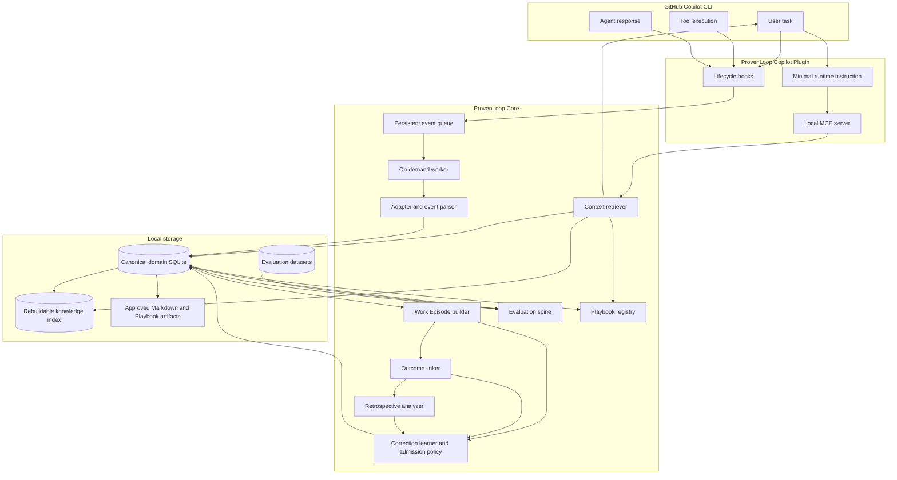

# ProvenLoop Technical Architecture

**Status:** Proposed architecture  
**Updated:** 2026-08-28

This document describes both the executable near-term architecture and the
long-term logical architecture. They use the same event, evidence, domain, and
evaluation contracts. Later milestones enable additional consumers and state
transitions; they do not introduce a second architecture.

## 1. Architecture goals

The system must:

- add negligible latency to interactive Copilot use;
- survive CLI and session-format changes;
- keep engineering evidence auditable;
- isolate repositories and personal knowledge;
- bound runtime context regardless of database size;
- support correction, supersession, evaluation, and rollback;
- avoid dependence on a single memory backend;
- run locally without an additional model API key for standard operation;
- install once, then reuse the user's supported Copilot sign-in for background
  model-assisted work without per-call prompts;
- allow capture, retrieval, learning, retrospective, and Playbook capabilities
  to be disabled independently;
- keep M0-M2 implementation small while preserving compatible M3-M6 extension
  points;
- make product claims executable through one versioned evaluation spine.

## 2. System overview



The diagram is the target logical architecture, not the first implementation
backlog. The executable M0-M2 slice is:

```text
Hooks -> Queue -> Worker -> Parser -> canonical SQLite
                               |
                               +-> basic Work Episode
                               +-> Correction Key and admission policy
                               +-> Branch Context / Knowledge projection

MCP -> Retriever -> canonical state + FTS projection -> bounded Context

Requirement Manifest -> Replay Spec -> Runner
  -> Evidence Ledger -> Deterministic Gate -> JSON/Markdown report + exit code
```

### 2.1 Capability activation by milestone

| Milestone | Newly active capability | Shared contract retained |
|---|---|---|
| M0 | Copilot adapter, hooks, queue, parser, canonical events, basic Episode builder, evaluation spine | Event identity, evidence references, deletion, Gate result |
| M1 | Branch Context, scoped retrieval, FTS projection, Explain and Feedback | Repository/branch identity, token budget, usage records |
| M2 | Correction Key, evidence-backed Knowledge, deterministic admission and dispute handling | Evidence tier, scope, trigger, provenance, product metrics |
| M3 | Automated delayed Outcome linking and observation-window qualification | Existing Episode and evidence relations |
| M4 | Deep Retrospective, evidence expansion, Insight Candidate | Existing evidence, admission, and evaluation contracts |
| M5 | Playbook evaluation, approval, Shadow, Canary, registry, rollback | Existing Knowledge, artifact, and Gate contracts |
| M6 | Additional Reader/Observer adapters and cross-Agent deduplication | Existing adapter capability and identity contracts |

An event type may be captured before its consuming milestone is active. For
example, M0 can persist a directly observed revert, and M2 can stop Knowledge
when explicit counterevidence is already linked. M3 adds automated discovery
and delayed association of Review, CI, Fix, Bug, and Revert evidence.

## 3. Component responsibilities

### 3.1 Copilot adapter

Responsibilities:

- install, enable, disable, upgrade, and uninstall plugin assets;
- register hooks and MCP;
- map Copilot lifecycle events into the canonical event schema;
- identify current session and workspace;
- report which lifecycle, tool, Git, and external outcome signals are actually
  available in the installed Copilot version;
- detect internal ProvenLoop sessions and prevent recursion;
- tolerate unknown event versions without breaking Copilot.

The MVP implements only the Copilot adapter. Future adapters use the same
contract and declare missing capabilities instead of fabricating events:

```ts
interface AgentAdapter {
  install(): Promise<void>;
  enable(): Promise<void>;
  disable(): Promise<void>;
  uninstall(options: { purge: boolean }): Promise<void>;
  doctor(): Promise<AdapterHealth>;
  capabilities(): Promise<AdapterCapabilityMatrix>;
  normalizeEvent(input: unknown): NormalizedEventResult;
  resolveSession(context: RuntimeContext): Promise<SessionIdentity>;
  registerHooks(): Promise<void>;
  registerContextTools(): Promise<void>;
}
```

### 3.2 Hooks and persistent queue

Hooks perform only bounded work:

1. validate event envelope;
2. redact likely secrets and sensitive payloads;
3. attach timestamp and adapter metadata;
4. write atomically to the persistent queue;
5. return immediately.

Hooks do not:

- call an LLM;
- scan prior sessions;
- build Work Episodes;
- update Knowledge Cards;
- block on network access.

Queue requirements:

- append-safe;
- retryable;
- idempotent event ingestion;
- stable item IDs and deduplication keys;
- explicit claim, acknowledge, retry, and dead-letter states;
- crash recovery;
- bounded retention after successful processing;
- dead-letter state with explicit errors.

### 3.3 Shared worker

The worker starts on demand when queue work exists. A lock prevents duplicate
workers. It processes events in batches and yields to interactive workloads.
Queue items remain durable while a consumer is paused or unavailable.

The initial deployment is a modular monolith: a thin hook shim and one shared
local ProvenLoop host containing the MCP server, worker, domain modules, and
CLI control surface. Components are code boundaries, not independently
deployed local services.

The Windows implementation uses a process lease or OS-released named mutex,
not an unbounded stale lock file. The platform boundary owns data-root
resolution, startup registration, process hosting, and interprocess locking;
the domain and evaluation code do not depend on Windows APIs.

Internal background Copilot calls are marked:

```text
PROVENLOOP_INTERNAL=1
```

The adapter ignores resulting hooks to prevent recursive learning.

Model-assisted consumers use a narrow inference boundary:

```ts
interface InferenceProvider {
  availability(): Promise<InferenceAvailability>;
  run(request: InferenceRequest): Promise<InferenceResult>;
}
```

Installation performs the one-time Copilot integration. Subsequent supported
background calls reuse the user's existing Copilot sign-in without copying or
persisting credentials, without an additional API key, and without per-call
authorization prompts. F0 must verify that this is possible through a
supported integration path for the declared Copilot version.

If Copilot is signed out, rate-limited, incompatible, or unavailable,
model-assisted consumers pause with explicit state. Captured work is retained,
deterministic processing continues where possible, and foreground Copilot use
is never blocked. Internal concurrency, retry, backlog, and resource circuit
breakers protect interactive work; these are safety controls, not a user-facing
quota product.

Capability switches include:

```text
capture
retrieval
correction_learning
outcome_learning
retrospective
playbook
external_research
```

Disabling a capability stops its consumers and side effects without corrupting
the queue or changing unrelated state. Global disable stops capture, injection,
and background inference but preserves data until an explicit delete or purge.

### 3.4 Event parser

The parser converts adapter-specific events to a stable model. Parsing failure
is recorded explicitly and does not fabricate a valid event.

```ts
type EventType =
  | "session.started"
  | "session.ended"
  | "prompt.submitted"
  | "tool.started"
  | "tool.completed"
  | "file.changed"
  | "test.completed"
  | "build.completed"
  | "git.commit"
  | "pull_request.updated"
  | "review.received"
  | "issue.linked"
  | "change.reverted"
  | "user.corrected"
  | "feedback.recorded"
  | "claim.declared"
  | "delegate.requested"
  | "delegate.completed"
  | "verification.completed";
```

Unsupported source events are recorded through an explicit compatibility or
error path. A declared adapter capability and a successfully observed event
are separate facts.

### 3.5 Work Episode builder

The builder groups events representing one real engineering objective.

Signals:

- repository ID;
- branch and commit ancestry;
- PR and issue references;
- changed-file overlap;
- test names and errors;
- task semantics;
- temporal proximity;
- explicit links and user feedback.

Associations receive confidence and evidence rather than becoming irreversible
foreign-key facts. Low-confidence associations remain candidates.

M0 implements enough deterministic grouping to measure precision, recall,
wrong merge, and wrong split. M1 adds cross-session and Branch Context behavior.
Incorrect merges are treated as more harmful than conservative splits.

### 3.6 Correction learner and admission policy

The M2 correction learner:

- normalizes explicit corrections into stable Correction Keys;
- requires a verified result before qualifying correction-based Knowledge;
- records opportunities where an existing correction could have applied;
- separates candidate generation from deterministic state transitions;
- immediately disputes applicable Knowledge when valid counterevidence appears.

The admission policy, not a model response, decides whether Knowledge is
candidate, active, disputed, superseded, or archived. Candidate, inferred,
disputed, uncertain, and scope-incompatible content is never silently injected.
Numeric model scores may rank candidates for review but cannot activate,
supersede, or broaden Knowledge.

### 3.7 Outcome linker

The linker detects later evidence that strengthens or weakens earlier learning:

- successful tests or CI;
- review acceptance or correction;
- user approval or rejection;
- follow-up fix;
- revert;
- regression;
- repeated success in another episode.

It must distinguish immediate completion from delayed failure. A task that
passed locally but was later reverted is not a successful training example.

M2 may consume explicit or already-linked direct counterevidence. M3 adds
automatic delayed association with strengths:

```text
direct
plausible
uncertain
unrelated
```

`uncertain` evidence cannot independently activate, weaken, dispute, or
supersede Knowledge. Episodes remain censored until the configured observation
window ends or qualifying external outcome evidence arrives.

### 3.8 Retrospective analyzer

Input:

- selected episode timeline;
- relevant diffs and outcome evidence;
- prior applicable knowledge;
- contradictory evidence.

Structured output:

```text
earlier_assumption
missing_check_or_invariant
later_evidence
generalized_lesson
applicability
non_applicability
counterevidence
confidence
recommended_action
```

Recommended actions:

```text
discard
create_candidate
merge_candidate
strengthen
weaken
dispute
supersede
propose_playbook
```

The analyzer produces an Insight Candidate. It cannot mutate Knowledge state or
activate a Playbook. M4 enables evidence expansion and counterexample search;
earlier milestones do not require this consumer to run.

### 3.9 Context retriever

The retriever accepts:

```ts
interface ContextRequest {
  prompt: string;
  cwd: string;
  sessionId: string;
  repoId?: string;
  branch?: string;
  fileHints?: string[];
  tokenBudget: number;
}
```

Ranking combines:

- scope compatibility;
- lexical or semantic relevance;
- trigger match;
- evidence quality;
- evidence tier;
- freshness;
- previous utility;
- contradiction and stale penalties.

The retriever enforces a token ceiling after rendering, not only before.

### 3.10 Evaluation spine and Playbook registry

The evaluation runner exists from the observation foundation. Its first
version is intentionally small:

- versioned Requirement Manifests and Replay Specs;
- an append-only Evidence Ledger over raw events and artifact digests;
- deterministic verifiers for process, scope, secret, command, and deletion
  facts;
- stable JSON and Markdown reports;
- stable exit codes for pass, gate failure, invalid input, and infrastructure
  failure.

The fixed exit codes are `0`, `1`, `2`, and `3` respectively. Detection that a
participant or tool is available is not completion evidence; the Ledger must
contain a successful invocation and resolved identity before a process claim
can pass.

M0-M2 use fixture and event-trace replay. Full repository sandbox execution,
automated canary orchestration, and Playbook comparison extend this runner in
later phases; they do not replace it.

The evaluator compares:

- no Knowledge and no Playbook;
- relevant Knowledge only;
- current approved Playbook;
- candidate Playbook.

Evaluation uses held-out episodes and negative trigger examples. A candidate
cannot be tested only on the episodes from which it was derived.

The Playbook registry is an M5 capability. Its contract guarantees:

- stable Playbook key;
- immutable versions;
- artifact hash;
- approval record;
- canary percentage;
- active version pointer;
- instant rollback;
- full source and metric history.

## 4. Domain model

### 4.1 RawEvent

```ts
interface RawEvent {
  eventId: string;
  parentEventId?: string;
  adapter: string;
  adapterVersion: string;
  eventType: string;
  sessionId?: string;
  repoId?: string;
  branch?: string;
  worktree?: string;
  commitSha?: string;
  toolName?: string;
  operationId?: string;
  actorId?: string;
  participantId?: string;
  requestedProvider?: string;
  requestedModel?: string;
  resolvedProvider?: string;
  resolvedModel?: string;
  protocol?: string;
  protocolVersion?: string;
  claimId?: string;
  redactedArguments?: unknown;
  resultDigest?: string;
  exitCode?: number;
  completionStatus?: "requested" | "running" | "succeeded" | "failed" | "cancelled";
  timestamp: string;
  trust: "user" | "system" | "tool" | "external-content" | "model";
}
```

Raw events are immutable during normal retention and are never injected
directly into model context. Source Delete and Purge are explicit exceptions:
they physically remove in-scope payloads and dependent data according to the
deletion workflow in section 5.

### 4.2 WorkEpisode

```ts
interface WorkEpisode {
  episodeId: string;
  goal: string;
  repoId?: string;
  branches: string[];
  sessionIds: string[];
  commitIds: string[];
  pullRequestIds: string[];
  issueIds: string[];
  startedAt: string;
  finishedAt?: string;
  outcome: "unknown" | "success" | "partial" | "failure" | "reverted";
  outcomeQualification: "open" | "censored" | "qualified";
  observationWindowEndsAt?: string;
  outcomeQualifiedAt?: string;
  outcomeEvidenceIds: string[];
  correctionEventIds: string[];
  associationConfidence: number;
}
```

`outcome: "success"` is not sufficient for training or product metrics while
`outcomeQualification` is `open` or `censored`.

### 4.3 BranchContext

```ts
interface BranchContext {
  branchContextId: string;
  repoId: string;
  branch: string;
  headSha: string;
  goal?: string;
  acceptedDecisions: string[];
  explicitConstraints: string[];
  implementationState: string[];
  unfinishedItems: string[];
  recentVerificationEvidenceIds: string[];
  sourceEpisodeIds: string[];
  updatedAt: string;
  expiresAt?: string;
}
```

Branch Context is a short-lived projection. Retrieval verifies repository,
branch, and HEAD before use. It is not a replacement for raw evidence or the
Work Episode.

### 4.4 CorrectionKey

```ts
interface CorrectionKey {
  correctionKeyId: string;
  scope: "personal" | "workflow" | "repository" | "branch";
  scopeId?: string;
  violatedConstraint: string;
  expectedBehavior: string;
  trigger: string;
  taskFamily?: string;
  subsystem?: string;
  sourceCorrectionEventIds: string[];
  verificationEvidenceIds: string[];
  createdAt: string;
}
```

The key is frozen before measuring a later opportunity. It is not redefined
after observing whether the future task succeeded.

### 4.5 OutcomeEvidenceLink

```ts
interface OutcomeEvidenceLink {
  linkId: string;
  episodeId: string;
  evidenceId: string;
  kind: "test" | "build" | "ci" | "review" | "fix" | "bug" | "revert" | "user";
  strength: "direct" | "plausible" | "uncertain" | "unrelated";
  supportingEvidenceIds: string[];
  state: "candidate" | "accepted" | "rejected";
  createdAt: string;
  decidedAt?: string;
}
```

### 4.6 KnowledgeCandidate

```ts
type EvidenceMark =
  | "user_confirmed"
  | "externally_verified"
  | "repeated_evidence";

type EvidenceTier =
  | "inferred"
  | "user_confirmed"
  | "externally_verified"
  | "repeated_evidence"
  | "disputed"
  | "locked_preference";
```

```ts
interface KnowledgeCandidate {
  knowledgeId: string;
  topicKey: string;
  kind: "episodic" | "semantic" | "procedural";
  scope: "personal" | "workflow" | "repository" | "branch";
  scopeId?: string;
  content: string;
  appliesWhen: string[];
  nonApplicability: string[];
  sourceEpisodeIds: string[];
  sourceEvidenceIds: string[];
  evidenceMarks: EvidenceMark[];
  evidenceTier: EvidenceTier;
  importance: number;
  utility: {
    applied: number;
    helpful: number;
    harmful: number;
  };
  coverage: {
    applicableOpportunities: number;
    observedOutcomes: number;
  };
  state: "candidate" | "active" | "disputed" | "superseded" | "archived";
  conflictsWith: string[];
  supersedes?: string;
  createdAt: string;
  validatedAt?: string;
  expiresAt?: string;
}
```

A Knowledge item may carry multiple evidence marks. `evidenceTier` is the
current explainable product behavior, not a model-provided probability.
Relevance and other numeric ranking signals are computed for a request; they do
not independently change `state`, `scope`, or `evidenceTier`.

### 4.7 InsightCandidate

```ts
interface InsightCandidate {
  insightId: string;
  sourceEpisodeIds: string[];
  observations: string[];
  hypotheses: string[];
  supportingEvidenceIds: string[];
  counterevidenceIds: string[];
  evidenceNeeded: string[];
  applicability: string[];
  nonApplicability: string[];
  uncertainty: string;
  validationPlan: string[];
  targetMetrics: string[];
  state: "investigating" | "rejected" | "qualified" | "procedure_candidate";
  createdAt: string;
}
```

### 4.8 PlaybookVersion

```ts
interface PlaybookVersion {
  playbookId: string;
  version: string;
  artifactHash: string;
  description: string;
  triggers: string[];
  negativeTriggers: string[];
  requiredPermissions: string[];
  sourceEpisodeIds: string[];
  baselineMetrics: EvaluationMetrics;
  candidateMetrics: EvaluationMetrics;
  status:
    | "draft"
    | "evaluated"
    | "canary"
    | "approved"
    | "deprecated"
    | "rolled_back";
  reviewer?: string;
  createdAt: string;
}
```

A Proven Playbook is the platform-neutral domain object. Agent-specific Skill
files are rendered artifacts and may be regenerated without changing the
Playbook identity, evidence, approval, or active version.

### 4.9 FeedbackEvent

```ts
interface FeedbackEvent {
  feedbackId: string;
  targetType: "knowledge" | "playbook" | "episode" | "process_claim";
  targetId: string;
  kind:
    | "confirm"
    | "irrelevant"
    | "correct"
    | "stale"
    | "conflict"
    | "weaken"
    | "strengthen"
    | "revoke"
    | "set_scope"
    | "mute_session";
  source:
    | "user"
    | "test"
    | "ci"
    | "review"
    | "revert"
    | "analyzer"
    | "process_verifier";
  evidenceRef: string;
  scopeChange?: {
    scope: "personal" | "workflow" | "repository" | "branch";
    scopeId?: string;
  };
  reason?: string;
  timestamp: string;
}
```

Feedback is append-only. Current state is rebuilt from events.

### 4.10 ProcessClaim

```ts
interface ProcessClaim {
  claimId: string;
  episodeId: string;
  kind: "tested" | "reviewed" | "protocol_completed" | "consensus" | "other";
  protocol?: string;
  protocolVersion?: string;
  requiredParticipantIds: string[];
  availabilityEvidenceIds: string[];
  invocationIds: string[];
  requiredEvidence: string[];
  evidenceIds: string[];
  status: "declared" | "verified" | "rejected" | "inconclusive";
  createdAt: string;
  verifiedAt?: string;
}
```

A ProcessClaim is not evidence of its own truth. Deterministic verifiers match
the claim to invocation, model, tool, exit-code, and artifact evidence before
it can be used by acceptance or learning.

### 4.11 Context use and correction opportunity

```ts
interface ContextUseRecord {
  requestId: string;
  episodeId?: string;
  sessionId: string;
  candidateKnowledgeIds: string[];
  returnedKnowledgeIds: string[];
  appliedKnowledgeIds: string[];
  renderedTokens: number;
  latencyMs: number;
  feedback?: "helpful" | "ignored" | "irrelevant" | "wrong" | "stale";
  createdAt: string;
}

interface CorrectionOpportunity {
  opportunityId: string;
  correctionKeyId: string;
  episodeId: string;
  applicable: boolean;
  knowledgeAvailableBeforeCorrection: boolean;
  knowledgeAppliedBeforeCorrection: boolean;
  correctionRepeated: boolean;
  outcomeKnown: boolean;
  createdAt: string;
}
```

These records support Retrieval Precision, Wrong Injection, repeated Context
tokens, RCR, and TTV without inferring the metric denominator after seeing the
result.

### 4.12 Evaluation contracts

The canonical field-level schemas live with the evaluation runner, but the
architecture fixes the following cross-version contracts:

```ts
interface RequirementManifest {
  requirementId: string;
  milestone: string;
  replaySpecIds: string[];
  verifierIds: string[];
  requiredEvidence: string[];
  releaseGate: "hard" | "conditional";
}

interface ReplaySpec {
  specId: string;
  requirementId: string;
  inputRef: string;
  frozenEnvironment: string;
  expectedGate: "pass" | "fail" | "inconclusive";
  expectedEvidence: string[];
}

interface EvidenceLedgerEntry {
  runId: string;
  eventId?: string;
  episodeId?: string;
  claimId?: string;
  participantId?: string;
  invocationId?: string;
  resolvedProvider?: string;
  resolvedModel?: string;
  status: string;
  inputDigest?: string;
  outputDigest?: string;
  timestamp: string;
}

interface GateResult {
  gateId: string;
  status: "pass" | "fail" | "inconclusive" | "infrastructure_error";
  evidenceIds: string[];
  message: string;
}
```

## 5. Storage architecture

Suggested local layout:

```text
%USERPROFILE%\.provenloop\
  config.json
  queue/
  state/
  provenloop.db
  projections/
    fts/
    backends/
  contexts/
  artifacts/
    knowledge/
    playbooks/
    agent-packages/
  evaluations/
  logs/
```

Storage boundaries:

- SQLite domain tables are canonical for raw events, relations, Episodes,
  Outcome links, Knowledge lifecycle, Playbook lifecycle, process claims,
  feedback, deletion state, queue state, metrics, and evaluation records.
- Immutable, content-addressed Markdown may be the canonical body of an
  approved user-reviewable Knowledge or Playbook artifact. SQLite remains
  canonical for its scope, provenance, lifecycle, active pointer, and deletion
  state.
- FTS5, Memorix, rendered Context, and Agent-specific Skill files are
  rebuildable projections. They cannot change domain lifecycle state.
- Every artifact and projection retains stable source IDs, content hashes, and
  projection versions.

These authority boundaries do not overlap. A search backend may return a
candidate ID, but the retriever rechecks current canonical scope, state,
evidence tier, and deletion status before rendering it.

### 5.1 Deletion workflow

Normal correction, dispute, revocation, and supersession are append-only.
User-initiated Forget, Delete by Source/Session/Episode, and Purge use a
separate persistent deletion workflow:

1. record a deletion operation and block new dependent work;
2. locate raw payloads, domain rows, artifacts, projections, caches,
   evaluation samples, queue items, and content-bearing logs by source;
3. physically delete the requested content and recompute dependent Knowledge
   and Playbook state;
4. rebuild or invalidate search projections;
5. run a deterministic deletion Gate proving the content is no longer
   retrievable;
6. retain only the minimal non-identifying tombstone allowed by the product
   deletion contract.

Purge removes the database, artifacts, projections, queue, cache, evaluations,
logs, and tombstones. Immutable hashes never justify retaining deleted source
content or a reversible source reference.

## 6. Knowledge backend boundary

```ts
interface KnowledgeBackend {
  index(records: KnowledgeProjection[]): Promise<void>;
  search(query: KnowledgeQuery): Promise<KnowledgeRecord[]>;
  get(id: string): Promise<KnowledgeRecord | undefined>;
  remove(ids: string[]): Promise<void>;
  rebuild(snapshot: KnowledgeProjectionSnapshot): Promise<void>;
  health(): Promise<KnowledgeBackendHealth>;
}
```

Implementations:

- `SqliteFtsKnowledgeBackend`: MVP implementation using FTS5/BM25;
- `MemorixKnowledgeBackend`: optional richer search implementation after the
  fallback path is stable.

Feedback, admission, archive, delete, and scope changes are domain operations,
not Knowledge backend operations. No ProvenLoop domain table may depend
directly on a backend internal schema.

## 7. MCP surface

### `provenloop_context`

Returns task-relevant guidance within a requested token budget.

Each result includes a stable Knowledge or Playbook ID, rendered guidance,
scope, evidence tier, applicability summary, and an explanation reference.
Candidate, disputed, stale, deleted, and scope-incompatible records are removed
after canonical-state verification even if a projection returned them.

### `provenloop_explain`

Returns provenance, applicability, current state, and contradictory evidence for
a previously retrieved item.

### `provenloop_feedback`

Records deterministic actions such as helpful, irrelevant, wrong, stale,
confirm, revoke, mute for this session, and change scope. Natural language may
invoke these actions, but it is not the only control surface.

Administrative operations remain CLI-first and are not automatically exposed to
the model when they carry destructive or high-impact behavior.

```text
provenloop install
provenloop status
provenloop doctor
provenloop enable [capability]
provenloop disable [capability]
provenloop forget <knowledge-or-playbook>
provenloop delete --source <source>
provenloop uninstall
provenloop purge
```

Install is idempotent. Disable does not delete data. Uninstall preserves data
unless explicitly combined with purge.

## 8. Technology choice

Recommended MVP:

- Windows 10/11 as the only required implementation and acceptance platform;
- TypeScript;
- Node.js 22+;
- SQLite;
- FTS5/BM25 initially;
- MCP over stdio;
- Zod or equivalent schema validation;
- packaged worker and plugin assets.

The plugin protocol, TypeScript, Node.js, SQLite, and MCP are portable, but the
complete local product is not platform-free. Startup registration, process
leases, file replacement, data paths, sleep/resume behavior, and crash cleanup
are platform concerns. The MVP implements Windows providers for these
boundaries; macOS and Linux providers are future work and are not release
requirements.

Why TypeScript for the MVP:

- close fit with Copilot plugin and MCP ecosystems;
- direct integration with Memorix SDK if adopted;
- shared types across plugin, MCP, worker, and CLI;
- faster iteration during product discovery.

A future native helper may be introduced only if startup, packaging, or resource
measurements justify it. A Go rewrite is not an MVP requirement.

## 9. Reliability and failure behavior

- Hook failure never prevents Copilot from running.
- Queue write failure is surfaced through health status and logs.
- Parser errors retain the raw envelope and explicit error.
- Analyzer failure does not create an empty or success-shaped memory.
- Knowledge backend failure does not change canonical Knowledge state; retrieval
  returns no injected context and records degradation.
- Retrieval timeouts fail closed with an empty result.
- Playbook evaluation failure blocks promotion.
- Unknown scope blocks cross-repository retrieval.
- Capability disable stops new side effects and leaves unrelated consumers
  healthy.
- Model-provider failure pauses model-assisted consumers with durable backlog
  and bounded retry; it never loops aggressively or discards queued work.
- Database migrations are versioned and transactional, with recovery or restore
  paths tested before stable release.

Three mechanisms remain separate:

1. **Crash recovery:** WAL, durable queue state, leases, and startup repair
   recover interrupted infrastructure work.
2. **Transaction rollback:** an incomplete unit of work commits no success
   state; its failure remains observable without fabricating results.
3. **User deletion:** the persistent workflow in section 5.1 removes requested
   content and derived data. It is never used as a crash-recovery shortcut.

The internal circuit breaker observes concurrency, repeated provider errors,
queue pressure, memory, CPU, and disk conditions. When open, it stops low
priority dequeue work, preserves the backlog, and gives foreground Copilot and
MCP requests priority. It does not require a usage dashboard or expose a
user-facing quota.

## 10. Security model

Controls:

- local-only default network policy except the supported Copilot inference path;
- no copying, exporting, or persisting Copilot credentials;
- secret patterns plus entropy checks before persistence;
- second redaction pass before retrieval;
- trust classification for every source;
- external content never treated as instruction evidence by itself;
- repository and workspace access checks;
- permission manifest for executable Playbooks;
- sandboxed replay beginning with the M5 Playbook evaluation capability;
- immutable evidence hashes;
- complete, Gate-verified deletion propagation;
- audit events for approval, activation, and rollback.

External research is disabled by default and uses an independent capability
switch. It must not send source code, raw prompts, secrets, or private project
identifiers.

## 11. Context scaling

The database may grow with years of work. Runtime context must not.

Scaling mechanisms:

- stable topic keys merge repeated evidence;
- episode compaction keeps relationships and conclusions;
- raw-event retention is configurable;
- candidates expire when never confirmed;
- approved knowledge is periodically consolidated;
- retrieval is Top-k with a rendered token ceiling;
- same-session deduplication;
- progressive disclosure through explanation calls;
- stale and unused guidance loses rank.

## 12. Observability

Track:

- hook and queue latency;
- worker backlog and failures;
- Episode precision, recall, wrong merge, and wrong split;
- Outcome link strength and censored observation windows;
- retrieval latency and result count;
- rendered tokens;
- Retrieval Precision@3, Negative Abstention, Wrong Injection, and Harm Rate;
- accepted, ignored, corrected, stale, revoked, and harmful retrievals;
- Correction Opportunities, repeated corrections, and RCR;
- TTV, repeated Context tokens, tool calls, and failed retries;
- Evidence Tier accuracy, coverage, and utility;
- candidate creation and merge rate;
- Insight precision and unsupported causality when M4 is active;
- Playbook promotion, Shadow, Canary, and rollback metrics when M5 is active;
- declared versus verified process claims;
- requested versus resolved participants and models;
- unsupported completion claims;
- deletion operations and propagation Gate results;
- secret and scope-policy violations.

The MVP needs CLI diagnostics, not a full dashboard.

## 13. Architectural decisions

1. ProvenLoop is a learning layer, not an agent runtime.
2. One architecture spans M0-M6; later milestones activate compatible
   capabilities rather than replacing the core.
3. The initial deployment is a modular monolith with a thin hook shim and one
   shared local host, not a set of local microservices.
4. Hooks persist; workers analyze.
5. Work Episode is the aggregation boundary.
6. Outcomes and feedback are append-only evidence during normal operation;
   explicit user deletion uses a separate hard-delete workflow.
7. SQLite domain state is authoritative. Search backends, rendered Context,
   Markdown views, and Agent packages are projections or versioned artifacts
   with non-overlapping authority.
8. ProvenLoop domain lifecycle remains independent of the memory backend.
9. Evidence Tier and deterministic admission govern activation; model scores do
   not grant authority.
10. The Requirement Manifest, Replay Spec, Evidence Ledger, deterministic Gate,
    report, and exit code form one evaluation spine from M0 onward.
11. Retrieval fails closed and is token bounded.
12. Knowledge activation and Playbook activation are separate gates.
13. Playbook versions are platform-neutral, immutable, and reversible;
    Agent-specific Skill files are rendered artifacts.
14. Installation integrates once with Copilot. Supported background inference
    reuses the existing sign-in, remains non-recursive, and can be disabled.
15. Windows is the only initial implementation target; platform-sensitive
    behavior stays behind explicit providers.
16. TypeScript/Node.js is the initial implementation platform.
