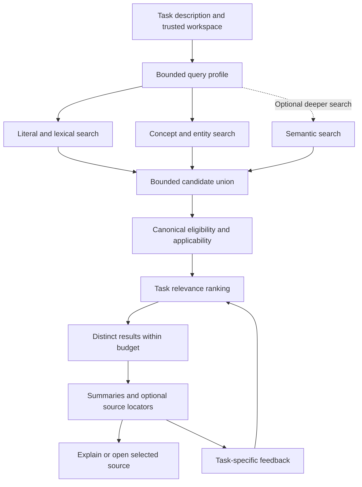

# Experience classification and retrieval

Status: implemented core workflow in the development tree; field validation pending.
Date: 2026-09-11.
Scope: organizing existing experience and improving its use across engineering tasks.

## 1. Product decision

ProvenLoop should find useful past experience when a developer describes a new
problem, including when the problem uses different wording. The same retrieval
path should serve investigation, design, implementation, testing, and operations.

Past incidents are already a source of experience. This design starts with the
knowledge in ProvenLoop. A lesson can carry a short explanation and optional
file, directory, or URL references. Importing an incident archive or building a
dedicated design assistant is outside this change.

The proposed sequence is:

1. Add small, automatically maintained classification and discovery metadata.
2. Improve query interpretation and retrieval using those fields.
3. Rank for task relevance, then select distinct useful results.
4. Support deeper search and source expansion through the same general tools.
5. Add semantic retrieval only after measuring what the preceding steps miss.

Users can correct metadata, but routine classification should require no work
from them. Existing scope, source checks, evidence tiers, and withdrawal rules
continue to control whether knowledge may be delivered. A tag or a similarity
score never changes those decisions.

## 2. Baseline before this implementation

This baseline describes the working tree inspected on 2026-09-11, including
uncommitted retrieval changes. HEAD was
`798afd7f881f6763d31ef0d035a50f63c185c532`; that commit alone does not contain all
the behavior below. No release or installed-host acceptance is implied.

| Stage | Current behavior | Relevant source |
|---|---|---|
| Knowledge structure | `episodic`, `semantic`, and `procedural` kinds; content, applicability, exclusions, scope, source IDs, evidence, and lifecycle state | [knowledge contract](../packages/contracts/src/knowledge-candidate.ts) |
| Learned references | Conventions, references, and recoveries retain captured quotations; reviewed proposals can provide concise lessons and search aliases | [learning contract](../packages/contracts/src/learning.ts), [source use](../packages/domain/src/learning-source-use.ts) |
| Query construction | At most 24 terms from the prompt, file hints, and trusted tool or command identity; Chinese segmentation and character bigrams | [context service](../packages/retrieval/src/context-service.ts), [tokenization](../packages/retrieval/src/search-text.ts) |
| Discovery | SQLite FTS5 with OR matching and BM25. Topic and aliases, content, and applicability have weights 4, 2, and 1 | [FTS backend](../packages/retrieval/src/sqlite-fts-knowledge-backend.ts) |
| Candidate checks | Scope/state/expiry prefilter; canonical source and admission checks; paged refill after exclusions and session suppression; identical-guidance deduplication | [retriever](../packages/retrieval/src/retriever.ts), [projection](../packages/retrieval/src/projection.ts) |
| Ranking | Fixed contributions from lexical matches, trigger overlap, scope, evidence, age, importance, and recorded utility | [context service](../packages/retrieval/src/context-service.ts) |
| Delivery | Up to 20 accepted candidates, then at most 3 items and 1,200 estimated tokens; at most 1 research reference. Default deadline is 150 ms and examined-candidate budget is 500 | [context service](../packages/retrieval/src/context-service.ts), [retriever](../packages/retrieval/src/retriever.ts) |
| Feedback | Helpful, wrong, stale, and other feedback already have defined behavior. `irrelevant` is recorded without affecting future ranking | [feedback contract](../packages/contracts/src/feedback-event.ts), [context service](../packages/retrieval/src/context-service.ts) |

Existing kinds describe storage and learning behavior. They provide little help
finding, for example, a retry-related lesson whose text only discusses duplicate
writes. Existing aliases already help bilingual retrieval; the remaining gap
includes general paraphrases, technical relationships, and task applicability.

The working tree already addresses filtering before candidate limits, refill,
exact duplicates, and generic-action-only matches. Preserve those changes. The
[scalability review](scalability-review.md) owns broader storage and worker work;
this document owns classification and retrieval relevance.

## 3. Classify by use and subject

Use independent facets with multiple values. A lesson can answer several kinds
of questions, and a task can need several kinds of experience. Inferred facets
contribute discovery hints and ranking features. Only an explicitly requested
browse filter should require a category match. Unclassified knowledge remains
searchable through its content and existing aliases.

### 3.1 Purpose

Use a small controlled vocabulary, with at most two purposes per item.

| Purpose | Meaning | Example |
|---|---|---|
| `fact` | A useful observed property of a system or project | Client code is generated from a schema |
| `constraint` | A requirement or boundary that applies under stated conditions | Repository documentation must use English |
| `lesson` | Experience that informs a later decision, including failure conditions | Retrying an external write after an ambiguous timeout can repeat the effect |
| `procedure` | A reusable way to perform work | Regenerate the client before running its contract tests |
| `rationale` | Why a choice was made and the tradeoff it addressed | A queue was selected to absorb bursts despite additional delivery latency |

A postmortem can support a fact, a lesson, and a procedure as separate knowledge
items when they are independently useful. Its document type does not determine
the purpose of every item. Keep the current `kind`, retention kind, and evidence
tier unchanged; purpose is optional discovery metadata.

### 3.2 Topics and mechanisms

Attach up to eight concept IDs. Start with a small versioned vocabulary covering
the actual collection: retries, idempotency, duplicate effects, cache invalidation,
schema migration, concurrency, resource limits, testing, and deployment. This is
a seed, not an exhaustive taxonomy or a required directory tree.

A concept has a stable ID, an English label, multilingual aliases, and a short
definition. Distinguish equivalent expressions from related concepts:

| Relationship | Example | Retrieval behavior |
|---|---|---|
| Alias | Idempotency and its translation | Normalize to the same concept |
| Related concept | Retry and duplicate effect | Add a weak exploratory query; preserve the distinction |
| Project alias | A service nickname and its actual identifier | Resolve only within its recorded project scope |

Retry, idempotency, and exactly-once delivery are not synonyms. Related-concept
expansion must not imply a causal finding or an equivalent guarantee. Permit
one expansion hop and at most four added concepts in the initial implementation.

New concepts enter a local pending vocabulary. Their literal phrases remain
searchable while awaiting consolidation. Merge names by an explicit alias
update; keep stable IDs and a migration map. Avoid creating a new topic for
every file, incident number, or paraphrase.

### 3.3 Entities and applicability

Keep named systems, components, protocols, paths, and error identifiers as
entities, separate from topics. Retain exact spelling and case where meaningful.
For example, `tool -X` and `tool -x` must remain distinct.

Existing `appliesWhen` and `nonApplicability` remain the source of conditions.
An optional derived index can associate their clauses with concepts such as
external side effects or at-least-once delivery. Each association points to its
original clause. Do not reduce a qualified statement to a bag of positive tags.

The task activity, such as debugging or design, is a weak query hint. It is not
a mandatory classification field on every lesson. A retry lesson should remain
discoverable during both design and incident investigation.

### 3.4 Proposed metadata contract

Store a versioned profile alongside a knowledge revision. All names below are
proposed contracts, not existing APIs. Existing content is the default summary.
An optional shorter summary must pass the same support review as other derived
text, and must preserve material conditions.

```typescript
type ExperiencePurpose =
  | "fact" | "constraint" | "lesson" | "procedure" | "rationale";

interface DiscoveryFeature<T> {
  value: T;
  basisIds: string[];
  polarity: "positive" | "excluded_context" | "required_condition";
}

interface DiscoveryProfile {
  schemaVersion: 1;
  knowledgeId: string;
  knowledgeDigest: string;
  vocabularyVersion: string;
  purposes: DiscoveryFeature<ExperiencePurpose>[]; // 0..2
  topics: DiscoveryFeature<string>[];             // 0..8 concept IDs
  entities: DiscoveryFeature<{ kind: string; value: string }>[]; // 0..16
  paraphrases: DiscoveryFeature<{ language: string; text: string }>[]; // 0..8
  shorterSummary?: DiscoveryFeature<string>;
  basis: {
    id: string;
    field: "content" | "appliesWhen" | "nonApplicability";
    clauseIndex?: number;
    text: string;
  }[];
  producer: "deterministic" | "model_reviewed" | "user";
  discoveryInputDigest: string;
  profileDigest: string;
  review?: {
    discoveryInputDigest: string;
    profileDigest: string;
    reviewVersion: string;
    reviewer: string;
    reviewDigest: string;
    accepted: boolean;
  };
}
```

Runtime validation must bound text lengths, array sizes, and total profile
bytes. Validate every feature's basis IDs and their clauses against the bound
knowledge revision. Required conditions travel with positive paraphrases;
excluded contexts never enter positive postings. A feature may cite several
clauses when a condition qualifies the statement.

Model-produced profiles require a separately accepted review bound to both the
input and profile digests. The host supplies reviewer identity and receipt
metadata, following the existing distillation-review pattern. Compute the
profile digest over its canonical fields excluding itself and the review
receipt; the review digest covers the receipt's other fields. A producer label
or a self-reported accepted flag is insufficient. Hashes detect stale metadata;
they do not establish semantic correctness.

Here `knowledgeDigest` binds semantic content, conditions, scope, and supporting
source identity/content. It excludes usage counters and timestamps that do not
change those inputs. `discoveryInputDigest` additionally binds the vocabulary
and material actually used for enrichment. Maintain a separate canonical
eligibility revision for lifecycle, controls, evidence, and feedback changes.
Ordinary utility updates must not trigger model enrichment or embedding again.

Original-language `queryTerms` retain their existing verbatim-source rule. New
paraphrases use a separate reviewed field because they need not occur literally
in a quotation. Review must reject changed negation, missing exceptions, added
claims, and unrelated search keywords.

## 4. Sources are optional navigation

Experience remains useful when only its summary is available. Preserve whatever
evidence status it already has. Adding a locator does not promote a candidate,
prove a statement, or make the referenced material available.

Add optional source references with the following representation:

| Field | Purpose |
|---|---|
| `sourceRefId` | Stable reference identity owned by the knowledge revision |
| `kind` | `file`, `directory`, or `url` |
| `locator` | Repository-relative path plus repository identity, explicit local path, or URL |
| `anchor` | Optional heading, line, symbol, or URL fragment |
| `evidenceIds` | Existing supporting evidence IDs, if any |
| `contentDigest` / `revision` | Version actually inspected, when available |
| `availability` | `captured`, `pointer_only`, or `unavailable`, with observation time |
| `relationship` | `supports`, `background`, or `investigation_start` |

Locators come from captured metadata or an explicit user-provided reference. A
model can select a known locator; it must not invent one from a title. A directory
is an investigation starting point, not a citation to all files below it.

Return summaries and locators first. The calling agent can open a selected source
with its normal file or browser tools. ProvenLoop does not crawl directories or
fetch URLs as part of automatic retrieval. Explain can return captured excerpts
and the recorded revision. Live content needs a fresh read and may differ from
the captured source.

Missing optional navigation does not automatically delete an otherwise eligible
summary. Deleting actual canonical supporting evidence continues to invoke the
existing admission and deletion rules. Source pointers, classification metadata,
and future vectors follow the knowledge lifecycle and deletion behavior.

## 5. Enrich experience outside the foreground path

For new knowledge, extend the existing extraction and separate model-review
workflow with optional discovery metadata. Keep semantic review and evidence
qualification separate. Reuse the configured learning provider and its request
budget; add no required service or API key.

For existing knowledge:

1. Build literal entity matches and vocabulary matches deterministically.
2. Queue bounded model enrichment for missing topics or useful paraphrases.
3. Review proposed metadata against the saved lesson and its existing conditions.
4. Publish a profile only if its input digest still matches.

Backfill is incremental and resumable. Prioritize recently used and newly
created eligible knowledge, then scan the remainder with a durable cursor.
Manual remember and source-backed learning use the same optional profile path.
The original lexical projection works while enrichment is disabled, pending,
failed, or unavailable. Backfill does not renew expiry, strengthen evidence, or
change scope.

A material knowledge edit invalidates the profile and any dependent embedding. Serve
the current canonical content through lexical retrieval while rebuilding.
Retain user metadata corrections and their history, and give them precedence
over automated refresh for the same knowledge revision. A semantic lesson edit
requires those corrections to be checked and rebound to the new digest; keep
incompatible or unresolved overrides inactive with an explanation.

## 6. Retrieval pipeline



### 6.1 Query representation

Build a query profile from the current request:

- Original text and exact literals, including identifiers and file hints.
- Detected concepts and entities, with the words that produced each match.
- Explicit positive and negative conditions.
- Optional activity and intended outcome supplied by the calling agent.

The cheap path uses deterministic parsing and vocabulary lookup. The calling
agent may supply a few alternate queries or concepts for a deeper search; they
are search hints, with no authority to change trusted workspace identity.

Keep exact literals, ordinary words, and expansions in separate channels. A long
prompt should not consume its entire query budget on an introductory paragraph.
Reserve slots for named entities and task clauses; preserve the original query
as a route even if concept detection fails. Use at most three alternate queries
per request, and preserve negation with each clause.

Unknown conditions remain unknown. A question about retries does not establish
that a system writes to an external service. Query expansion may find that
lesson, but delivery must show its unresolved applicability condition.

### 6.2 Candidate discovery

Use three bounded routes:

| Route | First implementation | Role |
|---|---|---|
| Literal and lexical | Existing FTS plus exact entity lookup | Preserve precise names, errors, commands, and sparse queries |
| Concept and phrase | Indexed concept IDs, reviewed paraphrases, and bounded related-concept expansion | Find useful experience across wording and language differences |
| Semantic | Optional multilingual embedding backend in a later phase | Recover relevant paraphrases missed by the other routes |

Apply available scope, lifecycle, and expiry filters in every backend. All hits
still pass canonical checks before return. Similarity cannot bypass source
integrity, current controls, typed tool contracts, or worktree applicability.

Use a per-route shortlist and merge by knowledge ID and revision. Reserve space
for both literal and concept hits so one route cannot fill the entire pool.
Refill after rejected candidates under one shared examined-candidate budget and
deadline. Count backend hits examined, including duplicates, against that budget.
Use a route-neutral hit carrying knowledge ID/revision, route rank, and match
features. Run one batched canonical admission pass over the union, with a
request-local evidence cache. Alternate queries share this pass and budget.

Carry route-specific match features through the retriever. The current acceptance
predicate requires a shared query token; applying it unchanged would discard
concept-only or semantic-only hits. Replace that condition with the relevance
assessment below, while retaining the generic-action-only rejection for lexical
hits. A non-lexical hit must demonstrate a relevant concept or mechanism match;
its backend score alone is insufficient.

For the initial experiment, use up to 30 hits per enabled route, at most 60
distinct candidates before final selection, and at most 500 examined hits on
automatic context requests. These are proposed tuning values. Measure their
cost against the current 20-candidate baseline before changing defaults.

Do not add BM25 scores directly to vector similarity scores. Use rank-based
fusion to create the shortlist; final relevance features determine delivery.
Within a route, retain the best rank per item across alternate queries. Each
route supplies at most one fusion contribution, so paraphrasing a query several
times cannot manufacture independent votes.
Exact entity and literal hits retain a route even when semantic search is
enabled. Related-concept matches alone require further task-relevance support.

The semantic experiment embeds the approved lesson text, conditions, and useful
discovery phrases. It does not embed raw sessions or fetched documents. Record
model, dimensions, language coverage, and input digest; never mix incompatible
vector versions. Select a local provider after measuring Windows memory and
latency. Any external provider needs a separately configured data path.

### 6.3 Applicability and relevance

Eligibility answers whether an item can be used at all. Relevance answers whether
it helps this task. Keep those decisions observable and separate.

Existing explicit exclusions and trusted scope rules remain hard checks. An
inferred category mismatch is a soft signal. Preserve current code-revision
revalidation notices and all typed recovery restrictions.

Rank eligible candidates in relevance bands:

| Band | Required support | Delivery |
|---|---|---|
| Direct | The task's problem or intended operation matches, all material applicability conditions are established, and none is contradicted | Eligible for automatic context |
| Conditional | The problem or mechanism is relevant, with at least one named material condition that is unresolved | At most one clearly conditional automatic item; eligible for deeper search |
| Weak | Only a broad topic, incidental word, or speculative relationship matches | Omit from automatic context |

Compute bands from explicit features: exact entity match, matched problem terms,
concept agreement, applicable-condition coverage, and contradictions. Store the
features and explanation, not a fabricated probability. Tune numeric thresholds
on development data and freeze them before held-out evaluation.
An entity match alone is insufficient. A lesson without material prerequisites
can qualify directly from a supported problem/operation match; an unknown
prerequisite always makes delivery conditional. Unresolved conditions must be
shown as checks to make, not as unconditional directions.

Within a band, prefer task coverage and specificity. Evidence, freshness, and
recorded usefulness break close ties; they cannot elevate a weak match above a
direct one. Missing feedback contributes no penalty. A source-supported
reference can be the best answer to an investigation despite having no runtime
verification receipt. Its evidence label must remain visible.

The first implementation is deterministic. If ranking errors remain after
measuring it, evaluate a local reranker or a bounded model assessment for deeper
search. No model call belongs in the default 150 ms path. A model reranker only
selects candidate IDs and relevance explanations; it does not rewrite lessons
or promote their evidence.

### 6.4 Diversity and stopping

Keep exact duplicate suppression, with case-sensitive commands and conditions
preserved. Semantic similarity may reduce repeated presentation; it must not
merge canonical records or combine their evidence. Different conditions or
opposing advice require separate treatment.

After relevance ranking, prefer additional coverage of the task over several
paraphrases of one lesson. Use matched concepts, entities, and checked equivalence
relations as features. Avoid a blanket one-item-per-topic rule: retry and
idempotency lessons may address distinct decisions in the same task.

Stop when the result budget is filled or remaining candidates are weak. Returning
no result is valid. Report timeout, unavailable index, or candidate-budget
exhaustion as degraded retrieval rather than an ordinary no-match. Partial
results must still pass all canonical checks and carry a completeness reason.

## 7. General delivery and deeper search

Keep `provenloop_context` as the small automatic entry point. Add a general
`provenloop_search` tool for deliberate investigation across the same authorized
knowledge. Design, debugging, and implementation all use it.

| Behavior | Automatic context | Deeper search |
|---|---|---|
| Trigger | Existing task-start integration | Agent requests more experience for the current task |
| Proposed result budget | Preserve 3 items and 1,200 estimated tokens | Default 8 summaries; maximum 12 and 3,000 estimated tokens |
| Proposed local deadline | Preserve 150 ms | 1,000 ms, with explicit degraded status |
| Query work | Deterministic profile and cached metadata | Up to 3 alternate queries; optional local semantic route |
| Repeated results | Preserve current automatic suppression | Allow previously shown items when deliberately searched again |
| Sources | Summary, conditions, evidence label, locator count | Same fields plus selected locators; captured excerpts via Explain |

Budgets for deeper search are proposed defaults to validate, not measured
capacity. Search returns ranked bounded results and a `moreAvailable` or
`truncatedByBudget` reason; first implementation does not promise stable paging
through a changing index.

Extend the request contract with bounded `alternateQueries`, `conceptHints`,
`entityHints`, and optional purpose/topic browse filters. Trusted scope still
comes from the host. The response records matched features, relevance band,
unresolved conditions, and available source references. Existing clients can
ignore additive fields. New request fields require a protocol/version check.

Extend Explain's existing session checks to items actually returned by deeper
search. Recheck scope, current revision, and deletion at explain time. Store
search delivery as a distinct observation; it is not automatic injection or
adoption.

Remove the fixed one-reference limit only after diversity and relevance checks
pass evaluation. Select references by their relevance and evidence conditions,
within the same token budget. Retrieval returns enough context to decide whether
to open a source; a missing source locator does not require a separate product
flow.

## 8. Make irrelevant feedback useful

An irrelevant result may contain a correct lesson. Record the feedback against
the knowledge revision and the task context in which it was shown. Preserve the
existing real-user confirmation requirements for persistent feedback.

Add a versioned relevance observation containing the request ID, knowledge digest,
matched concepts/entities, explicit conditions, retrieval policy version, and
feedback event ID. Use existing locally authorized request data and bounded
features; do not retain a new full prompt history for this purpose.

One confirmed `irrelevant` response creates a bounded local penalty for a later
query with the same topic/entity and condition signature. It does not archive
the item, change global utility, or invent an exclusion. Apply the penalty only
within the matched context, cap its influence within a relevance band, and expire
it after 30 days or a material lesson/policy revision. Treat 30 days as an initial
parameter to evaluate.

Deduplicate feedback by request and target. Do not count repeated impressions as
independent evidence. Helpful feedback in the same context can counter the
penalty; missing feedback and ignored items provide no negative label. Repeated
patterns may propose a metadata correction, which goes through the existing
review controls before changing applicability. Wrong and stale continue through
their current content/lifecycle paths.

## 9. Example behavior

The following lesson and requests are illustrative, not captured incidents.

Stored lesson: a downstream operation completed, its response was lost, and a
retry repeated an external write. The reusable guidance asks the developer to
check stable operation identity and deduplication around external effects.

| Field | Example value |
|---|---|
| Purpose | `lesson` |
| Topics | `retries`, `duplicate-effects`, `idempotency` |
| Conditions | The caller can retry after an ambiguous completion; the operation has an external effect |
| Exclusions | Read-only retries with no repeated effect |
| Optional source | A known repository file such as `docs/incidents/retry-duplication.md`; no locator is required |

| New request | Expected retrieval behavior |
|---|---|
| Prevent duplicate writes when a worker retries after a timeout | Direct lexical/concept hit |
| Ensure a task's external operation takes effect only once | Paraphrase/concept hit despite different wording |
| Design a queue worker with retries; side effects are unspecified | Conditional result that names the missing side-effect assumption |
| Retry a read-only health probe | Exclusion applies; omit the lesson |
| Change the retry count in a unit test | Do not infer that a production side effect exists; require further relevance support |

Classification makes the item easier to discover. The conditions decide how it
can inform the new task. The returned lesson remains tied to its existing scope
and evidence.

## 10. Implementation boundaries and migration

| Area | Change |
|---|---|
| Contracts | Versioned discovery profiles, source references, query hints, relevance observations, and additive response diagnostics |
| Domain and learning | Vocabulary matching, profile validation, metadata review, and relevance feedback interpretation |
| Storage | Profiles keyed by knowledge digest; indexed concept/entity postings; reference rows; bounded relevance observations |
| Retrieval | Multiple candidate routes, canonical admission, relevance bands, diversity, deeper-search service, and explanations |
| Copilot adapter and CLI | Optional extraction/review fields, `provenloop_search`, and updated general task instructions |
| Evaluation | Real paraphrase and applicability queries, backend ablations, and growing-corpus latency tests |

Extend [projection](../packages/retrieval/src/projection.ts) and the existing
incremental index synchronization for metadata. Keep profiles and postings
rebuildable from their versioned records. Do not put model inference in
[the FTS backend](../packages/retrieval/src/sqlite-fts-knowledge-backend.ts).

Coordinate canonical-store and retriever changes with the ongoing scalability
work. Add migrations through the repository's existing schema mechanism; choose
the next schema number at implementation time. Existing knowledge stays readable
without profiles, and old retrieval remains available during backfill.

Maintain semantic input digests across lexical, concept, and vector projections,
and a separate eligibility generation. A content or source change invalidates
the affected representations. Lifecycle changes immediately update eligibility
without reclassifying unchanged text. Forget removes all derived forms; stale
indexes cannot restore a withdrawn item.

Cache discovery IDs and match features rather than final delivery. Keys include
index generation, vocabulary and retrieval-policy versions, query features, and
trusted scope. Every delivery rechecks canonical admission, source availability,
expiry, current revision, session suppression/mute, and relevance feedback. Any
future ranked-response cache must also include feedback generation and session
state and expire before the earliest applicable knowledge expiry.

This work preserves existing cross-repository and worktree restrictions. Labels
do not make a repository-specific finding globally applicable. If controlled
cross-project transfer is later required, define and validate that capability
separately; it is not a prerequisite for improving discovery within today's
authorized scopes.

## 11. Delivery sequence and acceptance

### Phase 0: Freeze a useful baseline

Select existing knowledge and real later questions with permission to use them
locally. Record source digests, the dirty-tree diff when present, runtime, hardware,
index versions, and the exact retrieval configuration. Reuse the current
[evaluation package](../packages/evaluation/src/branch-continuation-evaluation.ts).

Start with roughly 100 labeled queries, including natural paraphrases, bilingual
queries, exact identifiers, unrelated tasks, conditional matches, stale sources,
and scope mismatches. Group data by originating incident or lesson family before
splitting, so paraphrases of one case do not leak into both development and test.
Keep real and synthetic results separate.

Reviewers label relevant items and their conditions, including multiple valid
answers. Build the review pool from all candidate methods and source inspection,
not solely the current top results. Queries may be written independently of the
stored summary to avoid measuring keyword copying.

### Phase 1: Profiles and concept-assisted retrieval

Implement purpose/topic/entity profiles, optional source locators, deterministic
query profiles, concept/phrase postings, candidate fusion, and relevance bands.
Keep default delivery budgets and expose feature diagnostics in Explain.

Acceptance requires compatibility with unclassified knowledge, no scope or
source-control regression, exact-identifier preservation, correct handling of
negation and conditions, and a measured improvement on paraphrase queries.

### Phase 2: Deeper search and contextual feedback

Add the general search tool, deliberate rediscovery, multiple relevant references,
and context-specific irrelevant feedback. Verify that suppression, Explain
authorization, source availability, token limits, and result accounting remain
consistent across automatic context and search.

### Phase 3: Evaluate semantic retrieval

Run an optional lexical-plus-vector backend in isolated evaluation. Adopt it only
if it improves remaining misses at an acceptable memory, latency, and deployment
cost. If concept-assisted retrieval meets the target, stop without adding a
vector runtime. Evaluate a reranker separately so its gain is not confused with
the gain from candidate recall.

### Metrics and proposed acceptance criteria

| Question | Metric or check | Initial acceptance proposal |
|---|---|---|
| Did relevant experience enter the shortlist? | Recall in the fused top 30, plus recall at the actual candidate/admission boundary | Recall@30 at least 90% on labeled answerable held-out queries |
| Were delivered items useful for the task? | Returned-item precision, fixed-denominator P@3, and nDCG@3 | Returned-item precision at least 90%; no regression on exact-identifier queries |
| Did the system abstain appropriately? | Irrelevant injection on unanswerable queries | At most 2%, with counts and uncertainty reported |
| Does deeper search expose useful alternatives? | Recall@8 and reviewer coverage of distinct concerns | Improve over the lexical baseline without increasing misleading condition matches |
| Is classification useful? | Per-facet precision plus retrieval with/without facets | Keep only facets that improve measured discovery or navigation |
| Do controls still hold? | Scope, revoked/deleted evidence, source mutation, and stale-profile cases | Zero violations in the regression suite |
| Is the cost acceptable? | End-to-end p50/p95/p99, degradation rate, memory, index size | Evaluate the 150 ms automatic and 1,000 ms search budgets on a declared reference host |

These are proposed product targets, not achieved results. Freeze thresholds
before held-out testing. Report denominators, confidence intervals, and small
sample limitations; a small pilot cannot establish a rare-error rate precisely.

Returned-item precision divides relevant deliveries by the number delivered;
fixed-denominator P@3 divides relevant deliveries in the first three positions
by three. Report both with their names and denominators. Use the former for
compatibility with the current evaluator's precision convention. Empty output
has undefined returned-item precision and zero P@3. Candidate recall uses
eligible relevant knowledge in the frozen query scope as its denominator.
Also report recall at the actual union boundary, initially up to 60 candidates,
and after admission to distinguish discovery misses from filtering losses.

Measure precision and coverage together. Zero relevant deliveries cannot pass
on abstention alone. For answerable
queries, report the fraction with at least one useful delivery and the number
lost at discovery, admission, ranking, or token fitting. Keep quality labels
independent of whether a backend succeeded.

Compare current lexical retrieval, added profiles, query expansion, revised
ranking, and optional vectors as separate ablations. Test warm and cold indexes
at 100, 1,000, and 10,000 knowledge items with realistic eligible and excluded
mixtures. Include concurrent update and deletion scenarios. Performance tests
must report degraded responses as failures to serve, not remove them from
latency percentiles.

## 12. Validation record

The original document-only review and baseline checks are recorded below. The
subsequent implementation is described in section 13. Proposed field acceptance
targets remain unvalidated.

Current-baseline regression run on 2026-09-11:

```powershell
npm test -- tests/unit/retrieval-natural-query.test.ts tests/unit/retrieval-scope.test.ts tests/unit/learning-alias-retrieval.test.ts tests/unit/learning-query-terms-retrieval.test.ts tests/unit/learning-source-use.test.ts tests/unit/learning-applicability.test.ts tests/unit/context-scale.test.ts
```

Result: 7 test files passed, 58 tests passed. These tests verify existing
behavior, including work in progress; they do not establish the proposed
classification or paraphrase-retrieval targets.

Document validation passed: 17 local link targets exist, all 3 code blocks have
language labels and balanced fences, and the document has English prose with
no trailing whitespace. Independent design review covered applicability,
per-feature provenance, feedback/cache invalidation, candidate fusion, and
metric definitions. The TypeScript example is a proposed data shape; it has no
runtime implementation in this change.

## 13. Implementation record

The development implementation keeps one general experience path for design,
investigation, coding, and operations. It adds no incident-specific importer or
design-specific agent. Database schema 22 adds the discovery/usage JSON reader
boundary; schema 23 adds durable background enrichment jobs and its scan cursor.
An older reader must not open these databases. Existing installation migration
and rollback controls still apply. The [0.16 preview release](releases/0.1.0-alpha.0.16.md)
includes this implementation; production quality targets remain unvalidated.

### Available behavior

- Discovery profiles carry up to two purposes, eight concepts, exact entities,
  per-feature basis and polarity, reviewed paraphrases, and optional source
  references. The initial vocabulary has 17 concepts, including documentation
  and conversation from existing project examples.
- Keyword and concept routes share candidate budgets, canonical admission, and
  expiry/scope checks. Alternate queries contribute once per route. Explicit
  entity hints form a real lookup route. Original task conditions govern
  applicability even when an alternate query supplies discovery vocabulary.
- Results distinguish direct and conditional relevance. Exclusions preserve
  qualifiers and negation; command case remains significant. Relevance dominates
  evidence/scope weights, and marginal topic coverage favors useful diversity.
- Automatic context preserves the 3-item/1,200-token ceiling. General search
  defaults to eight items, accepts at most 12, and uses up to 3,000 tokens with a
  1,000 ms local deadline. Multiple relevant references can be returned. Optional
  classification and locator details yield to the lesson when the budget is
  tight; Explain retains the full profile.
- Search can deliberately return previously seen knowledge. Its usage is stored
  separately from automatic context and is not counted as adoption. Explain
  rechecks current search scope, source availability, revision, and controls.
- Confirmed irrelevant feedback affects only matching query and profile revisions,
  expires after 30 days, and does not archive a correct lesson. Helpful feedback
  can offset the bounded local penalty.
- A worker refreshes old lexical projections when the discovery vocabulary is
  missing or obsolete, including a run with no newly captured events. Pending
  unreviewed candidates keep their existing lexical path and do not acquire
  expanded aliases through the deterministic profile.
- New untyped lessons can include metadata in their existing independent review.
  Idle learning passes also scan existing eligible lessons and process at most
  one durable enrichment job. Both extraction and review consume the existing
  daily budget and honor learning disable, deletion, shutdown, and maintenance.
  Failed jobs have bounded retries; candidate/source changes invalidate results.
  Enrichment is stored separately from the lesson and never changes its evidence,
  scope, expiry, or user-owned metadata.

### Use and inspection

The calling agent can request `provenloop_search` when the initial context needs
more relevant experience. Its request requires `protocolVersion: 1`; the host
supplies scope and session identity. Available hints are `alternateQueries`,
`conceptHints`, `entityHints`, `purposes`, and `topics`. New tools require the
updated integration to be loaded in the agent session.

Manual source pointers and classification use the existing CLI:

```powershell
provenloop remember --content "Use an idempotency key for retryable external writes." --when "Retrying an external write." --purpose lesson --topics retries,idempotency --source docs/incidents/retry.md --source-kind file
provenloop knowledge show <knowledge-id> --scope repository
provenloop knowledge replace <knowledge-id> --content "Use an idempotency key for retryable external writes." --topics retries,idempotency,external-effects --expect <current-review-digest> --confirm
```

`--source-kind` accepts `file`, `directory`, or `url`. These commands store
pointer-only navigation and never fetch the target. `show` and `list` include
the derived discovery profile. Metadata-only replacement preserves unspecified
user metadata and supersedes the earlier record; a material content, condition,
or scope change drops stale metadata unless a replacement is supplied.

Run the local retrieval comparison after building:

```powershell
npm run build
node scripts/evaluate-experience-retrieval.mjs
node scripts/evaluate-experience-retrieval.mjs --corpus C:\evaluation\labeled-experience.json --out .provenloop\experience-evaluation
```

The default 25-query corpus is synthetic development coverage. It helped expose
implementation defects and is not held-out acceptance data. The comparison
disables concept discovery in its lexical ablation while retaining current
admission and ranking. Reports distinguish returned-item precision, P@3,
candidate recall, query coverage, and degraded results. They are written beneath
`.provenloop` by default. A real labeled corpus can be supplied locally; the
built-in snapshot runner supports candidate-only fixtures, while complete
source-backed snapshots use the evaluator's injected runner interface.

`provenloop learning status` includes enrichment counts by state. Learning
disable also disables model backfill; deterministic classification and retrieval
continue under their existing capability controls. Source pointers retained
from prior learning remain attached when a separately reviewed profile is used.

### Boundaries and next validation

Concept postings are stored in the existing rebuildable FTS projection. There
is no vector model, external vector service, or foreground model reranker.
Runtime vocabulary is versioned in code; a user-managed concept registry and
automatic vocabulary consolidation remain future refinements. The durable
backfill cursor scans by knowledge ID, not predicted value, and uses the
existing learning provider.

The current candidate recall report measures backend shortlist coverage; it
does not yet expose every loss boundary as a separate metric. Production
classification quality, cold-start tail latency at large scale, and benefit on
independently labeled real incidents remain acceptance work. Existing workspace
and cross-project scope restrictions continue to apply. Semantic retrieval
remains an evaluation-driven option from phase 3.

### Implementation checks

The regression coverage includes the production learning/retrieval paths,
schema migration, old lexical indexes, empty-worker refresh, bilingual queries,
negative conditions, source navigation, deliberate search, feedback, expiry,
and deletion. Review regressions also cover a candidate or its source controls
changing between search pages, revoked results passed to Explain, and optional
metadata competing with the lesson for the token budget.

The development corpus has 25 queries, including 19 answerable queries and six
negative queries. Its frozen digest is
`2633249f310aae6ed6cf566272bcad9b170339a5a8163380288a83c90343a7d2`.
The 2026-09-11 local run returned relevant experience for all 19 answerable
queries, compared with 13 for the lexical-discovery ablation. Backend candidate
recall was 100% versus 57.1%; returned-item precision was 100% in both runs.
These development results justify further trials, not real-world quality claims.
Timings are local warmed in-memory measurements and are not deployment targets.

Validation commands:

```powershell
npm run lint
npm run typecheck
npm test
npm run test:integration
npm run package:verify
```

Final validation on 2026-09-11 passed lint, TypeScript checks, the build, 1,424
tests in 121 unit/source-runtime/native-process files (five existing skips),
and 273 integration tests in 26 files. The packaged installation smoke test
also passed. Earlier runs exposed a transient Windows archive-replacement
denial, fixed with bounded atomic-rename retries, and a wall-clock-dependent
session-deadline test, changed to a deterministic clock. The aggregate
provenance test passed when rerun against a stable build without concurrent
source edits or build jobs.

Package verification uses an isolated installation. On this Windows environment
it required a workspace npm cache and native process-enumeration access for the
test's upgrade/shutdown checks. No production installation or package publishing
is part of this change.
