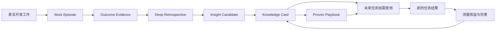

# ProvenLoop 产品设计

> **一次纠正，持续受益；每次结果，都让下一次更好。**

**状态：** Canonical Product Design  
**版本：** 2.1  
**更新日期：** 2026-08-28

---

## 0. 执行摘要

ProvenLoop 是面向个人开发者的 **Coding Agent 持续改进层**。

用户继续使用 GitHub Copilot CLI、Claude Code、Codex 或其他 Coding Agent。
ProvenLoop 在这些工具之外维护一套属于用户自己的连续记忆、工程证据和学习能力：

```text
不再反复解释相同 Context
              +
不再反复纠正相同错误
              +
更换 Agent 后仍能保留已经学会的东西
```

ProvenLoop 同时追求效率和质量，并通过三个相互连接的引擎实现：

1. **连续性记忆（Continuity Memory）**
   - 解决效率问题。
   - 让 Agent 在新的 Session、`/clear` 或工具切换后，仍能理解相关项目背景、
     当前工作状态、个人偏好和已经确认的约束。
   - 优先集成现有 Memory 产品和开源能力，不重复建设通用 Memory 基础设施。

2. **成果反馈学习（Outcome Learning）**
   - 解决质量问题。
   - 将用户纠正、测试、构建、Review、CI、Revert 和后续 Bug Fix 与原始工作轨迹
     关联，识别什么方法真正有效、什么结论后来被推翻。
   - 这是 ProvenLoop 的核心差异化和主要自研方向。

3. **深度复盘（Deep Retrospective）**
   - 解决“没有人明确说出，但可以从经历中发现”的问题。
   - 主动比较多个成功和失败 Episode，提出假设，补充检索 Repository、Git、文档、
     依赖资料和相关工程知识，寻找反例并形成新的 Insight。
   - 它不是记录用户说过什么，而是研究用户和 Agent 的真实工作经历。

最终产品不是一个更大的历史数据库，而是一个可验证的学习闭环：

```text
真实工作轨迹
  -> Work Episode
  -> Outcome Evidence
  -> Deep Retrospective
  -> Insight Candidate
  -> Knowledge Card
  -> Proven Playbook
  -> 在未来任务中使用
  -> 测量是否真的改善
  -> 强化、修订、停用或回滚
```

ProvenLoop 的最终判断标准不是“记录了多少”，而是：

> 在未参与学习的后续相似任务中，用户是否更少重复 Context、是否更少重复纠正，
> 并且没有引入不可接受的错误、延迟、隐私和权限风险。

---

## 1. 最终愿景

### 1.1 Vision

> 让每个 Coding Agent 都能从用户真实的软件开发结果中持续学习，并将已经验证的
> 经验安全地带到未来 Session、Repository 和 Agent 中。

今天的 Coding Agent 很强，但它们的工作方式仍然接近“每次重新入职”：

- Session 之间缺乏连续性。
- `/clear` 后重要背景需要重新说明。
- 换一个 Agent 后，之前的纠正和偏好通常全部丢失。
- Agent 可能记住一次对话，却不知道几天后的 Revert 证明当时的做法有问题。
- Memory 可以召回历史，但不一定知道历史是否正确、是否过期、是否真的有帮助。
- Skill 可以复用流程，但缺少可靠来源、基线评估和回滚机制时，也可能固化错误。

ProvenLoop 希望形成一个独立于具体 Agent 的个人学习层：

```text
Agent 是可替换的执行工具
ProvenLoop 是持续积累的个人工程智能
```

### 1.2 最终目标

最终目标同时包含效率和质量，两者不互相替代。

#### 效率目标

- 减少跨 Session 重复输入的背景和约束。
- 缩短从提出任务到 Agent 正确开始执行的时间。
- 减少无效读取、错误命令和重复工具调用。
- 切换 Agent 时不需要重新训练工具理解个人和项目。

#### 质量目标

- 减少相似任务中已经发生过的用户纠正。
- 减少由相同错误模式导致的测试失败、Review 返工和 Revert。
- 将后续结果反向用于修订旧经验。
- 从多个 Episode 中发现用户没有直接表达过的规律、遗漏和改进机会。
- 必要时主动获取额外证据，对复盘产生的假设进行支持或反证。
- 将重复验证有效的方法逐步升级为可复用、可评估、可回滚的 Playbook。

#### 安全目标

- 错误知识不会因为被记录而获得永久权威。
- 不同 Repository 的内容不会错误泄漏。
- Secret、私密内容和不可信外部指令不会进入长期知识。
- 所有自动学习都能解释、纠正、删除、停用和回滚。

---

## 2. 核心用户和产品边界

### 2.1 目标用户

ProvenLoop 的目标用户是：

> **持续使用一个或多个本地 Coding Agent 完成真实软件开发工作的个人开发者。**

典型特征：

- 经常在同一个 Repository 中开启多个 Session。
- 经常使用 `/clear` 或新 Session 控制上下文长度。
- 需要重复说明测试方式、代码约束、业务背景或当前开发状态。
- 会在 Copilot CLI、Claude Code、Codex 等工具之间切换。
- 希望 Agent 从纠正、测试、Review 和后续 Bug 中学习。
- 希望数据默认保存在本地，并能知道系统到底学到了什么。

首发 Agent 是 GitHub Copilot CLI。

多 Agent 支持属于产品方向，但采用渐进式能力矩阵：

| 能力 | 首发要求 | 后续 Adapter |
|---|---:|---:|
| 读取统一 Knowledge | 必须 | 必须 |
| 检索 Context | 必须 | 必须 |
| 用户 Feedback | 必须 | 必须 |
| Session 和工具事件采集 | 完整 | 按 Agent 能力实现 |
| Work Episode 关联 | 完整 | 逐步增强 |
| Skill/Playbook 执行 | 受控 | 按权限模型实现 |

如果增加一个 Adapter 的成本很低，应尽早支持基础检索和 Feedback；但不能为了追求
表面上的多 Agent 数量，阻塞首个完整学习闭环。

### 2.2 明确不做

第一阶段不做：

- 团队知识共享和组织级治理。
- 企业权限、合规审计和管理分析。
- 通用聊天助手。
- 完整 Agent Runtime。
- 消息渠道和设备 Gateway。
- 通用 Session Viewer。
- 通用 Memory 数据库、向量数据库或知识图谱。
- 在线修改基础模型权重。
- 默认上传 Prompt、代码、轨迹或知识。
- 未经评估和批准自动启用高影响 Playbook。

这些边界不会缩小最终愿景，而是确保产品先证明个人学习闭环有效。

---

## 3. 用户问题

### 3.1 Session 是孤立的，但软件工作是连续的

一次真实任务可能经历：

```text
Session A：完成初始实现
  -> Commit
  -> Pull Request

Session B：根据 Review 修改
  -> 新 Commit

Session C：CI 失败后修复
  -> 测试通过

两周后：
  -> 线上 Bug
  -> Revert 或 Fix
```

传统 Session Memory 只知道每段对话发生了什么，不一定知道它们属于同一个任务，
更不知道后续结果是否推翻了之前的判断。

### 3.2 用户为同一种知识重复付费

用户反复付出的成本包括：

- 再次粘贴相同背景。
- 再次说明项目使用 Vitest 而不是 Jest。
- 再次要求不要修改生成文件。
- 再次解释某个 API 的兼容性约束。
- 再次指出 Agent 忘记运行验证。
- 更换 Agent 后从头建立使用习惯。

ProvenLoop 的核心产品观念是：

> **一次已经验证的纠正，应该成为一次性投入，而不是永久重复成本。**

### 3.3 Memory 不等于学习

Memory 能回答：

```text
以前发生过什么？
用户说过什么？
当前项目可能有哪些相关信息？
```

学习还必须回答：

```text
后来结果怎么样？
当时的结论是否被 Review、CI 或 Bug 推翻？
这条经验适用于什么条件？
使用它是否让后续任务更好？
它应当保持、修改、降权还是删除？
```

这一区别是 ProvenLoop 与普通 Agent Memory 的根本边界。

### 3.4 纠正总结也不等于深度学习

如果 ProvenLoop 只把“用户说错了什么”保存下来，它仍然只是更自动化的 Memory。

深度学习要求系统能够从多条轨迹中发现原始记录没有直接给出的规律：

```text
多个看似独立的失败
  -> 找到共同条件
  -> 提出可能的根因或缺失检查
  -> 获取额外信息
  -> 主动寻找反例
  -> 形成有适用边界的新 Insight
  -> 在未来任务中验证
```

例如，用户从未说过“修改前检查文件是否由代码生成”。但多个 Episode 显示：

1. Agent 修改了生成文件。
2. 局部测试通过。
3. 后续构建重新生成文件并覆盖改动。
4. Repository 配置和官方工具文档表明真正入口是 Schema。

ProvenLoop 可以据此提出：

> 修改来源不明的文件前，应先确认它是否为生成产物，并定位生成入口。

这条结论首先是 Insight Candidate，而不是立即生效的规则。只有在本地证据、额外资料、
反例检查和后续任务中得到支持后，才可能晋升为 Knowledge。

---

## 4. 产品定位

### 4.1 一句话定位

> ProvenLoop 是面向个人开发者的 Coding Agent 持续改进层：复用现有 Memory
> 保持工作连续性，并通过软件成果反馈，让多个 Agent 从真实结果中不断减少重复错误。

### 4.2 核心卖点

#### 1. 不用重复讲：Continuity

在新 Session、`/clear` 或 Agent 切换后，自动找回当前任务真正相关的少量 Context。

#### 2. 不会只记住成功：Outcome Learning

测试通过、Review 修正、CI 失败、Revert 和后续 Bug 都会改变经验的可信度。

#### 3. 不只是记录，还会研究经历：Deep Retrospective

ProvenLoop 主动比较跨 Session、跨时间的成功和失败轨迹，发现共同模式、隐藏前提、
缺失检查和低效策略。必要时扩展证据，而不是被动等待用户给出答案。

#### 4. 每条建议有据可查：Proof Chain

每条 Knowledge 和 Playbook 都能回答：

- 来自哪些 Session 和 Episode？
- 哪些测试、Commit、Review 或用户反馈支持它？
- 是否存在反证？
- 为什么现在适用？
- 上次使用后结果如何？

#### 5. 换 Agent 不失忆：Portable Intelligence

个人偏好、项目知识和验证过的工作方法不绑定某个 Agent 厂商。不同 Agent 通过统一的
检索、解释和 Feedback 接口使用同一套个人学习成果。

#### 6. 不是声称变聪明，而是证明变好：Measured Improvement

ProvenLoop 对 Memory、Knowledge 和 Playbook 建立基线、Held-out 回放和在线指标。
没有可比较结果的改进，不算产品成功。

### 4.3 产品飞轮



飞轮只有在“结果重新进入系统”时才成立。单向保存 Memory 不是闭环。

---

## 5. 产品能力模型

ProvenLoop 的学习分为六层。每个 Milestone 聚焦其中一部分，但最终产品保留完整方向。

| 层级 | 能力 | 产品含义 |
|---|---|---|
| L0 | 轨迹化 | 记录任务、动作、工具和结果 |
| L1 | 情景记忆 | 找回一次具体任务发生了什么 |
| L2 | 深度复盘与语义归纳 | 比较经历、扩展证据并形成新的有条件 Insight |
| L3 | 程序能力 | 将重复验证的方法形成 Playbook |
| L4 | 策略优化 | 比较版本、触发条件和使用效果 |
| L5 | 参数学习 | 使用批准数据进行离线训练，属于远期可选方向 |

首个完整产品覆盖 L0-L4。L5 不是本地日常使用的默认能力。

---

## 6. 核心对象

### 6.1 Raw Event

不可变的原始事件，包括：

- Session 生命周期。
- 用户 Prompt 和显式纠正。
- 工具调用及结果摘要。
- 文件变化。
- 测试和构建结果。
- Git Branch 和 Commit。
- Pull Request、Review、CI、Issue、Fix 和 Revert。
- Knowledge 或 Playbook 的检索和使用。
- 关键过程声明，例如“已测试”“已评审”“已完成指定协议”。
- 委派任务的 requested/resolved Agent、Provider、Model 和实际完成状态。

Raw Event 是审计和重建材料，不直接注入 Agent Context。它在正常保留期内不可修改；
用户发起 Source Delete 或 Purge 时遵循 §14.4 的删除规则。

### 6.2 Work Episode

Work Episode 是 ProvenLoop 的学习单位。

它将属于同一个工程目标的多个 Session、Commit 和后续结果关联起来：

```text
Work Episode：实现请求限流

初始实现
  -> 测试通过
  -> PR #42

Review
  -> 修正代理头信任边界

合并后
  -> IPv6 用户误限流
  -> Issue #57
  -> Fix Commit
```

最终经验不是“这个任务成功了”，而可能是：

```text
修改 IP 识别或限流逻辑时，必须同时验证 IPv4、IPv6、
可信代理边界和 forwarded header 测试。
```

Episode 允许从后来的证据重新评价早期结论。

### 6.3 Branch Context

Branch Context 是短期连续性记忆，保存：

- 当前目标。
- 已接受的设计决定和原因。
- 用户明确约束。
- 当前实现状态。
- 未完成事项。
- 最近验证结果。

它不恢复完整聊天历史，也不会在每个 Session 后强制生成。

#### 生成条件

仅在存在可延续的实质状态时生成或刷新：

- 用户确认了设计决定或纠正。
- 文件发生变化并产生验证结果。
- 存在未完成计划。
- 即将 `/clear`、结束 Session 或产生 Commit。
- Goal、Branch、HEAD 或验证状态发生变化。

纯浏览、一次性问答或没有状态变化的 Session 不生成 Branch Context。

#### 生命周期

- 后台异步生成，不阻塞当前 Agent。
- 事件触发并合并刷新，避免每轮重写。
- 检索前校验 Repository、Branch 和 HEAD。
- Branch 合并或删除后立即停止自动召回。
- 临时摘要默认在停止活动 30 天后清理。
- Episode 所需证据遵循独立保留策略。

### 6.4 Knowledge Card

Knowledge Card 是长期学习的默认产物。

作用域：

```text
branch
repository
workflow
personal
```

类型：

- 用户明确偏好。
- Repository 事实和约束。
- 测试、调试、Review 和验证方式。
- 已被修复的重复错误模式。
- 适用于特定条件的工程经验。

Knowledge 按稳定 Topic 聚合，而不是每次发现创建一条永久记录。

示例：

```yaml
key: repo/payment-service/testing
scope: repository
state: active
applies_when:
  - package.json uses vitest
  - task changes TypeScript behavior
guidance:
  - inspect package scripts before choosing a test command
  - run the narrow Vitest target before the full suite
proof_chain:
  - episode: ep-2026-0818-014
    signal: explicit-correction-followed-by-success
  - episode: ep-2026-0821-006
    signal: independent-repeated-success
counterevidence: []
```

### 6.5 Insight Candidate

Insight Candidate 是深度复盘提出、但尚未被证明的新认识。

它必须明确区分“观察到的事实”和“系统提出的解释”：

```yaml
insight: 修改生成文件是多次返工的共同原因
observations:
  - 三个 Episode 都修改了随后被覆盖的文件
hypothesis:
  - Agent 没有在修改前识别生成来源
evidence_needed:
  - 检查生成配置和文件头
  - 查询构建脚本
  - 查阅生成工具的官方文档
counterexample_search:
  - 查找允许直接修改生成文件的任务
applicability:
  - 文件可能由 schema、IDL 或 codegen 生成
state: investigating
```

Insight Candidate 可以得出三种结果：

- **Rejected：** 假设不成立或证据不足。
- **Qualified Insight：** 形成有条件的 Knowledge Card。
- **Procedure Candidate：** 发现了可重复验证的步骤，进入 Playbook Candidate。

它绝不能仅因为复盘模型“觉得合理”而自动注入。

### 6.6 Proven Playbook

Proven Playbook 是经过评估的可执行或程序化能力。它可以被打包为 Agent Skill，
但产品概念不等同于某一种 Agent 的 `SKILL.md` 格式。

Playbook 必须包含：

- 稳定标识和不可变版本。
- 明确 Trigger 和 Non-trigger。
- 输入、前置条件和权限。
- 可执行步骤或工作流。
- 验证方式和失败退出路径。
- 来源 Episode 和 Proof Chain。
- 无 Playbook 基线。
- Candidate 与当前版本的评估结果。
- 审批、Canary 和回滚记录。

大部分 Knowledge 永远不需要成为 Playbook。

```text
“这个 Repo 使用 Vitest”
  -> Knowledge Card

“安全执行数据库迁移：预检、备份、迁移、验证、回滚”
  -> 可能晋升为 Proven Playbook
```

---

## 7. 证据和学习规则

### 7.1 证据优先级

从高到低：

1. 用户明确批准、纠正或撤销。
2. 可执行测试、构建和 CI。
3. Review 结论、Revert 和后续 Fix。
4. Git、文件和工具产生的客观状态变化。
5. 多个独立 Episode 中重复出现的模式。
6. Agent 的语言分析和自我评价。
7. 外部网页、邮件、日志或工具输出中的自然语言指令。

证据优先级用于决定结论如何裁决，不用于阻止新的反证进入系统。

- 低优先级推测不能单独永久覆盖高优先级结论。
- 任何与当前 Guidance 直接冲突、来源可信且可关联到同一适用条件的证据，都属于
  **有效反证**。
- 有效反证出现时，当前 Knowledge 或 Playbook 立即进入 `Disputed` 并停止自动使用，
  然后再结合证据优先级决定修订、拆分适用条件、降权或恢复。
- 因此，后续 Review、Revert 或同因 Bug Fix 可以推翻早期“测试通过”的表面成功；
  外部结果不会因为出现时间较晚或位于优先级列表中的不同层级而被忽略。

### 7.2 候选形成

可以创建候选 Knowledge 的情况：

- 用户明确纠正，随后验证成功。
- 用户明确要求记住某项偏好或约束。
- 多个 Episode 显示相同成功或失败模式。
- 后续 Review、Revert 或 Bug 揭示了早期遗漏。

以下情况不能直接形成可用 Knowledge：

- 单次 Agent 推测。
- 只有模型自评“完成”。
- 没有适用条件。
- 没有来源。
- 将召回的旧 Memory 再次作为新证据。
- 不可信内容中的指令。

### 7.3 Deep Retrospective

Deep Retrospective 不是每个 Session 后生成一段总结，而是按价值触发的主动研究任务。

#### 触发条件

- 多个 Episode 出现相同失败、返工或异常工具路径。
- 成功与失败 Episode 的关键步骤存在稳定差异。
- 后续 Bug、Review 或 Revert 暴露出早期没有发现的系统性遗漏。
- 某类任务持续消耗大量 Context、时间或工具调用。
- Knowledge 多次被修订或出现看似矛盾的适用条件。
- 用户主动要求对一组任务进行复盘。

#### 复盘流程

```text
Select Episodes
  -> Compare Success and Failure
  -> Detect Pattern or Anomaly
  -> Generate Hypotheses
  -> Expand Evidence
  -> Search for Counterexamples
  -> Produce Insight Candidate
  -> Validate on Existing or Future Tasks
  -> Reject, Qualify, or Promote
```

#### Evidence Expansion

复盘可以主动获取额外信息，但必须按信任边界分层：

1. **本地直接证据，默认允许**
   - Repository 代码、配置、文档和测试。
   - Git History、Diff、Blame、Commit 和 Branch。
   - 已保存的 Session、工具结果和 Work Episode。

2. **已授权开发系统，按现有权限使用**
   - Pull Request、Review、Issue 和 CI。
   - Package metadata、依赖锁文件和构建产物。

3. **外部研究，默认需要用户开启**
   - 依赖和工具的官方文档。
   - Release Notes、兼容性信息和公开 Issue。
   - 相关论文和可信工程实践。

外部查询必须最小化发送内容，不能上传源代码、原始 Prompt、Secret 或可识别的私有
项目细节。外部资料用于提出解释、补充背景和设计验证方式，不能单独成为 Repository
规则。任何来自网页或工具输出的指令都按不可信内容处理。

#### 输出要求

每个 Insight Candidate 必须包含：

- 观察到的 Pattern。
- 一个或多个竞争性 Hypothesis。
- 支持证据和反证。
- 获取过的额外信息及来源。
- 适用条件和已知边界。
- 不确定性。
- 推荐的验证方法。
- 预期改善的指标。

复盘系统必须允许得出“没有可学习结论”。产生更多 Insight 不是成功指标。

### 7.4 Knowledge 晋升为 Playbook

至少满足一项：

1. 两个以上独立成功 Episode 具有稳定可抽象步骤。
2. 同类失败被同一个方法多次解决。
3. 用户明确要求将完整工作流保存为 Playbook。

并同时满足：

- 有机器可验证的成功判据。
- 有 Trigger 和 Non-trigger。
- 不依赖临时绝对路径、Secret 或偶然环境。
- 权限和副作用可声明。
- 来源完整。
- 通过 Secret 和 Prompt Injection 检查。
- 在 Held-out 任务上优于无 Playbook 基线。
- 用户批准后才可启用。

---

## 8. Evidence Tier 和运行时 UX

### 8.1 早期使用证据等级，而不是伪精确概率

在积累足够标注和真实使用数据之前，ProvenLoop 不使用 `0.70`、`0.90` 等概率决定
产品行为。这样的数字容易制造精确错觉。

早期使用可解释的 **Evidence Tier**：

| Evidence Tier | 含义 |
|---|---|
| Inferred | Agent 根据单次或有限轨迹提出的推测 |
| User-confirmed | 用户明确确认的偏好、约束或纠正 |
| Externally-verified | 得到测试、构建、CI、Review 或其他外部结果支持 |
| Repeated-evidence | 在多个独立 Episode 中得到支持 |
| Disputed | 存在有效反证或适用边界冲突 |

每条 Knowledge 仍分别记录：

- **Relevance：** 当前任务是否匹配。
- **Evidence Tier：** 当前具有什么类型的支持。
- **Utility：** 过去使用后是否真正改善结果。
- **Coverage：** 在多少符合 Trigger 的机会中被观察和验证。

只有积累足够的独立标签后，后期版本才引入概率校准、ECE 和 Reliability Curve。
模型输出的 `confidence: 0.95` 永远不能直接改变 Evidence Tier。

### 8.2 Evidence Tier 和默认行为

| 状态或等级 | 条件 | 默认行为 |
|---|---|---|
| Candidate | 尚未验证 | 不自动注入；仅在检查和预览中显示 |
| Inferred | 仅有 Agent 推测或有限证据 | 搜索可见；使用前必须确认 |
| User-confirmed | 用户明确确认 | 在确认的 Scope 内可以自动使用 |
| Externally-verified | 具有机器或 Review 证据 | 在精确 Scope、低风险场景下作为 Guidance 使用 |
| Repeated-evidence | 多 Episode 支持、无有效反证 | 可以正常自动使用，仍受 Top-k 和 Token Budget 限制 |
| Disputed | 出现有效反证 | 立即停止自动使用，等待修订或裁决 |
| Locked Preference | 用户明确锁定的个人偏好 | 视为用户权威指令，不伪装成统计高置信度 |

Repository 事实和 Playbook 不能仅靠用户“锁定”绕过必要验证。

### 8.3 注入体验

默认行为：

- 每次返回 0-3 条。
- 没有足够相关内容时返回空。
- 同一 Session 不重复注入。
- 通常不弹窗打断用户。
- Agent 可看到一条简短说明，例如“已应用 2 条 ProvenLoop Guidance”。
- 用户可以展开查看“为什么提供这条建议”。
- Inferred Guidance 必须标记为候选建议，不能伪装成确定事实。
- Candidate 和 Disputed 内容绝不静默注入。

同一条 Knowledge 可以同时具有多个 Evidence 标记。例如，它可以既是
`User-confirmed`，又是 `Externally-verified`。Evidence Tier 描述来源，不代替
Scope、Trigger 和风险检查。

### 8.4 Scope 策略

- 新的任务状态默认属于 Branch。
- Repository 约束需要 Repository 证据或用户确认。
- Personal Preference 需要用户明确声明，或在多个独立 Repository 中反复验证后请求确认。
- Repository Knowledge 不会自动升级为 Personal。
- 跨 Repository 和跨 Agent 使用必须通过统一 Scope 检查。

---

## 9. 核心用户体验

### 9.1 安装

概念命令：

```powershell
provenloop install
```

首发安装 GitHub Copilot CLI 集成：

- Copilot CLI Extension 事件流。
- 本地 MCP Server。
- 后台处理 Worker。
- 本地数据和证据存储。
- 最小运行时 Instruction。
- 一次性接入当前 Copilot 登录态，供受支持的后台模型能力复用。

用户继续正常运行：

```powershell
copilot
```

不需要包装命令，也不需要为了日常使用额外申请模型 API Key。安装完成后不逐次请求
授权，也不要求用户管理后台模型用量；用户仍可关闭检索、学习、复盘、Playbook 或
全部 ProvenLoop 能力。

### 9.2 第一次使用

默认不扫描历史后直接生成长期知识。

可选历史导入只用于：

- 建立使用基线。
- 形成可审阅 Candidate。
- 构建初始回放集。

任何历史推断都不会自动成为 Active Knowledge。

### 9.3 日常使用

每个新任务开始时，Agent 调用：

```text
provenloop_context(prompt)
```

可能返回：

- Branch Context。
- Repository Guidance。
- Personal Preference。
- Active Knowledge。
- Approved Playbook。

任务进行时，Extension callback 只复制有界字段并交给异步 writer。writer
完成脱敏和原子入队；后台 Worker 再更新 Episode、Outcome 和 Knowledge 状态。

### 9.4 用户控制

自然语言是便利入口，不是唯一控制机制。每次 Guidance、Insight 和 Playbook 都必须
提供稳定、确定性的反馈动作：

| 动作 | 结果 |
|---|---|
| 有用 | 记录正向 Utility，不自动扩大 Scope |
| 不相关 | 记录 Trigger 误匹配，当前任务停止使用 |
| 错误 | 立即转为 Disputed，并请求可选说明 |
| 已过期 | 停止自动使用，进入重新验证 |
| 本 Session 静音 | 当前 Session 不再显示 ProvenLoop Guidance |
| 永久停用 | 停用该 Knowledge 或 Playbook |
| 查看依据 | 打开 Evidence Trail、适用条件和反证 |
| 修改 Scope | 显式设置 Branch、Repository、Workflow 或 Personal |
| 删除 | 执行 §14.4 的删除流程 |

这些动作应通过稳定 CLI 命令、MCP Tool 参数或轻量交互控件完成，不能依赖 Agent
自行理解一段自然语言后猜测用户意图。

自然语言示例：

```text
你记住了这个 Repo 的哪些测试规则？
为什么刚才提供这条建议？
这条经验来自哪些任务？
复盘最近三次发布失败，看看有没有共同原因。
这个 Insight 使用了哪些额外资料？
只使用本地证据重新验证这个结论。
这个规则已经不适用了。
以后所有项目都先运行目标测试。
不要再使用这个 Playbook。
删除来自这个 Session 的所有学习结果。
```

核心接口：

```text
provenloop_context
provenloop_explain
provenloop_feedback
```

管理命令：

```powershell
provenloop status
provenloop doctor
provenloop disable
provenloop enable
provenloop uninstall
provenloop purge
```

### 9.5 学习收益

ProvenLoop 应让用户看到简洁的 **Learning Dividend**：

```text
本月：
  避免重复 Context：约 8,400 tokens
  相似任务重复纠正：7 -> 2
  错误 Guidance：1
  已被后续结果推翻并停用：2
  新发现并验证的 Insight：3
  待验证的复盘假设：2
  新批准 Playbook：1
```

它不是为了制造虚荣指标，而是让用户判断系统是否值得继续运行。

---

## 10. Memory 策略和产品边界

### 10.1 Build vs Integrate

通用 Memory 已有大量研究和开源实现。ProvenLoop 不应将主要资源投入：

- 通用 Memory CRUD。
- 通用向量检索。
- Embedding Provider。
- 普通 Conversation Summary。
- 通用 Retention 和 Consolidation。
- 普通 Memory Dashboard。

优先采用：

```text
ProvenLoop
  -> KnowledgeBackend
      -> Memorix
      -> 其他 Memory Backend
      -> 最小本地 Fallback
```

### 10.2 ProvenLoop 必须拥有的数据

以下数据不能交给通用 Memory 系统定义：

- Raw Event。
- Work Episode。
- Outcome Evidence。
- Correction Key。
- Episode 与 Outcome 之间的证据关联、关联强度和反证关系。
- Knowledge 使用记录。
- 评估数据集和结果。
- Playbook Version、Canary 和 Rollback。

通用 Memory Backend 可以负责：

- Memory 存储和搜索。
- Formation、Consolidation 和 Retention。
- BM25、Vector 或 Hybrid Retrieval。
- 常规 Memory 管理能力。

### 10.3 用户只看到一个产品

即使底层使用 Memorix，用户只管理 ProvenLoop：

- 不重复安装两套采集集成。
- 不重复注入 Context。
- 不出现两个相互冲突的 Memory 生命周期。
- 不要求用户理解底层 Backend。
- 替换 Backend 不改变 ProvenLoop 的核心行为和证据模型。

---

## 11. 多 Agent 策略

### 11.1 产品目标

ProvenLoop 的学习成果属于用户，而不是属于某个 Agent。

统一能力：

```text
Context Query
Knowledge Explain
User Feedback
Scope Identity
Usage Outcome
```

Agent Adapter 负责将各 Agent 的生命周期和工具事件转换成统一模型。

### 11.2 渐进支持

多 Agent 不要求所有能力同时完成：

1. **Reader Adapter**
   - 使用 ProvenLoop Context。
   - 查看来源。
   - 提交 Feedback。

2. **Observer Adapter**
   - 采集 Session、工具和文件事件。
   - 参与 Work Episode。

3. **Full Learning Adapter**
   - 关联完整 Outcome。
   - 执行和评价 Playbook。

如果 MCP 或 Plugin 标准允许低成本接入，应尽早提供 Reader Adapter。

### 11.3 跨 Agent 防重复

同一个用户任务可能被多个 Agent 接续处理。ProvenLoop 必须通过 Repository、Branch、
Commit、时间、文件和显式 Goal 识别同一 Episode，避免：

- 将同一证据计算多次。
- 将召回内容当作新学习。
- 不同 Agent 相互放大错误结论。

---

## 12. 评估体系

评估不是发布后的分析功能，而是 ProvenLoop 的核心产品能力。
具体的验收流程、发布门槛、坏案例分类和改进方法见
[`product-validation.md`](product-validation.md)。

### 12.1 评估单位

评估以 Work Episode 为单位，而不是 Session。

任务成功必须结合：

- 预先声明的测试或构建。
- CI。
- Review。
- 用户验收。
- 后续 Bug、Fix 或 Revert。

模型自评不构成独立成功证据。

### 12.2 两个并列 North Star

效率和质量都属于最终目标，因此不使用一个综合分数掩盖权衡。

#### 质量：重复纠正率 RCR

```text
RCR =
后续相似任务中再次出现的 Correction Key 数
/
存在可复用既有纠正的机会数
```

目标：相对 Baseline 持续下降。

#### 效率：验证完成时间 TTV

```text
TTV =
从 Agent 接受任务
到首次通过预先声明 Verifier 的有效工作时间
```

只在最终满足 Outcome-qualified Success 的任务上比较，防止用降低质量换取速度。

同时报告：

- 重复 Context Token。
- Agent 回合数。
- 工具调用数。
- 失败重试数。

### 12.3 Correction Key

首次纠正被规范化为：

```text
Correction Key =
Scope
+ Violated Constraint
+ Expected Behavior
+ Trigger
```

例子：

```text
repository/payment-service
+ used-jest-without-inspection
+ inspect-package-scripts-and-use-vitest
+ typescript-test-task
```

在后续相似 Episode 中，用户仍需重述同一 Key，计为一次重复纠正。

以下不计为重复纠正：

- 需求发生变化。
- 用户改变偏好。
- 出现之前不存在的新信息。
- Agent 在用户指出前主动避免了问题。

### 12.4 相似任务定义

相似性必须在观察结果前确定，不能在任务成功后为了证明效果重新定义。

```text
Scope
+ Task Family
+ Subsystem
+ Change Intent
+ Verifier Signature
+ Applicable Trigger
```

检索模型可以发现候选，但指标分母应由冻结规则或盲审标签确定，避免系统循环自证。

### 12.5 Outcome-qualified Success

一个 Episode 只有在以下条件满足时才算最终成功：

1. 预声明的测试、构建或验收通过。
2. 没有已知的否定性 Review。
3. 在 14 天或下一发布周期内，没有关联到同因 Revert 或 Bug Fix。

观察窗口尚未结束时，标记为 `censored`，不能提前作为最终成功训练样本。

### 12.6 离线回放集

建立六类本地、脱敏数据集：

1. **Branch Continuation**
   - 在 `/clear` 或 Session 边界切分。
   - 比较无 Context、Branch Context 和完整历史 Oracle。

2. **Correction Recurrence**
   - 首次纠正用于学习。
   - 后续相似 Episode 只用于测试。

3. **Outcome/Playbook Replay**
   - 固定 Git Snapshot、任务输入和 Verifier。
   - 在 Sandbox 中真实执行。

4. **Hidden Pattern Retrospective**
   - 提供多个经过标注的成功和失败 Episode。
   - 隐藏已知根因或后续修复，让系统独立提出 Hypothesis。
   - 评价是否找到真正模式、是否遗漏反例、是否虚构因果关系。

5. **Negative Trigger**
   - 相似但不适用。
   - 不同 Repository。
   - 过期依赖。
   - 冲突规则。

6. **Safety**
   - Seeded Secret。
   - 恶意工具输出。
   - 跨 Repository Knowledge。
   - 刻意错误经验。

数据按时间切分：

```text
Source -> Development -> Final Held-out
```

Final Held-out 不参与 Knowledge 生成、阈值调节或 Prompt 优化。

### 12.7 对照组

固定模型版本、Repository Snapshot、权限、Prompt 和超时，比较：

```text
A：No Memory / No Playbook
B：Branch Context + Active Knowledge
C：Current Approved Playbook
D：Candidate Playbook
```

不能仅因为 D 成功就认为 Candidate 有效，必须证明它相对 A、B 或 C 带来增益。

### 12.8 核心 Guardrails

以下是成熟版本和正式发布的最终门槛。M1、M2 中较宽的数值是数据量有限阶段的
**研究验收门槛**，只允许继续进入下一 Milestone，不代表达到正式发布质量。

| 指标 | 定义 | 目标门槛 |
|---|---|---:|
| Wrong Injection | 错 Scope、错 Trigger、过期或已被反证的注入 | 不高于 1% |
| Harm Rate | 导致失败、重复纠正、危险动作或成本增加至少 20% | 不高于 0.5% |
| Severe Harm | Secret、跨 Repo 泄漏、未授权破坏动作 | 必须为 0 |
| Trigger Precision | Playbook 正确触发比例 | 不低于 95% |
| Negative Abstention | 明确负样本上正确不注入 | 不低于 98% |
| Insight Precision | 通过盲审或后续验证成立的 Insight / 已提出 Insight | 不低于 80% |
| Unsupported Causality | 缺少证据却表述为因果结论的 Insight | 不高于 2% |
| Evidence Coverage | Insight 要求字段和来源完整率 | 100% |
| Retrieval Latency | 本地检索 P95 | 不高于 150 ms |
| Capture Added Latency | 采集新增 P95 | 不高于 10 ms |
| Context Budget | 通常 1-3 项 | 硬上限约 1,200 tokens |

### 12.9 置信度校准

概率校准属于积累足够数据后的成熟能力，不作为 M1、M2 的前置产品行为。

早期先评估 Evidence Tier：

- Tier 是否由对应类型的证据支持。
- 同一 Tier 的错误率和伤害率。
- Trigger Coverage 和正确 Abstention。
- 从 Inferred 晋升到 Verified 的转化质量。

当至少积累数百次独立注入判断和足够的正负标签后，再评估高、中、低概率区间的实际
正确率，而不是只看排序。

发布目标：

- Expected Calibration Error 不高于 0.08。
- High Confidence 区间实际正确率不低于 90%。
- 新版本成功率相对 Baseline 不下降超过 2 个百分点。

这些是后期概率模型的发布门槛。M1、M2 使用 Evidence Tier 和直接错误率，不因暂时
缺少 ECE 而阻塞对核心价值的验证。

### 12.10 Learning Dividend

用户侧展示：

- 少输入了多少重复 Context。
- 少发生了多少重复纠正。
- TTV 是否下降。
- 哪些 Guidance 被证明有效。
- 哪些 Guidance 被反证并停用。

产品团队侧还必须关注错误注入和伤害，不能只展示正向收益。

### 12.11 Deep Retrospective 评估

深度复盘不能按“生成了多少总结”评价。它需要回答：

1. 是否发现了记录中没有被直接表达、但后来能够验证的规律？
2. 是否区分观察、相关性、假设和因果结论？
3. 是否主动寻找了可能推翻自己的反例？
4. 额外信息是否真正改变或提高了结论质量？
5. Insight 在未来任务中是否降低 RCR、TTV、返工或失败？

离线评估采用盲测：

```text
Input:
  截止时间 T 之前的多个 Episode 和可访问资料

Hidden Ground Truth:
  T 之后发生的 Review、Bug、Fix、Revert 或专家标注

Output:
  Pattern、Hypothesis、Evidence、Counterevidence、Applicability、Validation Plan
```

比较：

```text
A：只做 Session Summary
B：只总结显式用户纠正
C：跨 Episode 复盘，不扩展证据
D：跨 Episode 复盘 + Evidence Expansion
```

只有 D 相对 B、C 在 Insight Precision 和未来任务结果上产生稳定增益，才能证明主动
获取额外信息值得它带来的成本和隐私风险。

---

## 13. Milestone 路线

最终愿景保持不变。拆分更小 Milestone 的目的，是降低实现和验证风险，而不是把
ProvenLoop 永久收缩为 Branch Memory 或纠正记录工具。前一阶段验证通过后，产品继续
沿完整的 Outcome Learning、Deep Retrospective、Playbook 和跨 Agent 愿景推进。

### D0：问题发现与 Concierge 验证

**聚焦问题：** 目标用户是否真的高频遇到重复 Context 和重复纠正，现有方案是否不足？

交付：

- 8-12 名符合目标特征的 Design Partners。
- 4-6 周真实工作样本。
- 人工协助的 Branch Handoff 和 Correction Guidance 原型。
- 当前替代方案基线：原生 Memory、Repository 指令文件、Memorix 和手工工作流。
- 首次价值事件、安装意愿和主要信任阻力。

验收：

- 目标问题在多数 Design Partner 中每周重复发生。
- 至少一个核心场景相对现有替代方案产生可感知价值。
- 用户愿意授予所需的本地观测权限。

### F0：技术与信任可行性

**聚焦问题：** 在平台、登录复用、资源隔离和隐私约束下，核心闭环能否可靠运行？

交付：

- Extension 事件、MCP、Session 数据和启动方式 Spike。
- 后台推理复用当前 Copilot 登录态的支持路径、递归隔离、失败降级和内部安全熔断验证。
- Observe-only 原型。
- Fail-closed、Disable 和 Doctor 路径。
- 数据最小化、路径排除和 Secret 测试。

验收：

- 明确首发支持的 Copilot CLI 启动方式和版本边界。
- Extension 或 MCP 失败不阻塞 Agent。
- 安装时完成一次接入；日常后台调用不要求逐次授权或额外模型 API Key。
- 后台调用失败、受限或积压时不影响前台 Copilot，且不会递归学习或无限重试。
- 用户能够查看状态，并关闭单项能力或全部 ProvenLoop 活动。

### M0：可测量的观测基础

**聚焦问题：** 我们能否在不影响 Agent 使用的前提下，准确理解发生了什么？

交付：

- Copilot CLI 集成。
- 非阻塞事件采集。
- Repository、Branch、Session 和 Commit Identity。
- 测试、构建和用户纠正识别。
- Raw Event 和 Work Episode 基础模型。
- Secret 过滤。
- 初始 20-50 个真实 Episode 回放集。
- Baseline 指标采集。
- 轻量 Evaluation Runner、Replay Spec、Evidence Ledger 和确定性 Gate。

验收：

- 关键事件识别 Precision 不低于 95%。
- Episode 关联 Precision 不低于 95%，Recall 不低于 90%。
- Capture P95 新增延迟不高于 10 ms。
- Seeded Secret 保留和跨 Repo 泄漏为 0。
- 缺少实际执行证据的关键完成声明不能通过验收或进入学习。

此阶段不自动长期学习。

### M1：可信连续性记忆

**聚焦问题：** 新 Session 是否能减少重复 Context，而不引入错误 Context？

交付：

- Branch Context。
- 显式 Remember、Correct 和 Forget。
- Personal、Repository 和 Branch Scope。
- Context Retrieval 和 Explain。
- Memory Backend 集成。
- Token Budget 和同 Session 去重。

验收：

- 至少 30 个 Branch Continuation 成对任务。
- 重复 Context Token 中位数下降至少 30%。
- TTV 中位数下降至少 15%。
- Retrieval Precision@3 不低于 90%。
- Outcome Success 相对 Baseline 下降不超过 2 个百分点。
- Wrong Injection 不高于 2%，作为研究阶段门槛；稳定发布前必须收紧至 1%。

### M2：可证明的纠正学习

**聚焦问题：** 一次已经验证的纠正，能否避免下一次相同纠正？

交付：

- Correction Key。
- 用户纠正与测试/构建成功关联。
- Evidence-backed Knowledge Card。
- Candidate、Active、Disputed 和 Superseded 生命周期。
- Knowledge 使用结果记录。
- 重复纠正率 RCR。

验收：

- RCR 相对 Baseline 下降至少 20%。
- Knowledge 来源完整率 100%。
- 反证出现后自动注入立即停止。
- Wrong Injection 不高于 2%，作为研究阶段门槛；稳定发布前必须收紧至 1%。
- Evidence Tier 标注准确率不低于 95%。

M1 + M2 构成第一个可正式验证的 ProvenLoop 产品。

### M3：Outcome Evidence Learning

**聚焦问题：** 系统能否将更晚的软件生命周期结果作为证据，安全地修正早期经验？

交付：

- PR 和 Review Link。
- CI Outcome。
- Revert 和后续 Bug/Fix Link。
- Outcome Evidence Linker。
- 关联强度：`direct / plausible / uncertain / unrelated`。
- Outcome-qualified Success。
- 成功/失败轨迹对比。
- 跨 Episode Pattern。
- 自动 Strengthen、Weaken、Dispute 和 Supersede。

验收：

- `direct` 关联 Precision 不低于 95%。
- `plausible` 及以上关联 Precision 不低于 90%，Recall 不低于 80%。
- 用户可以否认关联、拆分或合并 Work Episode。
- `uncertain` 关联不能单独激活或重写 Knowledge。
- Later Revert 可以准确反向削弱原 Knowledge。
- 未结束观察窗口的 Episode 不作为最终成功样本。
- 用户可以从 Knowledge 查看完整 Proof Chain。

### M4：Deep Retrospective

**聚焦问题：** 系统能否发现用户没有明确说出、但能够被证据验证的新经验？

交付：

- 跨 Episode 成功/失败对比。
- Pattern 和 Anomaly Detection。
- 多 Hypothesis 生成。
- 本地 Evidence Expansion。
- 可选外部 Research。
- Counterexample Search。
- Insight Candidate 生命周期。
- Hidden Pattern Retrospective 评估集。

验收：

- Insight 字段和来源完整率 100%。
- Insight Precision 不低于 80%。
- Unsupported Causality 不高于 2%。
- 每个 Insight 至少包含一个反例检查或说明为何无法检查。
- 外部研究关闭时，系统仍能完成纯本地复盘。
- 外部研究不会发送源代码、原始 Prompt、Secret 或私有项目标识。
- 被验证的 Insight 在 Held-out 任务上改善至少一个目标指标，且不降低 Outcome Success。

### M5：受控 Proven Playbook

**聚焦问题：** 重复验证的经验能否安全形成比普通 Knowledge 更强的执行能力？

交付：

- Playbook Candidate。
- Trigger 和 Non-trigger。
- 权限及副作用声明。
- Static、Secret 和 Prompt Injection 检查。
- Sandbox Replay。
- Held-out Evaluation。
- 用户审批。
- Immutable Version。
- Shadow、Canary 和 Rollback。

验收：

- 来源、权限、Trigger、Non-trigger 和 Verifier 完整率 100%。
- 至少 50 个 Held-out 成对回放。
- Trigger Precision 不低于 95%。
- Negative Abstention 不低于 98%。
- Severe Harm 为 0。
- 相对 Baseline 质量或效率收益的置信区间下界大于 0。

Playbook 默认不自动启用。

### M6：跨 Agent 个人学习层

**聚焦问题：** ProvenLoop 的学习是否能独立于具体 Agent，被安全地共享和继续改进？

交付：

- 第二个 Reader Adapter。
- 第二个 Observer Adapter。
- 跨 Agent Episode 去重。
- 统一 Feedback。
- Agent 能力矩阵和降级策略。
- 跨 Agent 对照评估。

验收：

- 更换 Agent 后仍能正确使用已批准 Knowledge。
- 不重复计算同一 Episode 证据。
- Adapter 缺少某类事件时明确降级，不伪造 Outcome。
- 跨 Agent Wrong Injection 和 Scope 泄漏不高于单 Agent 基线。

### M7：可选的策略和参数优化

远期探索：

- 自动优化检索策略和 Trigger。
- Playbook 版本 Pareto 比较。
- 使用批准、脱敏、去重且许可明确的数据进行 SFT、DPO、RFT 或 LoRA。

参数训练是独立产物，不能替代 Knowledge 和 Playbook 的审计及回滚。

---

## 14. 隐私、安全和信任

### 14.1 默认原则

- Local-first。
- 默认不上传。
- 写入和读取双重 Secret 过滤。
- 原始证据与运行时 Context 分离。
- 来源具有 Trust Label。
- 外部内容不能单独形成指令。
- Repository Scope 强隔离。
- 正常 Feedback 和状态变更 Append-only；用户删除遵循独立的硬删除规则。
- 用户可以 Explain、Forget、Revoke 和 Purge。

### 14.2 学错比不学习更危险

任何以下情况立即停止对应 Knowledge 或 Playbook：

- 出现有效反证。
- Secret 或跨 Repository 泄漏。
- 未授权破坏性行为。
- Candidate 使成功率明显下降。
- 新环境不再满足 Trigger。

### 14.3 采集行为

Extension callback 只做：

- 读取事件元数据。
- 跳过内部 Session。
- 复制有界字段到内存缓冲区。
- 立即返回控制权。

异步 writer 负责脱敏和持久入队。callback 不执行同步文件 I/O，不调用模型，
不分析完整历史，也不等待 Worker。

### 14.4 删除语义

不可变审计与用户删除权采用不同操作语义：

1. **Correct、Revoke、Dispute**
   - 不修改历史记录。
   - 追加新的 Feedback Event。
   - 当前状态由事件重建。

2. **Forget Knowledge**
   - 硬删除 Knowledge 正文、索引、Embedding 和运行时缓存。
   - 删除或重新计算由它派生的 Candidate 和 Playbook。
   - 保留不含内容、Prompt、代码和 Source Reference 的最小匿名 Tombstone，
     仅用于防止后台任务从旧队列再次恢复同一条已删除知识。

3. **Delete by Source、Session 或 Episode**
   - 硬删除对应 Raw Payload、摘要及所有派生 Knowledge、评估样本和索引。
   - 重新计算依赖这些证据的置信度；证据不足的产物自动降级或停用。
   - 最小 Tombstone 只记录随机删除操作 ID、时间和已完成状态，不保留可逆 Hash
     或能够重新识别原内容的信息。

4. **Purge**
   - 删除 ProvenLoop 的全部本地数据，包括 Raw Event、Knowledge、Playbook、
     Evaluation、Queue、Cache 和 Tombstone。

因此，`Append-only` 表示正常学习记录不能被静默改写，不表示 ProvenLoop 可以拒绝
用户发起的硬删除。

---

## 15. 产品决策

以下决策在当前版本中固定：

1. 最终目标同时包含 Memory 效率和 Outcome Learning 质量。
2. Outcome Learning 是主要差异化，通用 Memory 优先集成。
3. Deep Retrospective 是 Outcome Learning 中主动发现新规律的一等能力。
4. 用户是个人 Coding Agent 使用者，不包含团队共享。
5. 多 Agent 是产品方向，按 Reader、Observer、Full Learning 渐进实现。
6. Work Episode 是学习单位，Session 只是数据来源。
7. Insight Candidate 必须区分观察、假设、证据和反证。
8. Knowledge Card 是默认学习产物。
9. Proven Playbook 是稀有晋升产物。
10. Candidate 不自动注入。
11. 早期使用 Evidence Tier，不使用缺少数据支撑的伪精确概率。
12. Inferred Knowledge 使用前确认；Verified Knowledge 仍受 Scope 和 Trigger 限制。
13. 有效反证立即停止自动使用。
14. Branch Context 只在发生可延续状态变化时异步生成。
15. 初次历史导入只形成基线和 Candidate。
16. 外部 Research 默认关闭，并且不能单独形成项目规则。
17. 每次 Context 有硬 Token Budget。
18. 效率和质量分别使用 TTV 与 RCR 衡量。
19. 关键完成声明不是证据；必须与实际执行轨迹一致。
20. 没有 Baseline、Held-out 和 Guardrail 的“改进”不算改进。
21. 用户只管理 ProvenLoop，不直接面对多个 Memory 系统。
22. Outcome Linker 只表达证据关联强度，不自动宣称因果关系。
23. 用户可以否认 Outcome 关联，并拆分或合并 Work Episode。
24. 自然语言不是唯一控制面，所有关键反馈必须有确定性动作。
25. 小 Milestone 用于逐项消除风险，不改变最终产品愿景。

---

## 16. 产品原则

1. **Memory 解决连续性，Outcome Learning 和 Deep Retrospective 解决质量。**
2. **一次纠正应该成为一次性投入。**
3. **不只记录经验，还要研究经验。**
4. **复盘可以提出新认识，但不能把假设伪装成事实。**
5. **Agent 可以切换，用户的学习成果不能丢失。**
6. **Session 不是工作，Work Episode 才是工作。**
7. **结果优先于模型自评。**
8. **Knowledge 是默认产物，Playbook 是严格晋升产物。**
9. **每条建议必须保留 Proof Chain。**
10. **自动提出与自动生效必须分离。**
11. **正确不注入与正确召回同样重要。**
12. **数据库可以增长，Context 不能线性增长。**
13. **所有改进必须可比较。**
14. **所有学习必须可纠正、删除和回滚。**
15. **先证明非参数学习，再考虑参数训练。**
16. **声称做过的事情，必须能从执行证据中证明。**

---

## 17. 最终产品判断

ProvenLoop 最终不是 Memory Plugin，也不是 Skill Generator。

它是一套属于个人开发者的、独立于具体 Agent 的持续改进系统：

```text
记住真正需要延续的 Context
  +
理解多个 Session 属于同一项工作
  +
用真实软件结果判断经验是否成立
  +
从多次经历中主动发现没有被直接表达的新规律
  +
扩展证据、寻找反例并验证这些规律
  +
把经过验证的经验带到下一次任务
  +
证明这次使用是否真的产生收益
```

它的长期壁垒来自六件事：

1. **Continuity：** 用户不用重复讲。
2. **Outcome Learning：** Agent 不会只记住表面成功。
3. **Deep Retrospective：** 不只记录用户说过什么，还能从经历中发现新规律。
4. **Proof Chain：** 每项学习都有来源和反证。
5. **Portable Intelligence：** 换 Agent 不失忆。
6. **Measured Improvement：** 能证明自己变得更好。

最终体验应该是：

> 我仍然按原来的方式使用 Coding Agent，但 ProvenLoop 不只记住我做过什么，还会
> 比较这些经历、主动补充证据并发现我没有明确说出的经验。随着时间推移，我需要重复
> 解释得更少，Agent 重复犯错得更少；即使更换工具，这些已经验证的能力仍然存在。

---

## 18. 研究基础

本设计建立在以下研究方向之上：

- ReAct：结构化任务轨迹。
- Reflexion、Self-Refine：利用反馈改进后续尝试。
- Generative Agents：从情景记忆形成高层规律。
- MemGPT/Letta：长期存储与有限 Context 的分层管理。
- ExpeL：比较成功和失败轨迹提炼经验。
- Voyager：经过环境验证后再进入技能库。
- Agent Workflow Memory：从实例轨迹抽象工作流。
- DSPy、OPRO、ACE、GEPA：使用指标优化 Agent 程序。
- SWE-Gym、SWE-RL：基于可验证软件任务进行进一步训练。

详细研究见：

- [Self-improving Agents Research](research/self-improving-agents.md)
- [Competitive Analysis](research/competitive-analysis.md)
