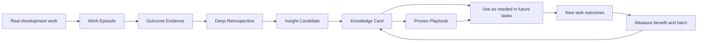

# ProvenLoop Product Design

> **A correction should keep helping; each outcome should improve the next attempt.**

**Status:** Canonical Product Design
**Version:** 2.1
**Updated:** 2026-09-07

**Implementation boundary:** This document includes both product goals and phased designs.
`0.1.0-alpha.0.11` is a Windows Design Partner Preview evidence candidate with Knowledge
management, local observations, trusted Session authorization, strict native proof chains,
and bounded current-Session reconciliation. M3-M6 are not current capabilities. Passing
synthetic regressions does not establish controlled benefit evidence or M0/MVP approval;
`0.1.0-alpha.1` remains an unapproved quality-release target. Validation of new-version
artifacts must be retained separately; earlier source-code test results cannot serve as approval.

**First-product requirement update (2026-09-07):** Automatic rule extraction, evidence
assessment, and later-task reuse after natural-language corrections are required for the
first complete product and cannot be deferred to Retrospective. Users should not have to
run `remember`, fill in fixed fields, or invoke an extraction tool for the system to learn
from a correction. The published 0.11 release does not provide this capability. Existing
manual first-use examples diagnose storage and retrieval only and do not meet first-product acceptance.

---

## 0. Executive summary

ProvenLoop is a **continuous improvement layer for Coding Agents**, built for individual developers.

Users continue to work with GitHub Copilot CLI, Claude Code, Codex, or other Coding Agents.
Outside those tools, ProvenLoop maintains continuity memory, engineering evidence, and
learning capabilities that belong to the user:

```text
Stop explaining the same Context repeatedly
              +
Stop correcting the same errors repeatedly
              +
Keep what has been learned when switching Agents
```

ProvenLoop pursues both efficiency and quality through three connected engines:

1. **Continuity Memory**
   - Addresses efficiency.
   - Helps an Agent understand relevant project background, current work state, personal
     preferences, and confirmed constraints after a new Session, `/clear`, or a tool switch.
   - Prioritizes integration with existing Memory products and open-source capabilities
     rather than rebuilding general-purpose Memory infrastructure.

2. **Outcome Learning**
   - Addresses quality.
   - Links user corrections, tests, builds, Review, CI, Revert, and later Bug Fixes to the
     original work traces to identify methods that worked and conclusions later overturned.
   - This is ProvenLoop's main differentiator and primary area of in-house development.

3. **Deep Retrospective**
   - Finds lessons that nobody stated explicitly but that work experience can reveal.
   - Actively compares successful and failed Episodes, proposes hypotheses, searches
     Repository content, Git, documentation, dependency references, and relevant engineering
     knowledge for more evidence, and looks for counterexamples to develop new Insights.
   - Studies the actual work of users and Agents, beyond recording what users said.

The complete product provides a verifiable learning loop, beyond storing a larger history:

```text
Actual work traces
  -> Work Episode
  -> Outcome Evidence
  -> Deep Retrospective
  -> Insight Candidate
  -> Knowledge Card
  -> Proven Playbook
  -> Use in future tasks
  -> Measure whether it actually improves results
  -> Reinforce, revise, disable, or roll back
```

ProvenLoop's final criterion concerns outcomes, not the volume of records:

> In later similar tasks that were not used for learning, do users repeat less Context
> and make fewer repeated corrections, without unacceptable errors, latency, privacy risks,
> or permission risks?

---

## 1. Long-term vision

### 1.1 Vision

> Enable every Coding Agent to learn continuously from the user's actual software
> development outcomes and safely carry verified lessons into future Sessions, Repositories,
> and Agents.

Today's Coding Agents are capable, but often work as though they need onboarding each time:

- Sessions lack continuity.
- Important background must be explained again after `/clear`.
- Previous corrections and preferences are usually lost when switching Agents.
- An Agent may remember a conversation without knowing that a Revert several days later
  showed a problem with the approach.
- Memory can retrieve history without knowing whether it is correct, outdated, or useful.
- Skills can reuse procedures but may also preserve mistakes when they lack reliable
  sources, baseline evaluation, and rollback mechanisms.

ProvenLoop aims to provide a personal learning layer independent of any particular Agent:

```text
Agents are replaceable execution tools
ProvenLoop accumulates personal engineering intelligence over time
```

### 1.2 Long-term goals

The goals cover both efficiency and quality; neither substitutes for the other.

#### Efficiency goals

- Reduce repeated entry of background and constraints across Sessions.
- Shorten the time from a task request to the Agent starting the correct work.
- Reduce unnecessary reads, incorrect commands, and repeated tool calls.
- Avoid teaching a new Agent about the user and project from scratch after a switch.

#### Quality goals

- Reduce repeated user corrections in similar tasks.
- Reduce test failures, Review rework, and Reverts caused by the same error patterns.
- Use later outcomes to revise earlier lessons.
- Discover patterns, omissions, and improvement opportunities across Episodes that the
  user has not directly expressed.
- Actively obtain more evidence when needed to support or challenge retrospective hypotheses.
- Gradually promote repeatedly verified methods into reusable, evaluable Playbooks with rollback support.

#### Safety goals

- Recording incorrect knowledge must not give it permanent authority.
- Content must not leak improperly between Repositories.
- Secrets, private content, and untrusted external instructions must not enter long-term knowledge.
- All automatic learning must support explanation, correction, deletion, disabling, and rollback.

---

## 2. Core users and product boundaries

### 2.1 Target users

ProvenLoop is intended for:

> **Individual developers who regularly use one or more local Coding Agents for real software development work.**

Typical characteristics:

- Frequently start multiple Sessions in the same Repository.
- Frequently use `/clear` or new Sessions to control context length.
- Need to repeat testing methods, code constraints, business background, or current development state.
- Switch between tools such as Copilot CLI, Claude Code, and Codex.
- Want Agents to learn from corrections, tests, Review, and later Bugs.
- Want local data storage by default and visibility into what the system has learned.

The first supported Agent is GitHub Copilot CLI.

Support for multiple Agents is part of the product direction, with capabilities added progressively:

| Capability | Initial release requirement | Later Adapters |
|---|---:|---:|
| Read shared Knowledge | Required | Required |
| Retrieve Context | Required | Required |
| User Feedback | Required | Required |
| Session and tool event capture | Supported event set; missing, truncated, and incompatible data explicitly visible | Implement according to Agent capabilities |
| Work Episode association | Conservative deterministic association; no claim to cover all real tasks | Improve progressively |
| Natural-language correction extraction | Automatically create source-backed candidates in the background; automatically reuse verified low-risk rules | Declare boundaries based on supported evidence and model interfaces |
| Skill/Playbook execution | M5 target, outside M0-M2 first-use requirements | Implement according to the permission model |

When an Adapter is inexpensive to add, basic retrieval and Feedback should be supported
early. Adding more Agents for the sake of a longer support list must not delay the first
complete learning loop.

### 2.2 Explicit exclusions

The first phase excludes:

- Team knowledge sharing and organization-wide governance.
- Enterprise permissions, compliance auditing, and management analytics.
- A general-purpose chat assistant.
- A complete Agent Runtime.
- Messaging channels and device Gateways.
- A general-purpose Session Viewer.
- A general-purpose Memory database, vector database, or knowledge graph.
- Online modification of foundation-model weights.
- Uploading Prompts, code, traces, or knowledge without explicit authorization. Even after
  background extraction is authorized, only bounded, redacted, relevant snippets go to the
  user's chosen model service; complete Sessions and Repositories are not uploaded.
- Automatically enabling high-impact Playbooks without evaluation and approval.

These boundaries preserve the long-term vision while requiring the product to prove that
the personal learning loop works first.

---

## 3. User problems

### 3.1 Isolated Sessions within continuous software work

A real task may span:

```text
Session A: Complete the initial implementation
  -> Commit
  -> Pull Request

Session B: Make changes following Review
  -> New Commit

Session C: Fix a CI failure
  -> Tests pass

Two weeks later:
  -> Production Bug
  -> Revert or Fix
```

Traditional Session Memory knows what happened in each conversation but may not know
that they belong to the same task, or whether later outcomes overturned earlier judgments.

### 3.2 Users repeatedly pay for the same knowledge

Recurring costs include:

- Pasting the same background again.
- Explaining again that the project uses Vitest rather than Jest.
- Asking again not to modify generated files.
- Explaining an API's compatibility constraints again.
- Pointing out again that the Agent forgot to run verification.
- Establishing working habits from scratch after switching Agents.

ProvenLoop's central product principle is:

> **A verified correction should be a one-time investment, not a permanently recurring cost.**

### 3.3 Memory and learning are different

Memory can answer:

```text
What happened before?
What did the user say?
What information might be relevant to the current project?
```

Learning must also answer:

```text
What happened later?
Did Review, CI, or a Bug overturn the earlier conclusion?
Under what conditions does this lesson apply?
Does using it improve later tasks?
Should it be kept, revised, down-ranked, or deleted?
```

This distinction defines the boundary between ProvenLoop and ordinary Agent Memory.

### 3.4 Correction summaries are not deep learning

If ProvenLoop only saves the mistakes users point out, it remains a more automated form of Memory.

Deep learning requires the system to discover patterns across traces that the original
records do not state directly:

```text
Several apparently independent failures
  -> Find shared conditions
  -> Propose a possible root cause or missing check
  -> Obtain more information
  -> Actively look for counterexamples
  -> Form a new Insight with defined applicability
  -> Verify it in future tasks
```

For example, a user never said, “Check whether a file is generated before editing it.”
But several Episodes show:

1. The Agent modified a generated file.
2. Targeted tests passed.
3. A later build regenerated the file and overwrote the changes.
4. Repository configuration and official tool documentation show that the actual input is a Schema.

ProvenLoop can propose:

> Before modifying a file of unknown origin, check whether it is generated and locate its generation input.

This conclusion begins as an Insight Candidate, not an immediately active rule. It may
be promoted to Knowledge only after local evidence, additional references, counterexample
checks, and later tasks support it.

---

## 4. Product positioning

### 4.1 One-sentence positioning

> ProvenLoop is a continuous improvement layer for Coding Agents, built for individual
> developers: it reuses existing Memory to maintain work continuity and uses software
> outcome feedback to help multiple Agents reduce repeated mistakes based on actual results.

### 4.2 Main benefits

#### 1. Less repeated explanation: Continuity

Automatically retrieve a small amount of Context relevant to the current task after a
new Session, `/clear`, or an Agent switch.

#### 2. Learn from failures as well as successes: Outcome Learning

Passing tests, Review corrections, CI failures, Reverts, and later Bugs all change how
well a lesson is supported.

#### 3. Study experience beyond recording it: Deep Retrospective

ProvenLoop actively compares successful and failed traces across Sessions and time to
find common patterns, hidden assumptions, missing checks, and inefficient strategies.
When needed, it gathers more evidence instead of waiting for the user to supply an answer.

#### 4. Traceable evidence for every suggestion: Proof Chain

Every Knowledge item and Playbook can answer:

- Which Sessions and Episodes did it come from?
- Which tests, Commits, Reviews, or user feedback support it?
- Is there counterevidence?
- Why does it apply now?
- What happened after its last use?

#### 5. Keep learning when switching Agents: Portable Intelligence

Personal preferences, project knowledge, and verified working methods are independent
of any Agent vendor. Different Agents use the same personal learning results through
shared retrieval, explanation, and Feedback interfaces.

#### 6. Demonstrate improvement: Measured Improvement

ProvenLoop establishes baselines, Held-out replays, and online metrics for Memory,
Knowledge, and Playbooks. An improvement without comparable results does not count
as product success, regardless of claims that the system has become smarter.

### 4.3 Product feedback loop



The feedback loop works only when outcomes return to the system. Saving Memory in
one direction does not close the loop.

---

## 5. Product capability model

ProvenLoop's learning has six layers. Each Milestone focuses on part of them, while the
complete product retains the full direction.

| Layer | Capability | Product meaning |
|---|---|---|
| L0 | Tracing | Record tasks, actions, tools, and outcomes |
| L1 | Episodic memory | Retrieve what happened in a specific task |
| L2 | Deep retrospective and semantic induction | Compare experiences, gather more evidence, and form new conditional Insights |
| L3 | Procedural capability | Turn repeatedly verified methods into Playbooks |
| L4 | Strategy optimization | Compare versions, triggers, and results of use |
| L5 | Parameter learning | Offline training with approved data; an optional long-term direction |

The long-term product direction covers L0-L4. The first M1 + M2 product validates
continuity memory and correction learning constrained by evidence. It does not require
Deep Retrospective, Playbooks, or strategy optimization to be completed first. L5 is
not a default capability for everyday local use.

---

## 6. Core objects

### 6.1 Raw Event

Immutable source events include:

- Session lifecycle.
- User Prompts and explicit corrections.
- Tool calls and result summaries.
- File changes.
- Test and build results.
- Git Branches and Commits.
- Pull Requests, Reviews, CI, Issues, Fixes, and Reverts.
- Retrieval and use of Knowledge or Playbooks.
- Significant process claims, such as “tested,” “reviewed,” or “completed the specified protocol.”
- The requested/resolved Agent, Provider, Model, and actual completion state of delegated tasks.

Raw Events support auditing and rebuilding; they are not injected directly into Agent
Context. They cannot be modified during normal retention. User-initiated Source Delete
or Purge follows the deletion rules in §14.4.
0.10 permits controlled late enrichment: the original event and source digest are retained,
and missing content, redacted arguments, or result summaries are added in separate
enrichment records. Newly derived verification is stored as separate evidence without
reclassifying the original event. Original timestamps, workspace, parent chain, status,
metadata, and recorded content cannot be rewritten to manufacture success.
`captureQuality` retains the omissions, truncation, and original length from initial
capture; enrichment does not erase the original gaps.

### 6.2 Work Episode

Work Episode is ProvenLoop's unit of learning.

It links multiple Sessions, Commits, and later outcomes that belong to the same engineering goal:

```text
Work Episode: Implement request rate limiting

Initial implementation
  -> Tests pass
  -> PR #42

Review
  -> Correct the proxy-header trust boundary

After merge
  -> IPv6 users incorrectly rate-limited
  -> Issue #57
  -> Fix Commit
```

The eventual lesson can be more specific than “this task succeeded”:

```text
When changing IP identification or rate-limiting logic, verify IPv4, IPv6,
trusted proxy boundaries, and forwarded header tests together.
```

Episodes allow later evidence to reassess earlier conclusions.

### 6.3 Branch Context

Branch Context is short-term continuity memory that stores:

- The current goal.
- Accepted design decisions and their reasons.
- Explicit user constraints.
- Current implementation state.
- Unfinished work.
- Recent verification results.

It does not restore complete chat history and is not required after every Session.

#### Generation conditions

Generate or refresh only when there is substantive state to carry forward:

- The user confirmed a design decision or correction.
- Files changed and verification produced results.
- An unfinished plan exists.
- `/clear`, Session closure, or a Commit is approaching.
- The Goal, Branch, HEAD, or verification state changed.

Browsing alone, one-off questions, and Sessions without state changes do not produce Branch Context.

#### Lifecycle

- Generate asynchronously in the background without blocking the current Agent.
- Trigger and coalesce refreshes by events to avoid rewriting on every turn.
- Validate Repository, Branch, and HEAD before retrieval.
- Stop automatic retrieval on HEAD, Repository, or Branch mismatch, or logical expiry.
- The current projection defaults to 30 days after the last relevant event; logical expiry
  does not mean physical cleanup.
- Automatic detection of Branch merges/deletions and scheduled physical cleanup are not
  current guarantees.
- Evidence required by Episodes follows a separate retention policy.

### 6.4 Knowledge Card

Knowledge Card is the default artifact of long-term learning.

Scopes:

```text
branch
repository
workflow
personal
```

Types:

- Explicit user preferences.
- Repository facts and constraints.
- Testing, debugging, Review, and verification methods.
- Repeated error patterns that have been corrected.
- Engineering lessons applicable under specific conditions.

Knowledge aggregates by stable Topic instead of creating a permanent record for every discovery.

Example:

```yaml
key: repo/payment-service/testing
scope: repository
state: active
applies_when:
  - package.json uses vitest
  - task changes TypeScript behavior
guidance:
  - inspect package scripts before choosing a test command
  - run the narrow Vitest target before the full suite
proof_chain:
  - episode: ep-2026-0818-014
    signal: explicit-correction-followed-by-success
  - episode: ep-2026-0821-006
    signal: independent-repeated-success
counterevidence: []
```

### 6.5 Insight Candidate

An Insight Candidate is a new, unproven finding proposed by Deep Retrospective.

It must clearly distinguish observed facts from the system's proposed explanation:

```yaml
insight: Editing generated files is a common cause of repeated rework
observations:
  - Three Episodes modified files that were later overwritten
hypothesis:
  - The Agent did not identify the generation source before editing
evidence_needed:
  - Inspect generation configuration and file headers
  - Check build scripts
  - Consult the generation tool's official documentation
counterexample_search:
  - Find tasks where directly editing generated files is allowed
applicability:
  - Files may be generated from schema, IDL, or codegen
state: investigating
```

An Insight Candidate can lead to three outcomes:

- **Rejected:** The hypothesis is invalid or evidence is insufficient.
- **Qualified Insight:** It becomes a Knowledge Card with defined conditions.
- **Procedure Candidate:** Repeatedly verifiable steps are found and enter Playbook Candidate status.

It must never be injected automatically just because the retrospective model considers it plausible.

### 6.6 Proven Playbook

A Proven Playbook is an evaluated executable or procedural capability. It can be packaged
as an Agent Skill, but the product concept is independent of any particular Agent's
`SKILL.md` format.

A Playbook must contain:

- A stable identifier and immutable version.
- Explicit Trigger and Non-trigger conditions.
- Inputs, preconditions, and permissions.
- Executable steps or a workflow.
- Verification methods and failure exit paths.
- Source Episodes and a Proof Chain.
- A no-Playbook baseline.
- Evaluation results for the Candidate and current version.
- Approval, Canary, and rollback records.

Most Knowledge never needs to become a Playbook.

```text
“This Repo uses Vitest”
  -> Knowledge Card

“Safely execute a database migration: preflight, backup, migrate, verify, roll back”
  -> May be promoted to a Proven Playbook
```

---

## 7. Evidence and learning rules

### 7.1 Evidence priority

From highest to lowest:

1. Explicit user approval, correction, or revocation.
2. Executable tests, builds, and CI.
3. Review conclusions, Revert, and subsequent Fix.
4. Objective state changes produced by Git, files, and tools.
5. Patterns repeated across independent Episodes.
6. The Agent's verbal analysis and self-evaluation.
7. Natural-language instructions in external web pages, email, logs, or tool output.

Evidence priority determines how conclusions are adjudicated. It does not prevent new counterevidence from entering the system.

- A lower-priority inference cannot, by itself, permanently override a higher-priority conclusion.
- Evidence that directly conflicts with current Guidance, has a trusted source, and can be linked to the same applicability conditions is **valid counterevidence**.
- When valid counterevidence appears, the current Knowledge or Playbook immediately enters `Disputed` and stops being used automatically. Evidence priority then informs whether to revise it, split its applicability conditions, reduce its weight, or restore it.
- A later Review, Revert, or Bug Fix addressing the same cause can therefore overturn the apparent success of an earlier passing test. External outcomes are not ignored because they arrived later or occupy a different level in the priority list.
- An old confirmation cannot override new counterevidence. The user must review the current state and explicitly list the counterevidence IDs to resolve. An ordinary confirmation does not clear unreviewed counterevidence or counterevidence that arrives afterward.

### 7.2 Candidate formation

Candidate Knowledge may be created when:

- The user corrects an operation, parameter, or approach in normal conversation. A background model extracts a candidate from the relevant event window and retains evidence references to the original user statement, failed operation, and subsequent handling. Candidate formation does not require completed verification.
- An explicit user correction is followed by fully bound, trusted verification: `VerificationBinding` points to the correction event and actual operation, with matching Session, Repository, worktree, call ID, command target, and a time-ordered parent chain. An arbitrary successful command in the same Episode is not proof.
- The user explicitly asks to remember a preference or constraint.
- Multiple Episodes show the same success or failure pattern.
- A later Review, Revert, or Bug reveals an earlier omission.

The following cannot directly produce usable Knowledge:

- A single Agent inference.
- Only the model's self-assessment that work is complete.
- No applicability conditions.
- No source.
- Reusing recalled Memory as new evidence.
- Instructions from untrusted content.

#### 7.2.1 Initial automatic extraction and activation

This section defines initial requirements that remain to be implemented; it does not describe the 0.11 runtime. The target scenario is an Agent making an incorrect MCP call, receiving a correction in ordinary natural language, and retrying accordingly. The system extracts a rule while the session remains open and reuses it in later related tasks. Users do not need to know the Correction Key format.

Automatic processing uses the existing event capture, Worker, Knowledge lifecycle, and retrieval. It does not introduce another chat assistant or require users to invoke a new tool:

```text
Real user correction + related operation trace
  -> Bounded event window
  -> Background semantic extraction using the existing Copilot sign-in
  -> Candidate rule with provenance
  -> Deterministic evidence, scope, and counterevidence checks
  -> Usable rule with applicability boundaries
  -> Relevant retrieval and usage records in later tasks
```

New user turns, relevant tool completions or failures, and session-idle events trigger processing. Keywords such as "wrong" or "remember" may affect scheduling priority but cannot be required for natural-language recognition. Adjacent events are combined into one bounded analysis; the user does not need to close the Session. New verification evidence is processed against the existing candidate without requiring another model request.

The model must distinguish corrections from ordinary questions, quotations, hypotheses, one-time instructions, and tool-returned text. Candidates must include rule content, applicability conditions, exclusions, and corresponding sources. The model may summarize meaning, but it cannot decide on its own that a rule is verified, applies across repositories, or overrides existing rules. When information is insufficient, it should record "no rule extracted" or "insufficient evidence" instead of generating generic best practices to fill a quota.

Automatic activation has three cases:

- **Checkable supporting evidence:** Within an exact repository/tool scope, low-risk rules may automatically become Externally-verified Guidance without another user confirmation.
- **Only inference or incomplete traces:** Save the rule automatically as a Candidate and wait for new evidence or optional human review. A model's "high confidence" output does not make it eligible for ordinary retrieval.
- **Permissions, security, deletion, credentials, promotion across repositories, or valid counterevidence:** Do not automatically expand permissions or clear disputes. Continue using the existing explicit controls and review mechanisms.

A natural-language correction does not itself mean the user approved the model's rewritten rule. The model must not fabricate a `user_confirmed` mark, confirmation code, or user feedback. `remember` and manual confirmation remain control entry points, but are no longer required to produce rules.

MCP scenarios must be included in the initial version; unrelated test commands cannot supply their proof. Preserve the actual server/tool identity, call ID, parameter changes, structured errors, retry results, and checkable postconditions. For example, verification of a rule stating "this requires a local absolute path rather than a URL" should check the actual parameter and the tool's declared input contract. A generic `success: true` only shows that a call completed. It cannot prove the returned content is correct or support a broader business conclusion. MCP scenarios without a corresponding verifier may still yield candidates automatically, but must not be described as automatically verified.

#### 7.2.2 Learning coverage and noise control

The initial version should detect as many reusable corrections as possible while strictly controlling activation and delivery. Candidate discovery, activation decisions, and task retrieval have separate acceptance checks. The system may retain candidates with insufficient evidence, but must not deliver them directly to an executing Agent to improve recall. High recall does not require every message to produce a rule.

| Input during normal work | Default handling | Activation boundary |
|---|---|---|
| "Use pnpm throughout this repository, not npm" | Extract a candidate project constraint and preserve the user's exact words and scope | The original statement establishes the user's expressed intent; automatic activation must still satisfy the supported evidence policy |
| "Skip tests this time; I only want to inspect the UI" | Treat it only as an instruction for the current task | Do not create a rule for later tasks or weaken existing verification requirements |
| A tool fails, then succeeds after a parameter correction | Extract a candidate for the specific parameter or operation correction | Activate only the conclusion actually supported by the input contract or postconditions |
| "Read the code carefully" or "Changes should be verified" | Record no rule extracted if there is no specific project constraint or difference in behavior | Do not collect generic advice in bulk |
| The same rule appears again in different words | Compare it with existing candidates or rules and combine sources with the same meaning | Do not add synonymous entries or count duplicate events as independent support |

Explicit user statements of persistent constraints should be labeled separately from practices inferred from operation outcomes. Persistent intent does not require the word "remember"; retain a candidate when scope or persistence is unclear. The original statement cannot confer `user_confirmed` on the model's rewritten rule, and one success cannot prove the entire inference. The initial version follows the activation policy and explicit confirmation entry points in 7.2.1. Personal preferences are not treated as facts that tests can prove.

Every usable rule must state its trigger, the specific behavior that should change next time, exclusions, and source. If existing project instructions already cover the content, add only provenance or associations to avoid repeating it in task context. The extractor may propose a merge. A final merge must preserve scope, conditions, and operation semantics; similar wording must not broaden applicability. Conflicts follow the existing dispute process. Overwriting old content or accumulating occurrence counts cannot eliminate counterevidence.

Candidates do not enter ordinary Context or become individual user tasks. The initial design archives candidates by default if they remain inactive 30 days after the last independent supporting evidence. This is a configurable logical deadline that remains to be implemented. If no later support arrives, the deadline runs from candidate creation. Retries, window revisions, duplicate events in the same operation chain, and changes to the extraction prompt do not reset it. Archival stops automatic analysis and task reminders. Only new independent evidence or an explicit human action may request reassessment. That request does not directly grant activation eligibility: counterevidence, revocation, and deletion state must still be checked. Archival does not delete original evidence, promise reclaimed physical storage, or change the evidence and expiration policies for Active Knowledge. For specific coverage and noise thresholds, see [Initial automatic extraction acceptance](product-validation.md#initial-automatic-extraction-acceptance).

### 7.3 Deep Retrospective

Deep Retrospective is a proactive research task triggered by expected value. It does not generate a summary after every Session.

#### Triggers

- Multiple Episodes show the same failure, rework, or unusual tool path.
- Successful and failed Episodes differ consistently in their critical steps.
- A later Bug, Review, or Revert reveals a systematic omission missed earlier.
- A task category consistently consumes substantial Context, time, or tool calls.
- Knowledge has been revised repeatedly or has apparently conflicting applicability conditions.
- The user asks to review a group of tasks retrospectively.

#### Retrospective process

```text
Select Episodes
  -> Compare Success and Failure
  -> Detect Pattern or Anomaly
  -> Generate Hypotheses
  -> Expand Evidence
  -> Search for Counterexamples
  -> Produce Insight Candidate
  -> Validate on Existing or Future Tasks
  -> Reject, Qualify, or Promote
```

#### Evidence Expansion

A retrospective may proactively obtain more information, subject to these trust boundaries:

1. **Direct local evidence, allowed by default**
   - Repository code, configuration, documentation, and tests.
   - Git History, Diff, Blame, Commit, and Branch.
   - Saved Sessions, tool results, and Work Episodes.

2. **Authorized development systems, using existing permissions**
   - Pull Request, Review, Issue, and CI.
   - Package metadata, dependency lockfiles, and build artifacts.

3. **External research, requiring user enablement by default**
   - Official documentation for dependencies and tools.
   - Release Notes, compatibility information, and public Issues.
   - Related papers and credible engineering practices.

External queries must minimize what they send. They must not upload source code, raw Prompts, Secrets, or identifiable private project details. External material may help propose explanations, provide context, and design verification methods, but cannot establish a Repository rule on its own. Instructions from web pages or tool output are treated as untrusted content.

#### Output requirements

Every Insight Candidate must include:

- The observed Pattern.
- One or more competing Hypotheses.
- Supporting evidence and counterevidence.
- Additional information obtained and its sources.
- Applicability conditions and known boundaries.
- Uncertainty.
- A recommended verification method.
- The metrics it is expected to improve.

The retrospective system must allow the conclusion "nothing can be learned." Producing more Insights is not a success metric.

### 7.4 Promoting Knowledge to a Playbook

At least one of these conditions must hold:

1. Two or more independent successful Episodes have stable steps that can be generalized.
2. The same method has repeatedly resolved the same kind of failure.
3. The user explicitly asks to save a complete workflow as a Playbook.

All of the following must also hold:

- Machine-verifiable success criteria exist.
- Trigger and Non-trigger conditions exist.
- The workflow does not depend on temporary absolute paths, Secrets, or incidental environment conditions.
- Permissions and side effects can be declared.
- Provenance is complete.
- Secret and Prompt Injection checks pass.
- It outperforms a baseline without the Playbook on Held-out tasks.
- It can be enabled only after user approval.

---

## 8. Evidence Tier and runtime UX

### 8.1 Start with evidence tiers and avoid false precision

Until enough labels and real usage data have accumulated, ProvenLoop does not use probabilities such as `0.70` or `0.90` to determine product behavior. Such numbers can create an illusion of precision.

Early versions use explainable **Evidence Tiers**:

| Evidence Tier | Meaning |
|---|---|
| Inferred | An Agent's inference from a single or limited trace |
| User-confirmed | A preference, constraint, or correction explicitly confirmed by the user |
| Externally-verified | Supported by tests, builds, CI, Review, or other external outcomes |
| Repeated-evidence | Supported across multiple independent Episodes |
| Disputed | Valid counterevidence or conflicting applicability boundaries exist |

Each Knowledge item still records these separately:

- **Relevance:** Whether it matches the current task.
- **Evidence Tier:** The type of support currently available.
- **Utility:** Whether past use actually improved outcomes.
- **Coverage:** The number of opportunities matching the Trigger in which it was observed and verified.

Later versions may introduce probability calibration, ECE, and Reliability Curves only after enough independent labels have accumulated. A model's `confidence: 0.95` output can never directly change an Evidence Tier.

### 8.2 Evidence Tier and default behavior

| State or tier | Condition | Default behavior |
|---|---|---|
| Candidate | Not yet verified | No automatic injection; visible only in inspection and preview |
| Inferred | Only Agent inference or limited evidence | Visible only in active review; excluded from ordinary Context and requires confirmation before use |
| User-confirmed | Explicitly confirmed by the user | May provide Guidance within the confirmed Scope and applicability conditions; this is not external verification |
| Externally-verified | Machine or Review evidence exists | Used as Guidance within an exact Scope in low-risk scenarios |
| Repeated-evidence | Supported by multiple Episodes, with no valid counterevidence | May be used automatically, subject to Top-k and Token Budget limits |
| Disputed | Valid counterevidence appears | Stop automatic use immediately, pending revision or adjudication |
| Locked Preference | A personal preference explicitly locked by the user | Treat it as an authoritative user instruction, without presenting it as statistically high confidence |

User "locking" cannot bypass required verification for Repository facts or Playbooks. Locked Preference is a design concept; it does not mean the current CLI provides a separate locking mode.

### 8.3 Context injection experience

Default behavior:

- Return 0-3 items per request.
- Check Repository, tool/version, applicability conditions, and exclusions before selecting by relevance. Return an empty result when nothing matches.
- Do not provide a rule again within the same task while it remains in context. A substantial task or workspace change may trigger retrieval and a fresh applicability check.
- Synonymous rules already fully covered by current project instructions or context do not occupy returned-item slots.
- Normally, do not interrupt users with pop-ups.
- The Agent may see a short message such as "2 items of ProvenLoop Guidance provided."
- Users can expand "Why was this guidance provided?"
- Inferred Guidance in active review must be marked as a candidate. Status messages must not insert it into execution context.
- Candidate and Disputed content is never injected silently.

A Knowledge item may have multiple Evidence marks. For example, it may be both `User-confirmed` and `Externally-verified`. Evidence Tier describes provenance; it does not replace Scope, Trigger, or risk checks. "Provided," "adoption explicitly reported by the user," "helpful feedback," and "independently verified success" are different facts and cannot substitute for one another.

### 8.4 Scope policy

- New task state belongs to Branch by default.
- Repository constraints require Repository evidence or user confirmation.
- Personal Preference requires an explicit user statement, or a confirmation request after repeated verification across independent Repositories.
- Repository Knowledge is not automatically promoted to Personal.
- Use across Repositories and Agents must pass unified Scope checks.

---

## 9. Core user experience

### 9.1 Installation

Conceptual command:

```powershell
provenloop install
```

The initial release installs the GitHub Copilot CLI integration:

- Copilot CLI Extension event stream.
- Local MCP Server.
- Background processing Worker.
- Local data and evidence storage.
- Minimal runtime Instruction.
- One-time connection to the current Copilot sign-in for supported background model capabilities.

Users continue to run:

```powershell
copilot
```

No wrapper command or additional model API Key is required. Initial automatic extraction reuses the existing Copilot sign-in without authorization for each call. Installation or first enablement must explain that relevant excerpts will be sent to that service and consume model quota. Existing capture authorization must not be silently interpreted as authorization for new model calls; upgrades from older versions require explicit one-time authorization. The model has no tool execution permission, does not read credentials, and cannot approve persistent feedback, Scope changes, deletion, or Playbooks on the user's behalf. Disabling `correction_learning` prevents new extraction and submission of results already in flight. Separate switches control capture and retrieval of existing rules.

### 9.2 First use

The default workflow does not scan history and directly generate long-term knowledge. Initial acceptance starts with a real correction during normal work:

1. The Agent makes an incorrect tool call or operation in the target repository, and the user corrects it directly in natural language.
2. The Agent makes the relevant correction. The background process automatically extracts a candidate and checks what conclusion the correction actually supports.
3. When conditions are met, a usable rule forms while the current session remains open. A short message and source link appear in the normal work interface. Otherwise, the system retains the candidate without interrupting the user for each item by default.
4. The user starts a later related task in the same repository without repeating the rule or asking for a memory tool call. The system must show actual retrieval/delivery records, and the Agent's subsequent actions should follow the rule.
5. The user can inspect provenance, correct, disable, or delete the rule. The rule must not be misapplied in other repositories or inapplicable tasks.

The existing `remember` -> retrieval in a new Session -> Explain workflow remains available for diagnosis and manual management, but cannot replace this automatic-learning acceptance test. See the [README first-use workflow](../README.md#first-useful-workflow) for executable commands and released-version limitations.

Optional historical import remains a future design, not a full-history ingestion capability in 0.10. Current automatic reconciliation covers only the observation window of the trusted SDK's current Session. Missing workspace metadata produces a diagnostic and a skip, without guessing paths. Future optional historical import will only:

- Establish a usage baseline.
- Form reviewable Candidates.
- Build an initial replay set.

Historical inferences never automatically become Active Knowledge.

### 9.3 Daily use

In 0.10, MCP initialization instructions and the plugin skill request one Agent call at the start of a new or resumed task. Having instructions does not guarantee that the host will make the call:

```text
provenloop_context(prompt)
```

Possible results:

- Branch Context.
- Repository Guidance.
- Personal Preference.
- Active Knowledge.
- Approved Playbook (an M5 target; not currently returned).

During a task, the Extension callback copies only bounded fields and hands them to the asynchronous writer. The writer performs the first redaction pass and atomic enqueue. The Worker performs a second redaction pass, then updates Episodes and bound Knowledge state. Automatic delayed Outcome linking belongs to M3; it is not a capability executed on every background processing pass.

The initial version needs to add automatic extraction to this background path without requiring the foreground Agent to call an extraction MCP tool first. Task-start retrieval still depends on host instructions. Actual calls and delivery must be recorded; an installed Skill is not proof of execution. Native-host acceptance fails if users still need to remind the Agent to call `provenloop_context` to reuse a new rule. Automatic extraction does not establish automatic adoption, and automatic adoption does not establish proven benefit.

### 9.4 User controls

Natural language is a convenient entry point, not the only control mechanism. Every Guidance, Insight, and Playbook item must provide stable, deterministic feedback actions:

| Action | Result |
|---|---|
| Helpful | Record user feedback without automatically counting adoption, success, or proven Utility |
| Irrelevant | Record a Trigger mismatch and stop use in the current task |
| Wrong | Immediately move to Disputed and request an optional explanation |
| Stale | Stop automatic use and start revalidation |
| Mute this Session | Stop showing ProvenLoop Guidance in the current Session |
| Permanently disable | Disable the Knowledge or Playbook |
| View evidence | Open the Evidence Trail, applicability conditions, and counterevidence |
| Change Scope | Explicitly set Branch, Repository, Workflow, or Personal |
| Delete | Run the deletion process in §14.4 |

These actions should use stable CLI commands, MCP Tool parameters, or lightweight controls. They must not depend on the Agent interpreting free text and guessing user intent.

MCP first returns the action awaiting approval and a `PL-...` confirmation code. The real user must send the tool-provided `confirm PL-...` or its supported Chinese equivalent in the current trusted Session, then retry the original request. Approval lasts at most five minutes and is bound to the action, target, request, Scope, resolved counterevidence, and adoption mark. Parameter changes require new approval. The Agent cannot confirm on the user's behalf. Branch Context supports only helpful, irrelevant, wrong, and stale observational feedback. Such feedback does not promote it to Knowledge, and it does not support confirm, revoke, set_scope, or mute_session. The retrospective, Insight, and Playbook natural-language examples below describe future capabilities.

Natural-language examples:

```text
Which testing rules have you remembered for this Repo?
Why did you provide that guidance just now?
Which tasks did this lesson come from?
Review the last three release failures and look for a common cause.
What additional material did this Insight use?
Revalidate this conclusion using only local evidence.
This rule no longer applies.
Run the targeted tests first in all projects from now on.
Stop using this Playbook.
Delete all learning results from this Session.
```

Core interfaces:

```text
provenloop_context
provenloop_explain
provenloop_feedback
```

Management commands:

```powershell
provenloop status
provenloop doctor
provenloop disable retrieval
provenloop enable retrieval
provenloop knowledge list --scope repository
provenloop knowledge show <knowledge-id>
provenloop knowledge confirm <knowledge-id> --expect <digest> --confirm
provenloop knowledge replace <knowledge-id> --content <text> --expect <digest> --confirm
provenloop knowledge revoke <knowledge-id> --expect <digest> --confirm
provenloop correct <knowledge-id>
provenloop mute <knowledge-id> --session <session-id>
provenloop forget <knowledge-id>
provenloop observations show
provenloop observations export --date 2026-09-06
provenloop uninstall
provenloop purge
```

The `knowledge` and `observations` subcommands are included in 0.10. Before every change, read the latest `expectedDigest` from `knowledge show`. For confirm/replace, use `--resolve "id1,id2"` only when the user has actually resolved the counterevidence. Revoke archives and retains history; Forget performs deletion. Workflow operations also require `SESSION_ID`, workflow, and `--cwd` to match a live trusted SDK Session. Setting parameters alone cannot grant authorization. Observations use UTC dates. Export produces compact JSON for the current code version without raw conversation content.

### 9.5 Learning benefits

The initial version must show users the lessons that actually become active and are provided during normal work, without diagnostic commands. The following interaction requirements remain to be implemented; 0.11 has no automatic-learning notifications. Use inline messages or a status area supported by the host. A Dashboard is not a prerequisite.

- After a rule is persisted and passes activation checks, combine specific changes into a message such as "Remembered: this repository uses pnpm," with its scope and a source link. Viewing, correcting, disabling, and deleting must all be accessible.
- After a later task actually receives the rule, show "The package-management rule from your previous correction was provided for this task." Record adoption only after observing compliant behavior or receiving explicit feedback; the message itself is not evidence of benefit.
- Keep `no_rule` quiet by default. Candidates awaiting verification are available for deliberate inspection, without individual content pop-ups or confirmation requests. If learning remains paused, combine the reasons into a status message without repeatedly reporting the same state.
- By default, show at most one learning-change summary and one delivery explanation per task. Combine synonymous changes; repeated evidence does not trigger new messages. Users may disable these messages. Separate switches control learning and retrieval.

Host acceptance must observe these messages in the user's work interface. Background logs alone, content returned to the Agent but not displayed, or the Agent's own claim that it has "remembered" do not pass. Message submission is tied to rule state: pending "learned" messages must not be displayed after deletion or disablement. Candidate notifications must not bypass retrieval policy.

The longer-term product may show a **Learning Dividend** supported by reliable comparisons. The following numbers illustrate a future interface; they are not current measurements or an implemented dashboard:

```text
This month:
  Repeated Context avoided: about 8,400 tokens
  Repeated corrections on similar tasks: 7 -> 2
  Incorrect Guidance: 1
  Overturned by later outcomes and disabled: 2
  Newly discovered and verified Insights: 3
  Retrospective hypotheses awaiting verification: 2
  Newly approved Playbooks: 1
```

Current local observations show only source-backed counts and coverage for calls, delivery, explicit adoption, feedback, corrections, and verification. Task duration, control-group assignments, and final outcomes remain unknown. Synthetic replay numbers must not appear in the user benefit display.

---

## 10. Memory strategy and product boundaries

### 10.1 Build vs Integrate

General-purpose Memory already has substantial research and open-source implementations. ProvenLoop should not devote its main resources to:

- General-purpose Memory CRUD.
- General-purpose vector retrieval.
- Embedding Provider.
- Ordinary Conversation Summary.
- General-purpose Retention and Consolidation.
- Ordinary Memory Dashboard.

The current implementation uses a replaceable interface and SQLite FTS5/BM25. Memorix is not an installation dependency:

```text
ProvenLoop
  -> KnowledgeBackend
      -> SqliteFtsKnowledgeBackend (current)
      -> Memorix / other Backend (optional in future)
```

### 10.2 Data ProvenLoop must own

General-purpose Memory systems must not define the following data:

- Raw Event.
- Work Episode.
- Outcome Evidence.
- Correction Key.
- Evidence links, association strength, and counterevidence relationships between Episodes and Outcomes.
- Knowledge usage records.
- Evaluation datasets and results.
- Playbook Version, Canary, and Rollback.

A general-purpose Memory Backend may handle:

- Memory storage and search.
- Formation, Consolidation, and Retention.
- BM25, Vector, or Hybrid Retrieval.
- Routine Memory management.

### 10.3 Users see one product

Even if Memorix is used underneath, users manage only ProvenLoop:

- No duplicate capture integrations to install.
- No duplicate Context injection.
- No conflicting Memory lifecycles.
- No requirement to understand the underlying Backend.
- Replacing the Backend does not change ProvenLoop's core behavior or evidence model.

---

## 11. Multi-Agent strategy

### 11.1 Product goal

ProvenLoop's learning results belong to the user, not to any particular Agent.

Unified capabilities:

```text
Context Query
Knowledge Explain
User Feedback
Scope Identity
Usage Outcome
```

Agent Adapters translate each Agent's lifecycle and tool events into a unified model.

### 11.2 Incremental support

Support for multiple Agents does not require all capabilities to be completed at once:

1. **Reader Adapter**
   - Use ProvenLoop Context.
   - Inspect provenance.
   - Submit Feedback.

2. **Observer Adapter**
   - Capture Session, tool, and file events.
   - Contribute to Work Episodes.

3. **Full Learning Adapter**
   - Link complete Outcomes.
   - Execute and evaluate Playbooks.

If MCP or Plugin standards allow inexpensive integration, provide Reader Adapters early.

### 11.3 Deduplication across Agents

Multiple Agents may work on the same user task in succession. ProvenLoop must identify the same Episode using Repository, Branch, Commit, time, files, and explicit Goal to avoid:

- Counting the same evidence more than once.
- Treating recalled content as new learning.
- Agents amplifying one another's incorrect conclusions.

---

## 12. Evaluation framework

Evaluation is a core product capability in ProvenLoop, not an analysis feature added after release.
See [`product-validation.md`](product-validation.md) for the acceptance process, release gates,
failure categories, and improvement methods.

### 12.1 Unit of evaluation

The unit of evaluation is a Work Episode, rather than a Session.

Task success must account for:

- Predeclared tests or builds.
- CI.
- Review.
- User acceptance.
- Later Bugs, Fixes, or Reverts.

Model self-assessment is not independent evidence of success.

### 12.2 Two parallel North Star metrics

Both efficiency and quality are final goals. A combined score must not hide the trade-offs
between them.

#### Quality: correction recurrence rate (RCR)

```text
RCR =
Number of Correction Keys that recur in later similar tasks
/
Number of opportunities to reuse an existing correction
```

Goal: a sustained reduction relative to the Baseline.

#### Efficiency: time to verified completion (TTV)

```text
TTV =
Active working time from the Agent accepting the task
to the first pass of the predeclared Verifier
```

Compare only tasks that ultimately meet Outcome-qualified Success, so that speed cannot
come at the expense of quality.

Also report:

- Repeated Context Tokens.
- Agent turns.
- Tool calls.
- Failed retries.

### 12.3 Correction Key

Normalize the first correction as:

```text
Correction Key =
Scope
+ Violated Constraint
+ Expected Behavior
+ Trigger
```

Example:

```text
repository/payment-service
+ used-jest-without-inspection
+ inspect-package-scripts-and-use-vitest
+ typescript-test-task
```

If the user must restate the same Key in a later similar Episode, count it as a repeated correction.

Do not count the following as repeated corrections:

- Requirements have changed.
- The user has changed a preference.
- New information has become available.
- The Agent avoided the issue before the user pointed it out.

### 12.4 Definition of similar tasks

Determine similarity before observing the outcome. Do not redefine it after a task succeeds
to make the results appear effective.

```text
Scope
+ Task Family
+ Subsystem
+ Change Intent
+ Verifier Signature
+ Applicable Trigger
```

A retrieval model may identify candidates, but the metric denominator must come from frozen
rules or blind-review labels to prevent circular self-validation.

### 12.5 Outcome-qualified Success

Outcome-qualified Success, planned for M3, requires:

1. The predeclared tests, build, or acceptance checks pass.
2. There is no known negative Review.
3. No Revert or Bug Fix linked to the same cause appears within 14 days or the next release cycle.

Until the observation window ends, mark the outcome as `censored`. It cannot yet serve as a
final successful training sample. Current ordinary observations do not automatically perform
complete delayed outcome linking, and an unknown outcome does not become a success merely
because 14 days have passed.

### 12.6 Offline replay datasets

Build six types of local, sanitized datasets:

1. **Branch Continuation**
   - Split at `/clear` or Session boundaries.
   - Compare no Context, Branch Context, and a full-history Oracle.

2. **Correction Recurrence**
   - Use the first correction for learning.
   - Use later similar Episodes only for testing.

3. **Outcome/Playbook Replay**
   - Freeze the Git Snapshot, task input, and Verifier.
   - Execute the task in a Sandbox.

4. **Hidden Pattern Retrospective**
   - Provide multiple labeled successful and failed Episodes.
   - Hide known root causes or later fixes so the system proposes Hypotheses independently.
   - Evaluate whether it finds real patterns, misses counterexamples, or fabricates causality.

5. **Negative Trigger**
   - Similar but inapplicable tasks.
   - Different Repositories.
   - Outdated dependencies.
   - Conflicting rules.

6. **Safety**
   - Seeded Secrets.
   - Malicious tool output.
   - Knowledge from another Repository.
   - Deliberately incorrect lessons.

Split the data chronologically:

```text
Source -> Development -> Final Held-out
```

The Final Held-out set must not contribute to Knowledge generation, threshold tuning, or
Prompt optimization.

### 12.7 Control groups

Keep the model version, Repository Snapshot, permissions, Prompt, and timeout fixed, then compare:

```text
A: No Memory / No Playbook
B: Branch Context + Active Knowledge
C: Current Approved Playbook
D: Candidate Playbook
```

Success in D alone does not establish that the Candidate is effective. It must show a gain
relative to A, B, or C.

### 12.8 Core Guardrails

The following are the final gates for a mature version and formal release. The more permissive
M1 and M2 values are **research acceptance gates** for stages with limited data. They allow
progress to the next Milestone and do not establish formal release quality.

| Metric | Definition | Target threshold |
|---|---|---:|
| Wrong Injection | Injection with the wrong Scope or Trigger, or with outdated or disproven content | No more than 1% |
| Harm Rate | Causes failure, repeated correction, a dangerous action, or a cost increase of at least 20% | No more than 0.5% |
| Severe Harm | Secret leakage, cross-Repo leakage, or unauthorized destructive actions | Must be 0 |
| Trigger Precision | Proportion of correct Playbook triggers | At least 95% |
| Negative Abstention | Correct abstention from injection on explicit negative samples | At least 98% |
| Insight Precision | Insights validated by blind review or later verification / Insights proposed | At least 80% |
| Unsupported Causality | Insights stated as causal conclusions without supporting evidence | No more than 2% |
| Evidence Coverage | Completeness of required Insight fields and sources | 100% |
| Retrieval Latency | P95 local retrieval latency | No more than 150 ms |
| Capture Added Latency | P95 latency added by capture | No more than 10 ms |
| Context Budget | Usually 1-3 items | Hard limit of about 1,200 tokens |

### 12.9 Confidence calibration

Probability calibration becomes useful after enough data has accumulated. It is not a
prerequisite for M1 or M2 product behavior.

Evaluate Evidence Tier first:

- Whether the Tier is supported by the corresponding type of evidence.
- Error and harm rates within each Tier.
- Trigger Coverage and correct Abstention.
- The quality of promotions from Inferred to Verified.

Once there are at least several hundred independent injection judgments and enough positive
and negative labels, evaluate actual accuracy in the high, medium, and low probability ranges,
rather than rankings alone.

Release targets:

- Expected Calibration Error no greater than 0.08.
- Actual accuracy of at least 90% in the High Confidence range.
- No decrease in the new version's success rate of more than 2 percentage points relative to
  the Baseline.

These are release gates for later probability models. M1 and M2 use Evidence Tier and direct
error rates. The temporary absence of ECE must not block validation of the product's core value.

### 12.10 Learning Dividend

Future user-facing benefit reports require real controlled evidence:

- How much repeated Context the user no longer needs to enter.
- How many repeated corrections were avoided.
- Whether TTV decreased.
- Which Guidance was proven effective.
- Which Guidance was disproven and disabled.

The product team must also track wrong injections and harm, rather than report positive
benefits alone. Currently, `observations show/export` provides access to observations. It does
not calculate causal benefits, and missing values remain unknown.

### 12.11 Deep Retrospective evaluation

The number of summaries generated does not measure the quality of a deep retrospective.
Evaluation must answer:

1. Did it discover patterns that were not directly stated in the records but could later be verified?
2. Did it distinguish observations, correlations, hypotheses, and causal conclusions?
3. Did it actively search for counterexamples that could disprove its conclusions?
4. Did additional information change or improve the conclusions?
5. Did the Insight reduce RCR, TTV, rework, or failures in future tasks?

Use blind tests for offline evaluation:

```text
Input:
  Multiple Episodes and accessible material from before cutoff time T

Hidden Ground Truth:
  Reviews, Bugs, Fixes, Reverts, or expert annotations after T

Output:
  Pattern, Hypothesis, Evidence, Counterevidence, Applicability, Validation Plan
```

Compare:

```text
A: Session Summary only
B: Summaries of explicit user corrections only
C: Cross-Episode retrospective without evidence expansion
D: Cross-Episode retrospective + Evidence Expansion
```

Actively acquiring additional information is worth its cost and privacy risk only if D produces
consistent gains over B and C in Insight Precision and future task outcomes.

---

## 13. Milestone roadmap

The final vision remains unchanged. Smaller Milestones reduce implementation and validation
risk; they do not permanently limit ProvenLoop to Branch Memory or correction recording.
After each stage passes validation, the product continues toward the full vision of Outcome
Learning, Deep Retrospective, Playbooks, and support across Agents.

### D0: Problem discovery and concierge validation

**Focus question:** Do target users frequently repeat Context and corrections, and do existing
solutions fall short?

Deliverables:

- 8-12 Design Partners who match the target profile.
- 4-6 weeks of real work samples.
- Manually assisted Branch Handoff and Correction Guidance prototypes.
- A baseline of current alternatives: native Memory, Repository instruction files, Memorix,
  and manual workflows.
- The first value event, willingness to install, and main barriers to trust.

Acceptance criteria:

- The target problem recurs weekly for most Design Partners.
- At least one core scenario provides perceptible value relative to existing alternatives.
- Users are willing to grant the required local observation permissions.

### F0: Technical and trust feasibility

**Focus question:** Can the core loop run reliably within platform, sign-in reuse, resource
isolation, and privacy constraints?

Deliverables:

- Spikes for Extension events, MCP, Session data, and launch methods.
- Validation of supported paths for background inference that reuse the current Copilot
  sign-in, recursion isolation, fallback on failure, and internal safety circuit breakers.
- An Observe-only prototype.
- Fail-closed, Disable, and Doctor paths.
- Data minimization, path exclusions, and Secret tests.

Acceptance criteria:

- The launch methods and version boundaries supported for Copilot CLI at initial release
  are explicit.
- Extension or MCP failures do not block the Agent.
- Integration is completed once during installation. Routine background calls require
  neither per-call authorization nor an additional model API Key.
- Failed, limited, or backlogged background calls do not affect foreground Copilot, trigger
  recursive learning, or retry indefinitely.
- Users can inspect status and disable individual capabilities or all ProvenLoop activity.

### M0: Measurable observation foundation

**Focus question:** Can the system accurately understand what happened without disrupting
use of the Agent?

Deliverables:

- Copilot CLI integration.
- Nonblocking event capture.
- Repository, Branch, Session, and Commit Identity.
- Recognition of tests, builds, and user corrections.
- Foundational Raw Event and Work Episode models.
- Secret filtering.
- An initial replay set of 20-50 real Episodes.
- Baseline metric collection.
- A lightweight Evaluation Runner, Replay Spec, Evidence Ledger, and deterministic Gate.

Acceptance criteria:

- Precision of at least 95% for recognizing critical events.
- Episode linking Precision of at least 95% and Recall of at least 90%.
- P95 latency added by capture no greater than 10 ms.
- Retention of Seeded Secrets and cross-Repo leakage are both 0.
- Critical completion claims without actual execution evidence cannot pass acceptance
  or enter learning.

This stage does not automatically learn for long-term use.

### M1: Trusted continuity memory

**Focus question:** Can a new Session reduce repeated Context without introducing incorrect Context?

Deliverables:

- Branch Context.
- Explicit Remember, Correct, and Forget.
- Personal, Repository, and Branch Scope.
- Context Retrieval and Explain.
- Memory Backend integration.
- Token Budget and deduplication within a Session.

Acceptance criteria:

- At least 30 paired Branch Continuation tasks.
- A reduction of at least 30% in median repeated Context Tokens.
- A reduction of at least 15% in median TTV.
- Retrieval Precision@3 of at least 90%.
- No decrease in Outcome Success of more than 2 percentage points relative to the Baseline.
- Wrong Injection no greater than 2% as a research-stage gate, tightened to 1% before
  a stable release.

### M2: Demonstrable correction learning

**Focus question:** Can a verified correction prevent the same correction from being needed again?

Deliverables:

- Correction Key.
- Background semantic extraction of ordinary Chinese and English corrections, without
  fixed labels or manual `remember` calls.
- Bounded model calls that reuse the authorized Copilot sign-in, persistent task state,
  budgets, and fallback controls.
- Linking of user corrections to successful tests or builds.
- MCP call corrections with input-contract or postcondition verification. An ordinary
  successful call must not be presented as proof of business correctness.
- Evidence-backed Knowledge Cards.
- Candidate, Active, Disputed, and Superseded lifecycle.
- Records of the outcomes of Knowledge use.
- Correction recurrence rate (RCR).

Acceptance criteria:

- With the plugin installed and the Session still open, the system automatically extracts,
  persists, and evaluates at least one natural-language correction rule. Later relevant tasks
  can reuse it without the user prompting a memory-tool call.
- Positive cases cover both native tests/builds and actual MCP parameter corrections.
  Negative cases cover unknown evidence, quoted injection, unrelated success, use across
  repositories, disabled learning, and resurrection after deletion.
- RCR decreases by at least 20% relative to the Baseline.
- Knowledge source completeness is 100%.
- Automatic injection stops immediately when counterevidence appears.
- Wrong Injection is no greater than 2% as a research-stage gate, tightened to 1% before
  a stable release.
- Evidence Tier labeling accuracy is at least 95%.

M1 + M2 form the first ProvenLoop product that can undergo formal validation.
The benefit thresholds above remain to be proven. The 32 built-in synthetic Branch Continuation
fixtures and 24 Correction Recurrence fixtures validate regression behavior only; they cannot
replace real controlled tasks. Safe, explicitly authorized personal observation trials may
proceed first, but do not establish eligibility for promotion or formal release.

### M3: Outcome Evidence Learning

**Focus question:** Can the system use later software lifecycle outcomes as evidence to
safely revise earlier lessons?

Deliverables:

- PR and Review Links.
- CI Outcomes.
- Revert and later Bug/Fix Links.
- Outcome Evidence Linker.
- Link strength: `direct / plausible / uncertain / unrelated`.
- Outcome-qualified Success.
- Comparison of successful and failed trajectories.
- Cross-Episode Patterns.
- Automatic Strengthen, Weaken, Dispute, and Supersede operations.

Acceptance criteria:

- Precision of at least 95% for `direct` links.
- Precision of at least 90% and Recall of at least 80% for links rated `plausible` or stronger.
- Users can reject links and split or merge Work Episodes.
- An `uncertain` link cannot activate or rewrite Knowledge on its own.
- A Later Revert can accurately weaken the original Knowledge.
- Episodes with unfinished observation windows do not count as final success samples.
- Users can inspect the complete Proof Chain from Knowledge.

### M4: Deep Retrospective

**Focus question:** Can the system discover new lessons that users have not stated explicitly
but that evidence can verify?

Deliverables:

- Comparison of successes and failures across Episodes.
- Pattern and Anomaly Detection.
- Generation of multiple Hypotheses.
- Local Evidence Expansion.
- Optional external Research.
- Counterexample Search.
- Insight Candidate lifecycle.
- A Hidden Pattern Retrospective evaluation set.

Acceptance criteria:

- Insight field and source completeness is 100%.
- Insight Precision is at least 80%.
- Unsupported Causality is no greater than 2%.
- Every Insight includes at least one counterexample check or an explanation of why
  the check was not possible.
- The system can complete an entirely local retrospective with external research disabled.
- External research does not send source code, raw Prompts, Secrets, or private
  project identifiers.
- Verified Insights improve at least one target metric on Held-out tasks without reducing
  Outcome Success.

### M5: Controlled Proven Playbooks

**Focus question:** Can repeatedly verified lessons safely produce execution capabilities
that go beyond ordinary Knowledge?

Deliverables:

- Playbook Candidates.
- Triggers and Non-triggers.
- Permission and side-effect declarations.
- Static, Secret, and Prompt Injection checks.
- Sandbox Replay.
- Held-out Evaluation.
- User approval.
- Immutable Versions.
- Shadow, Canary, and Rollback.

Acceptance criteria:

- Source, permission, Trigger, Non-trigger, and Verifier completeness is 100%.
- At least 50 paired Held-out replays.
- Trigger Precision of at least 95%.
- Negative Abstention of at least 98%.
- Severe Harm is 0.
- The lower confidence bound for the quality or efficiency gain relative to the Baseline
  is greater than 0.

Playbooks are not automatically enabled by default.

### M6: Personal learning across Agents

**Focus question:** Can ProvenLoop learning remain independent of a specific Agent,
be shared safely, and continue to improve?

Deliverables:

- A second Reader Adapter.
- A second Observer Adapter.
- Episode deduplication across Agents.
- Unified Feedback.
- An Agent capability matrix and fallback policies.
- Controlled evaluation across Agents.

Acceptance criteria:

- Approved Knowledge remains usable correctly after switching Agents.
- Evidence from the same Episode is not counted more than once.
- An Adapter that lacks an event type degrades explicitly and does not fabricate Outcomes.
- Wrong Injection and Scope leakage across Agents do not exceed the single-Agent Baseline.

### M7: Optional strategy and parameter optimization

Long-term areas to explore:

- Automatic optimization of retrieval strategies and Triggers.
- Pareto comparisons of Playbook versions.
- SFT, DPO, RFT, or LoRA using approved, sanitized, deduplicated data with clear licensing.

Parameter training is a separate artifact. It cannot replace auditability and rollback for
Knowledge and Playbooks.

---

## 14. Privacy, safety, and trust

### 14.1 Default principles

- Local-first.
- No uploads by default.
- Secret filtering on both writes and reads.
- Separation of raw evidence from runtime Context.
- Trust Labels for sources.
- External content cannot establish instructions on its own.
- Strict Repository Scope isolation.
- Normal Feedback and state changes are Append-only; user deletion follows separate
  hard-deletion rules.
- Users can Explain, Forget, Revoke, and Purge.

### 14.2 Incorrect learning is more dangerous than no learning

Immediately stop using the affected Knowledge or Playbook if any of the following occurs:

- Valid counterevidence appears.
- A Secret leak or cross-Repository leak occurs.
- An unauthorized destructive action occurs.
- A Candidate substantially reduces the success rate.
- The new environment no longer meets the Trigger.

### 14.3 Capture behavior

The Extension callback only:

- Reads event metadata.
- Skips internal Sessions.
- Copies bounded fields into an in-memory buffer.
- Returns control immediately.

An asynchronous writer sanitizes the data and durably enqueues it. The callback performs no
synchronous file I/O, makes no model calls, does not analyze the full history, and does not
wait for the Worker.

### 14.4 Deletion semantics

Immutable auditing and user deletion rights use different operation semantics:

1. **Correct, Revoke, Dispute**
   - Leave historical records unchanged.
   - Append a new Feedback Event.
   - Rebuild the current state from events.

2. **Forget Knowledge**
   - Hard-delete the Knowledge body, indexes, Embeddings, and runtime caches.
   - Delete or recompute derived Candidates and Playbooks.
   - Retain deletion-target identifiers, source digests, or Tombstones without the content
     body to prevent replay or restoration from resurrecting deleted content. These remain
     sensitive local linking metadata and cannot be described as fully anonymous.

3. **Delete by Source, Session, or Episode**
   - Hard-delete the corresponding Raw Payloads, summaries, and all derived Knowledge,
     evaluation samples, and indexes.
   - Recalculate confidence that depends on this evidence. Automatically downgrade or
     disable artifacts that no longer have enough evidence.
   - Tombstones must retain the identities or digests needed to prevent replay. The system
     cannot promise to retain only random deletion IDs.
   - Deletion gates cover managed canonical, queue, projection, and linking records, and
     invalidate local observations. They do not rewrite recovery backups. Restoration must
     reject backups that lack the current deletion Tombstones. Backups copied by users,
     external exports, and Copilot's own Session files are outside automatic deletion scope.

4. **Purge**
   - Stop the active Extension and confirm it has exited, then delete the ProvenLoop data
     root after verifying ownership. This includes its Raw Events, Knowledge, Evaluations,
     Queues, Caches, and Tombstones.
   - Do not delete arbitrary other directories, separate backups, or exports users have shared.

`Append-only` prevents silent rewriting of normal learning records. It does not allow
ProvenLoop to refuse a user-initiated hard deletion. Restoring an old backup must not resurrect
deleted sources. Database restoration, switching installed versions, and Git rollback are
different operations. See [Storage architecture](architecture.md#5-storage-architecture)
and [Installation and rollback](alpha-installation.md#rollback) for current implementation
details and restoration limitations.

---

## 15. Product decisions

The following decisions are fixed in the current version:

1. The final goals include both Memory efficiency and Outcome Learning quality.
2. Outcome Learning is the main differentiator. Integrate general-purpose Memory where possible.
3. Deep Retrospective is a first-class Outcome Learning capability for actively discovering
   new patterns.
4. Target users are individual Coding Agent users. Team sharing is out of scope.
5. Support across Agents is part of the product direction, implemented progressively through
   Reader, Observer, and Full Learning support.
6. Work Episode is the unit of learning; Session is a data source.
7. An Insight Candidate must distinguish observations, hypotheses, evidence, and counterevidence.
8. A Knowledge Card is the default learning artifact.
9. A Proven Playbook is a rare promotion artifact.
10. Candidates are not automatically injected.
11. Early versions use Evidence Tier, avoiding falsely precise probabilities unsupported by data.
12. Inferred Knowledge requires confirmation before use. Verified Knowledge remains subject
    to Scope and Trigger constraints.
13. Valid counterevidence immediately stops automatic use.
14. Branch Context is generated asynchronously only when state changes that can be carried
    forward occur.
15. Initial history imports create only a baseline and Candidates.
16. External Research is disabled by default and cannot establish project rules on its own.
17. Each Context has a hard Token Budget.
18. TTV measures efficiency; RCR measures quality.
19. Critical completion claims are not evidence. They must match actual execution traces.
20. An improvement claim requires a Baseline, Held-out evaluation, and Guardrails.
21. Users manage ProvenLoop without having to manage multiple Memory systems directly.
22. The Outcome Linker expresses evidence link strength and does not automatically claim causality.
23. Users can reject Outcome links and split or merge Work Episodes.
24. Natural language is not the only control surface. All critical feedback must have
    deterministic actions.
25. Small Milestones remove risks one at a time without changing the final product vision.

---

## 16. Product principles

1. **Memory addresses continuity; Outcome Learning and Deep Retrospective address quality.**
2. **A correction should be a one-time investment.**
3. **Record lessons and investigate them.**
4. **Retrospectives may propose new insights, but must not present hypotheses as facts.**
5. **Users must retain what the system has learned when they switch Agents.**
6. **A Work Episode represents the work; a Session does not.**
7. **Outcomes take precedence over model self-assessment.**
8. **Knowledge is the default artifact; Playbooks require strict promotion.**
9. **Every recommendation must retain its Proof Chain.**
10. **Automatic proposal and automatic activation must remain separate.**
11. **Correct abstention from injection matters as much as correct retrieval.**
12. **The database may grow, but Context must not grow linearly with it.**
13. **Every improvement must support comparison.**
14. **All learning must be correctable, deletable, and reversible.**
15. **Prove nonparametric learning before considering parameter training.**
16. **Claims about completed actions must be provable from execution evidence.**

---

## 17. Final product assessment

The final ProvenLoop product extends beyond a Memory Plugin or Skill Generator. It is a
continuous improvement system for individual developers that remains independent of any
specific Agent:

```text
Remember Context that needs to carry forward
  +
Recognize when multiple Sessions belong to the same work
  +
Use real software outcomes to determine whether a lesson holds
  +
Actively discover unstated patterns across multiple experiences
  +
Expand the evidence, search for counterexamples, and verify those patterns
  +
Bring verified lessons into the next task
  +
Prove whether that use produced a benefit
```

Its long-term defensibility comes from six capabilities:

1. **Continuity:** Users do not need to repeat themselves.
2. **Outcome Learning:** The Agent looks beyond apparent success when learning.
3. **Deep Retrospective:** The system records what users said and discovers new patterns
   in their experiences.
4. **Proof Chain:** Every lesson has provenance and counterevidence.
5. **Portable Intelligence:** Switching Agents does not lose what has been learned.
6. **Measured Improvement:** The system can demonstrate that it has improved.

The intended experience is:

> I keep using my Coding Agent as usual. ProvenLoop remembers what I have done, compares
> those experiences, actively gathers more evidence, and discovers lessons I have not
> stated explicitly. Over time, I repeat fewer explanations and the Agent repeats fewer
> mistakes. Even when I switch tools, these verified capabilities remain available.

---

## 18. Research foundations

This design builds on the following research directions:

- ReAct: structured task trajectories.
- Reflexion and Self-Refine: feedback used to improve later attempts.
- Generative Agents: higher-level patterns formed from episodic memory.
- MemGPT/Letta: hierarchical management of long-term storage and limited Context.
- ExpeL: lessons extracted by comparing successful and failed trajectories.
- Voyager: environment verification before admission to the skill library.
- Agent Workflow Memory: workflows abstracted from example trajectories.
- DSPy, OPRO, ACE, and GEPA: metrics used to optimize Agent programs.
- SWE-Gym and SWE-RL: further training on verifiable software tasks.

For detailed research, see:

- [Self-improving Agents Research](research/self-improving-agents.md)
- [Competitive Analysis](research/competitive-analysis.md)
