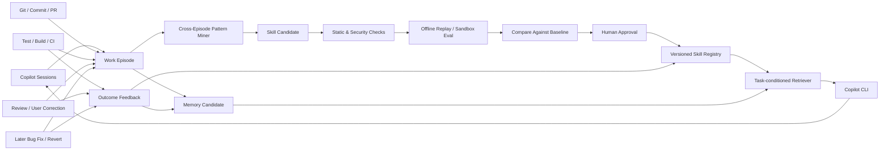
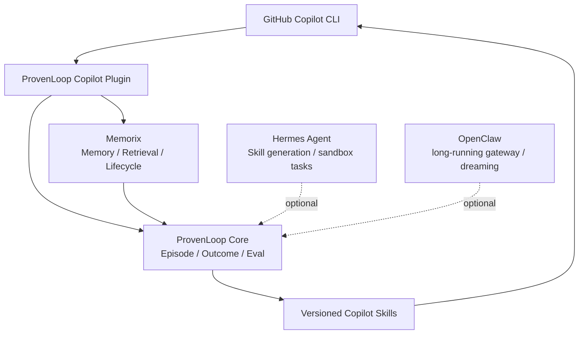

# From Memory to continuous learning: Self-Improving Agent research and a ProvenLoop engineering proposal

> Goal: Enable a Coding Agent to extract patterns from real work trajectories, form skills, validate their effects, and reduce repeated mistakes and manual corrections in future tasks, beyond simply retaining history.

**Research date:** 2026-08-27
**Related documents:**

- [Competitive research findings](competitive-analysis.md)
- [Product design](../product-design.md)

---

## 1. Summary of conclusions

An Agent can become more capable over time. The most practical, safe, and implementable path today is a nonparametric learning loop, rather than continuously modifying foundation-model weights on the user's machine:

```text
Real task trajectories
  -> Episodic memory
  -> Patterns across trajectories
  -> Executable skills or workflows
  -> Independent evaluation
  -> Approval and versioning
  -> Activation based on task conditions
  -> Strengthening, revision, or rollback based on new outcomes
```

Existing research has validated the main parts of this loop separately:

- **ReAct** shows how to produce inspectable Thought-Action-Observation trajectories.
- **Reflexion** and **Self-Refine** show that language feedback can improve the next attempt without updating model weights.
- **Generative Agents** shows how episodic memories can be retrieved using importance, relevance, and time, then used to form higher-level reflections.
- **MemGPT/Letta** shows how information can move between limited context and long-term storage, much as an operating system manages memory.
- **ExpeL** shows how comparing successful and failed trajectories can yield lessons across tasks.
- **Voyager** shows that only procedures verified as successful by the environment should enter an executable skill library.
- **Agent Workflow Memory** shows how reusable workflows can be abstracted from example trajectories.
- **ACE, DSPy, OPRO, and GEPA** show how prompts, rules, and Agent programs can be continuously optimized using trajectories and metrics.
- **SWE-Gym and SWE-RL** show that trajectories can also train model parameters when tasks have executable tests and verifiers.

ProvenLoop's most useful role therefore extends beyond Memory:

> **A software outcome feedback learning layer for Coding Agents: connect Sessions, Commits, PRs, Reviews, CI, tests, and later Bug Fixes into Work Episodes, then promote repeatedly verified lessons into versioned Skills.**

---

## 2. What counts as becoming more capable

Distinguish six capabilities so that retaining more chats is not mistaken for learning.

| Level | Capability | Changes model weights | Typical implementations |
|---|---|---:|---|
| L0 Trajectory recording | Record tasks, actions, observations, and outcomes | No | ReAct, SWE-agent |
| L1 Episodic memory | Retrieve what happened in a specific task | No | Reflexion, MemGPT |
| L2 Semantic induction | Extract patterns and conditions from multiple experiences | No | ExpeL, Generative Agents |
| L3 Procedural skills | Compile patterns into Skills, scripts, or workflows | No | Voyager, AWM, Hermes |
| L4 Strategy optimization | Compare and optimize prompts, routing, and processes with metrics | No | DSPy, OPRO, ACE, GEPA |
| L5 Parameter learning | Use trajectories for SFT, DPO, RL, or continual training | Yes | SWE-Gym, SWE-RL |

For local Copilot CLI users, L0-L4 should come first:

- Low cost.
- No additional training infrastructure.
- Explainable behavior.
- Isolation by repo.
- Support for deletion, revision, and rollback.
- Improvements to real development work within a relatively short time.

L5 should be a later, offline, centralized capability. It should not automatically modify the model after each Session.

---

## 3. Types of memory

### 3.1 Working memory

The goals, plan, recent tool output, and unfinished steps in the current Session.

This belongs in model context but should not be retained permanently.

### 3.2 Episodic memory

A specific experience:

```yaml
task: Fix a better-sqlite3 installation failure on Windows
context:
  repo: owner/project
  branch: feature/memory
  platform: Windows
actions:
  - Check the Node ABI
  - Check for prebuilt binaries
  - Initialize the MSVC environment
outcome:
  tests_passed: true
  exit_code: 0
evidence:
  - session-id
  - commit-sha
  - test-run-id
```

Episodic memory answers what happened last time.

### 3.3 Semantic memory

Stable facts or patterns inferred from multiple experiences:

```text
When building native Node modules on Windows, a mismatch between the Node ABI
and prebuilt binaries is a frequent cause of failure. Use the MSVC compilation
path only when no suitable prebuilt package is available.
```

Semantic memory answers why something usually happens.

### 3.4 Procedural memory

A procedure that can be executed or followed directly:

```markdown
---
name: windows-native-node-build
description: Use when a Node native dependency fails to install on Windows.
---

1. Check Node, npm, Python, and the target architecture.
2. Confirm whether the dependency provides a prebuilt package for the current ABI.
3. Check Visual Studio Build Tools only when necessary.
4. Load vcvars64.bat and run the build in the same cmd.exe process.
5. Run a minimal smoke test.
```

Procedural memory answers what to do next time.

---

## 4. Research development

## 4.1 ReAct: trajectories as learning material

**ReAct: Synergizing Reasoning and Acting in Language Models** organizes reasoning, actions, and environmental observations into a loop:

```text
Thought -> Action -> Observation -> Thought
```

It does not itself provide learning across Sessions, but produces the structured trajectories that later learning systems need.

Implications for ProvenLoop:

- Preserve replayable actions and outcomes, not just final summaries.
- Link tool failures, test output, file changes, and user corrections to the same Work Episode.
- Do not retain full hidden reasoning by default. Actions, observations, explicit reasons, and outcomes can be retained.

Source: [ReAct](https://arxiv.org/abs/2210.03629)

## 4.2 Reflexion and Self-Refine: learning through language feedback

**Reflexion** converts failures, environmental feedback, or compilation errors into language reflections and injects them into the next attempt. The paper calls this verbal reinforcement learning, but it does not update model weights.

**Self-Refine** uses the same model in a repeated cycle:

```text
Generate -> Feedback -> Revise
```

Implications for ProvenLoop:

- User corrections should be high-value Outcome Signals.
- Link a failure's cause to the next successful fix.
- Reflections require external verification. The model's own criticism cannot directly become a permanent rule.

Sources:

- [Reflexion](https://arxiv.org/abs/2303.11366)
- [Self-Refine](https://arxiv.org/abs/2303.17651)

## 4.3 Generative Agents: higher-level patterns from events

The Memory Stream in Generative Agents records time, importance, relevance, and an embedding for each event. Retrieval combines:

```text
recency + relevance + importance
```

When accumulated importance reaches a threshold, the system forms higher-level reflections from multiple underlying events.

Implications for ProvenLoop:

- Do not treat all history equally.
- Patterns should cite the original Episodes that support them.
- Frequent, important, repeatedly verified content is worth promoting.
- Reflections are not permanent truths. Retain their sources, timestamps, and confidence.

Source: [Generative Agents](https://arxiv.org/abs/2304.03442)

## 4.4 MemGPT/Letta: context as a cache, not a database

MemGPT treats limited model context as main memory and external memory as persistent storage, using tools to move information between them.

Implications for ProvenLoop:

```text
History size on disk != Context size for each request
```

- Raw events, Memory, and Skills should live in an external database.
- Inject only a small number of Briefs relevant to the current task into each request.
- Expand Details and full trajectories only when specifically needed.
- Context must have a strict token budget.

Source: [MemGPT](https://arxiv.org/abs/2310.08560)

## 4.5 ExpeL: comparing success and failure

ExpeL collects task trajectories, compares successful and failed cases, and extracts natural-language insights. At inference time, it retrieves both experiences and patterns.

Implications for ProvenLoop:

- A single successful case is insufficient to establish a general Skill.
- Failed trajectories can identify steps that should not be repeated.
- The differences between success and failure are the most useful information.
- Rules must state applicability conditions instead of issuing unconditional commands.

Source: [ExpeL](https://arxiv.org/abs/2308.10144)

## 4.6 Voyager: verification before admission to the skill library

In the Minecraft environment, Voyager:

1. Automatically selects curriculum goals.
2. Generates executable code.
3. Continuously revises it in response to environmental errors.
4. Uses a critic to judge whether the task is complete.
5. Adds only successful programs to the vector skill library.

This is the closest match to the Skill Promotion that ProvenLoop needs:

```text
Episode -> Candidate Skill -> Execute -> Verify -> Promote
```

For a Coding Agent, the critic should prefer:

- Unit tests.
- Build results.
- Static checks.
- CI.
- Explicit user acceptance.
- The absence of later rollbacks or fixes.

Model self-assessment can only be a supporting signal.

Source: [Voyager](https://arxiv.org/abs/2305.16291)

## 4.7 Agent Workflow Memory: abstracting workflows from examples

Agent Workflow Memory removes instance-specific parameters from concrete trajectories to form reusable workflows.

For example:

```text
Specific experience:
Modify auth.ts in repo-a and run npm test -- auth

Abstract workflow:
Locate the authentication entry point -> Make the smallest necessary change -> Run authentication tests -> Check for regressions
```

Implications for ProvenLoop:

- Forming a Skill requires parameter abstraction.
- Absolute paths, temporary branch names, specific tokens, and one-off commands should not enter a general Skill.
- Workflows should retain triggers, inputs, verification methods, and fallback paths.

Source: [Agent Workflow Memory](https://arxiv.org/abs/2409.07429)

## 4.8 DSPy, OPRO, ACE, and GEPA: optimizing Agent programs

These works treat prompts, rules, examples, and multistep programs as objects of optimization:

- **DSPy** selects successful traces using task metrics and compiles demonstrations or prompts.
- **OPRO** places existing candidates and scores in a meta-prompt so the model can propose better candidates.
- **ACE** uses a Generator to produce trajectories, a Reflector to analyze successes and failures, and a Curator to update a playbook incrementally.
- **GEPA** evolves Agent programs using full trajectories and language feedback, retaining Pareto candidates.

Implications for ProvenLoop:

- Skills need versions and scores, rather than a binary state of existing or not existing.
- Compare new versions with old versions and a baseline without the Skill.
- Do not evaluate a Skill only on the tasks that produced it.
- Retain multiple candidates instead of overwriting the current best version each time.

Sources:

- [DSPy](https://arxiv.org/abs/2310.03714)
- [OPRO](https://arxiv.org/abs/2309.03409)
- [ACE](https://arxiv.org/abs/2510.04618)
- [GEPA](https://arxiv.org/abs/2507.19457)

## 4.9 From external learning to model parameter learning

SWE-agent primarily improves the Agent-Computer Interface. It is not itself a continual learning system.

Examples that use software engineering trajectories to train models include:

- **SWE-Gym** generates trajectories from executable software tasks to train Agents and verifiers.
- **SWE-smith** synthesizes tasks and trajectories from codebases to train software engineering models.
- **SWE-RL** uses real software evolution and verifiable rewards for reinforcement learning.

Implications for ProvenLoop:

- The MVP should not include local online fine-tuning.
- Approved trajectories could become sanitized training datasets in the future.
- Parameter training needs separate data licensing, deduplication, evaluation, and model rollback processes.

Sources:

- [SWE-agent](https://arxiv.org/abs/2405.15793)
- [SWE-Gym](https://arxiv.org/abs/2412.21139)
- [SWE-smith](https://arxiv.org/abs/2504.21798)
- [SWE-RL](https://arxiv.org/abs/2502.18449)

---

## 5. What existing engineering systems provide

| System | Memory retrieval | Pattern induction | Skill formation | Independent evaluation | Updates model weights |
|---|---:|---:|---:|---:|---:|
| OpenAI Agents Sessions | Yes | No | No | No | No |
| AutoGen Memory | Yes | No | No | No | No |
| LangGraph Memory | Yes | Built by the application | Built by the application | Built by the application | No |
| Letta/MemGPT | Yes | Limited | No | No | No |
| CrewAI Memory | Yes | Merging/decay | No | No | No |
| Memorix | Yes | Yes | Mini-skill/Promotion | Replay foundation | No |
| OpenClaw | Yes | Dreaming/Consolidation | Skills ecosystem | Preview and rollback mechanisms | No |
| Hermes Agent | Yes | Background Review | Yes | Limited | No |
| Voyager | Yes | Yes | Yes | Critic/environment | No |
| DSPy/GEPA | Trajectory input | Yes | Prompt/Program | Yes | No |
| SWE-Gym/SWE-RL | Training data | Yes | Parameterized | Yes | Yes |

### 5.1 Memorix

Memorix is best suited to general-purpose Memory infrastructure:

- Project, Reasoning, Git, and Long-term Memory.
- Repo identity derived from Git remotes.
- Write admission, value classification, merging, decay, and archival.
- MCP, Hooks, Copilot Plugin, and Dashboard.
- Memory feedback, auditing, and project isolation.
- Promotion of stable knowledge into mini-skills.

Its limitation is that its core remains a Memory Control Plane. It does not automatically prove that a Skill improves software task success rates.

### 5.2 Hermes Agent

Hermes is closer to turning experience into skills:

- `MEMORY.md`, `USER.md`, and Session SQLite.
- `/learn` generates or revises `SKILL.md` from documents, code, or a recently completed workflow.
- Skill usage counts, status, creators, related skills, and recoverable archival.
- Background Memory/Skill Review.
- Independent sub-Agents, tool execution, and multiple sandbox backends.

Its learning still occurs mainly in external Memory and Skill layers. It does not automatically train model weights.

### 5.3 OpenClaw

OpenClaw is better suited to a persistent personal Agent:

- A Gateway continuously receives real-world events.
- Active Memory.
- Multistage Dreaming: Light, REM, and Deep.
- Writes to long-term Memory are allowed only in the Deep stage.
- Consolidation retains source references and preimages, with preview and rollback support.
- Source deletion can operate by session, participant, or hook source.

It demonstrates a useful principle:

> Offline consolidation should be a controlled maintenance task. Long-term knowledge should not change immediately after every chat.

---

## 6. How ProvenLoop should differentiate itself

General-purpose memory and Skill files are already relatively mature capabilities. ProvenLoop should focus its own development on a software engineering outcome feedback loop.



Generating a SKILL.md is only part of the distinction. ProvenLoop also:

1. Knows which Sessions, Commits, and tests produced a Skill.
2. Knows which later outcomes support or contradict that Skill.
3. Can compare results on historical tasks with and without it.
4. Can canary a new version on a small number of tasks.
5. Can automatically roll back when results deteriorate.

---

## 7. Recommended data model

### 7.1 RawEvent

```text
event_id
parent_event_id
user_id / agent_id / session_id
repo_id / branch / worktree / commit
model / prompt / skill_versions
event_type
tool_name
redacted_arguments
result_digest
exit_code
timestamp
```

RawEvent is an immutable audit record and does not enter model context directly.

### 7.2 WorkEpisode

```text
episode_id
goal
repo_id
branches
session_ids
commit_ids
pull_request_ids
started_at / finished_at
outcome
test_results
user_corrections
reverts
follow_up_bug_ids
confidence
```

WorkEpisode links the same software work across Sessions.

### 7.3 MemoryCandidate

```text
memory_id
kind: episodic | semantic | procedural
scope: personal | repo | team
content
source_episode_ids
source_refs
trust
confidence
importance
admission: ephemeral | candidate | qualified | approved
lifecycle: active | superseded | archived
conflicts_with
supersedes
created_at / validated_at / last_accessed_at
access_count
ttl
pii_class
```

### 7.4 SkillVersion

```text
skill_id
version
artifact_hash
description
triggers
procedure
scripts
required_permissions
source_episode_ids
baseline_metrics
candidate_metrics
status: draft | canary | approved | deprecated | rolled_back
reviewer
created_at
```

### 7.5 FeedbackEvent

```text
feedback_id
target_type: memory | skill | episode
target_id
kind: confirm | correct | conflict | weaken | strengthen | revoke
source
evidence_ref
timestamp
```

Feedback should be an append-only event. Rebuild the current state from events to support auditing and rollback.

---

## 8. Rules for promoting Memory to Skills

Automatic generation of a Skill Candidate requires at least one of the following:

1. Two or more independent successful trajectories share the same stable steps.
2. The user explicitly asks to save a procedure or Skill.
3. The same fix resolves the same type of failure multiple times.

All of the following must also hold:

- There is a machine-verifiable success criterion.
- The procedure does not depend on temporary absolute paths, keys, or incidental environment conditions.
- Triggers are clear.
- Required permissions can be declared.
- Source trajectories are complete.
- Instructions in webpages, emails, or tool output are not directly treated as trusted rules.

The following must not be automatically promoted by default:

- Speculation after a single failure.
- Procedures judged successful only by model self-assessment.
- Facts without a repo, session, or source.
- Retrieved old Memory counted again as new evidence.
- Content containing credentials, personal data, or raw private conversations.

---

## 9. Evaluation framework

### 9.1 Why a baseline without Skills is necessary

Task success after enabling a Skill does not prove that the Skill is effective. The foundation model may already have been able to complete the task.

Compare at least:

```text
Baseline: No Memory, no Skill
Memory: Relevant history only
Skill-old: Current released version
Skill-new: Candidate version
```

### 9.2 Evaluation metrics

| Dimension | Metrics |
|---|---|
| Task capability | success rate, test pass rate, pass@k |
| Efficiency | tokens, model calls, tool calls, latency, cost |
| Human effort | user corrections, rejections, manual interventions |
| Memory | precision, recall, wrong injection rate, repeated injection rate |
| Skill | trigger precision, wrong selection rate, version promotion rate |
| Continual learning | forward transfer, backward transfer, forgetting rate |
| Safety | secret retention rate, cross-repo leakage rate, injection success rate |

### 9.3 Held-out evaluation

A Skill cannot be tested only on the Episodes that produced it. Reserve:

- Historical Episodes that did not contribute to induction.
- Later tasks.
- Similar, portable tasks from different repos.
- Negative samples where the Skill explicitly should not trigger.

---

## 10. Main failure modes

| Risk | Symptom | Controls |
|---|---|---|
| Memory contamination | Malicious instructions in webpages or tool output become long-term rules | Source trust labels, candidate isolation, injection scanning |
| Entrenched errors | A single hallucination is promoted into a Skill | Multiple evidence sources, external tests, human approval |
| Reward hacking | The Agent optimizes superficial test results instead of the real goal | Multiple metrics, independent verifiers, human spot checks |
| Context growth | More history increases token use | Top-k, token budgets, progressive disclosure |
| Cross-repo leakage | Project facts enter other projects | Git identity, scope ACLs, leakage tests |
| Privacy leakage | Secrets or private conversations enter long-term storage | Sanitization on both writes and reads, source deletion |
| Catastrophic forgetting | A new summary overwrites an older valid rule | Append-only, preimages, supersession |
| Overfitting to history | A Skill works only on old tasks | Held-out data, out-of-time evaluation, canary |
| Version drift | Model, code, or dependency changes invalidate a Skill | Environment version records, TTL, revalidation |

Related safety research:

- [AgentPoison](https://arxiv.org/abs/2407.12784)
- [AgentDojo](https://arxiv.org/abs/2406.13352)
- [ToolEmu](https://arxiv.org/abs/2309.15817)

---

## 11. Phased engineering roadmap

## Phase 0: Observe only

- Capture Copilot Sessions, tools, files, Git, and test results.
- Establish immutable trajectory storage.
- Sanitize by default.
- Do not perform automatic long-term writes.
- Build a replay set of 20-50 real tasks.

Success criteria:

- Work Episodes can be reconstructed.
- Normal Copilot CLI latency is unaffected.
- Test success, failure, user corrections, and reverts can be identified accurately.

## Phase 1: Safe Memory

- Explicit `/remember`.
- Repo-scoped Memory.
- Separate management of portable personal preferences.
- Inject at most 3-5 items per request, with a token ceiling.
- Support correction, resolve, archive, and delete.

Success criteria:

- Repeated explanations in new Sessions decrease substantially.
- Cross-repo leakage is zero.
- Incorrect Memory can be traced to its source and revoked.

## Phase 2: Outcome Linker

- Link Sessions to Commits, PRs, Reviews, CI, and later Bug Fixes.
- Strengthen or weaken historical Memory based on outcomes.
- Distinguish an immediate pass from a later rollback.
- Build a view of differences between success and failure.

This is ProvenLoop's primary distinction from general-purpose Memory.

## Phase 3: Skill Candidate

- Generate `SKILL.md` drafts from repeatedly successful Episodes.
- Abstract absolute paths and instance parameters.
- Declare triggers, verification steps, and permissions.
- Run static checks, Secret scans, and Prompt Injection scans.

Do not enable automatically by default.

## Phase 4: Offline evaluation and release

- Replay historical tasks in a sandbox.
- Compare no Skill, the old Skill, and the new Skill.
- Send passing candidates for human approval.
- Publish an immutable version.
- Use a 5% canary.
- Support one-click rollback.

## Phase 5: Optional parameter training

- Use only approved, sanitized, deduplicated trajectories with clear licensing.
- Separate training, validation, and out-of-time test sets.
- Use SFT, DPO, RFT, or LoRA.
- Release model versions as separate artifacts.
- Do not override auditing capabilities in the Memory and Skill layers.

---

## 12. MVP recommendations

A hackathon or first version should not attempt a complete self-learning Agent. Focus on:

```text
Session + Git + Test
       ↓
Work Episode
       ↓
Outcome Linker
       ↓
Knowledge Card correction
       ↓
Skill Candidate preview
```

Required implementation:

- Copilot Plugin/Hooks.
- Local event capture.
- Repo and Branch identity.
- Work Episode linking.
- Recognition of user corrections and test results.
- Memory provenance and state.
- One path for generating a Skill Candidate.
- Skill diffs and source display.
- Manual approval, rejection, and rollback.

Out of scope for now:

- Online model fine-tuning.
- Automatic activation of Skills with elevated permissions.
- Team-level knowledge synchronization.
- A general-purpose chat assistant.
- Mandatory summaries after every Session.
- Building a vector database or general-purpose Memory platform.

---

## 13. Combining Memorix, Hermes, and OpenClaw

Recommended relationship:



### Memorix responsibilities

- Project memory.
- MCP retrieval.
- Git Memory.
- Formation, Retention, and Consolidation.
- Dashboard and basic governance.

### ProvenLoop responsibilities

- Work Episode.
- Outcome Linker.
- Causal feedback across time.
- Skill Candidate.
- Offline replay and version comparison.
- Canary, approval, and rollback.

### Optional Hermes responsibilities

- Retrospectives by independent Agents.
- Skill draft generation.
- Verification tasks in Docker or cloud environments.
- Parallel research by multiple Agents.

### Optional OpenClaw responsibilities

- Persistent scheduling.
- Human approval across devices.
- Nightly Dreaming/Consolidation.
- Notifications and remote control.

The MVP should not depend on all three at once. The most practical sequence is:

```text
Copilot Plugin + ProvenLoop Core
  -> Integrate Memorix
  -> Add Hermes or OpenClaw as needed
```

---

## 14. Product principles

1. **Memory alone is not learning.** Lessons count as learning only when they are abstracted, verified, and improve later tasks.
2. **Outcomes take precedence over model self-assessment.** Tests, CI, Reviews, user acceptance, and later rollbacks are more trustworthy than language reflections.
3. **Keep provenance.** Every pattern and Skill must be traceable to Episodes, Sessions, and Commits.
4. **Separate candidates from activation.** Automated systems can make proposals, but cannot permanently change behavior without conditions.
5. **Keep personal, Repo, and team scopes strictly isolated.** Crossing scopes requires explicit approval.
6. **Context has a hard budget.** The database may grow, but request context must not grow linearly with it.
7. **Every improvement must support comparison.** Without a baseline, increased capability cannot be proven.
8. **Every improvement must be reversible.** Incorrect learning is more dangerous than no learning.
9. **Start with external learning, then consider parameter learning.** Consider model training only after Memory, Skill, and Policy are mature.

---

## 15. References

### Agent trajectories and reflection

- [ReAct: Synergizing Reasoning and Acting in Language Models](https://arxiv.org/abs/2210.03629)
- [Reflexion: Language Agents with Verbal Reinforcement Learning](https://arxiv.org/abs/2303.11366)
- [Self-Refine: Iterative Refinement with Self-Feedback](https://arxiv.org/abs/2303.17651)
- [Generative Agents: Interactive Simulacra of Human Behavior](https://arxiv.org/abs/2304.03442)

### Long-term memory and experiential learning

- [MemGPT: Towards LLMs as Operating Systems](https://arxiv.org/abs/2310.08560)
- [ExpeL: LLM Agents Are Experiential Learners](https://arxiv.org/abs/2308.10144)
- [Episodic Memory in Lifelong Language Learning](https://arxiv.org/abs/1906.01076)
- [Episodic Memory is the Missing Piece for Long-Term LLM Agents](https://arxiv.org/abs/2502.06975)
- [LongMemEval](https://arxiv.org/abs/2410.10813)
- [LoCoMo](https://arxiv.org/abs/2402.17753)

### Skills and program optimization

- [Voyager](https://arxiv.org/abs/2305.16291)
- [Agent Workflow Memory](https://arxiv.org/abs/2409.07429)
- [DSPy](https://arxiv.org/abs/2310.03714)
- [Large Language Models as Optimizers / OPRO](https://arxiv.org/abs/2309.03409)
- [TextGrad](https://arxiv.org/abs/2406.07496)
- [Agentic Context Engineering / ACE](https://arxiv.org/abs/2510.04618)
- [GEPA](https://arxiv.org/abs/2507.19457)

### Software engineering Agents and parameter training

- [SWE-agent](https://arxiv.org/abs/2405.15793)
- [SWE-bench](https://arxiv.org/abs/2310.06770)
- [SWE-Gym](https://arxiv.org/abs/2412.21139)
- [SWE-smith](https://arxiv.org/abs/2504.21798)
- [SWE-RL](https://arxiv.org/abs/2502.18449)

### Continual learning surveys

- [Continual Learning for Large Language Models: A Survey](https://arxiv.org/abs/2402.01364)
- [Continual Learning of Large Language Models: A Comprehensive Survey](https://arxiv.org/abs/2404.16789)
- [Lifelong Learning of Large Language Model based Agents: A Roadmap](https://arxiv.org/abs/2501.07278)

### Safety and evaluation

- [AgentPoison](https://arxiv.org/abs/2407.12784)
- [AgentDojo](https://arxiv.org/abs/2406.13352)
- [ToolEmu](https://arxiv.org/abs/2309.15817)
- [AgentBench](https://arxiv.org/abs/2308.03688)
- [WebArena](https://arxiv.org/abs/2307.13854)
- [GAIA](https://arxiv.org/abs/2311.12983)
- [OSWorld](https://arxiv.org/abs/2404.07972)

### Engineering implementations

- [Memorix](https://github.com/AVIDS2/memorix)
- [Hermes Agent](https://github.com/NousResearch/hermes-agent)
- [OpenClaw](https://github.com/openclaw/openclaw)
- [Letta](https://github.com/letta-ai/letta)
- [LangGraph Memory](https://docs.langchain.com/oss/python/concepts/memory)
- [AutoGen Memory](https://microsoft.github.io/autogen/)
- [CrewAI Memory](https://docs.crewai.com/en/concepts/memory)
- [OpenAI Agents SDK Sessions](https://openai.github.io/openai-agents-python/sessions/)
- [LangSmith Dataset Versioning](https://docs.langchain.com/langsmith/manage-datasets)
- [Phoenix Experiments](https://arize.com/docs/ax/improve/experiment-in-code)

---

## 16. Final assessment

ProvenLoop's vision is feasible, but success cannot be measured by:

> How many Sessions were saved or how much Memory was generated.

It should be measured by:

> Whether similar new tasks have fewer failures, less rework, and fewer user corrections, while producing verifiable results with lower token use, fewer tool calls, and less time.

Its core assets therefore extend beyond the Memory Database:

```text
Traceable Work Episodes
+ Trustworthy Outcomes
+ Testable Skills
+ Versioned evaluation results
+ Safe activation and rollback mechanisms
```

These five parts form the engineering loop that turns remembered history into continuous improvement.
