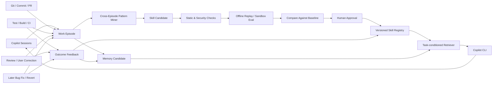
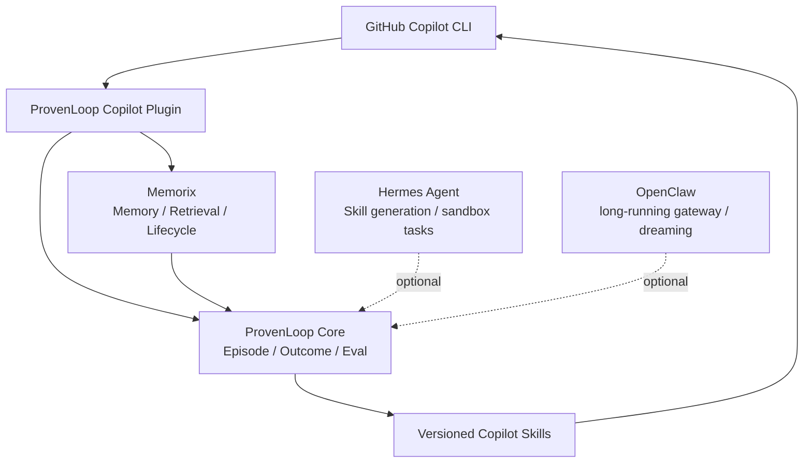

# 从 Memory 到持续学习：Self-Improving Agent 研究与 ProvenLoop 工程方案

> 目标：让 Coding Agent 不只是保存历史，而是从真实工作轨迹中提炼规律、形成技能、验证效果，并在未来任务中持续减少重复错误和人工纠正。

**研究日期：** 2026-08-27  
**关联文档：**

- `ProvenLoop-investigation-findings.md`
- `ProvenLoop-product-design.md`

---

## 1. 结论摘要

“Agent 随时间变得越来越聪明”可以实现，但当前最现实、安全且可工程化的路径，不是在用户机器上持续修改基础模型权重，而是构建一个非参数学习闭环：

```text
真实任务轨迹
  -> 情景记忆
  -> 跨轨迹规律
  -> 可执行技能或工作流
  -> 独立评估
  -> 审批和版本化
  -> 按任务条件激活
  -> 根据新结果强化、修订或回滚
```

现有研究已经分别验证了这个闭环的主要环节：

- **ReAct** 说明如何产生可检查的 Thought-Action-Observation 轨迹。
- **Reflexion** 和 **Self-Refine** 说明语言反馈可以改善下一次尝试，而不必更新模型权重。
- **Generative Agents** 说明情景记忆可以通过重要性、相关性和时间因素进行检索，并进一步形成高层反思。
- **MemGPT/Letta** 说明可以像操作系统管理内存一样，在有限上下文与长期存储之间换入换出信息。
- **ExpeL** 说明可以比较成功和失败轨迹，提炼跨任务经验。
- **Voyager** 说明只有经环境验证成功的过程，才应进入可执行技能库。
- **Agent Workflow Memory** 说明可以从实例轨迹中抽象出可复用工作流。
- **ACE、DSPy、OPRO、GEPA** 说明提示、规则和 Agent 程序本身可以通过轨迹与指标持续优化。
- **SWE-Gym、SWE-RL** 说明当任务存在可执行测试和 verifier 时，可以进一步用轨迹训练模型参数。

因此，ProvenLoop 最有价值的定位不应只是 Memory，而应是：

> **面向 Coding Agent 的软件成果反馈学习层：把 Session、Commit、PR、Review、CI、测试和后续 Bug Fix 连接为 Work Episode，再将经过验证的重复经验升级为可版本化 Skill。**

---

## 2. 什么才算“变得更聪明”

需要区分六种能力，避免把“保存更多聊天”误认为学习。

| 层级 | 能力 | 是否改变模型权重 | 典型实现 |
|---|---|---:|---|
| L0 轨迹化 | 记录任务、动作、观察和结果 | 否 | ReAct、SWE-agent |
| L1 情景记忆 | 找回某次具体任务发生了什么 | 否 | Reflexion、MemGPT |
| L2 语义归纳 | 从多次经历提炼规律和条件 | 否 | ExpeL、Generative Agents |
| L3 程序技能 | 把规律编译成 Skill、脚本或工作流 | 否 | Voyager、AWM、Hermes |
| L4 策略优化 | 用指标比较和优化提示、路由及流程 | 否 | DSPy、OPRO、ACE、GEPA |
| L5 参数学习 | 用轨迹执行 SFT、DPO、RL 或持续训练 | 是 | SWE-Gym、SWE-RL |

对本地 Copilot CLI 用户而言，最优先的是 L0-L4：

- 成本低。
- 不要求额外训练基础设施。
- 可解释。
- 可按 repo 隔离。
- 可以删除、修订和回滚。
- 能在较短时间内改善真实开发体验。

L5 应当是后期、离线、集中式能力，而不是每个 Session 结束后自动修改模型。

---

## 3. 记忆类型

### 3.1 工作记忆

当前 Session 中的目标、计划、最近工具输出和未完成步骤。

它适合进入模型上下文，但不适合永久保存。

### 3.2 情景记忆

一次具体经历：

```yaml
task: 修复 Windows 上 better-sqlite3 安装失败
context:
  repo: owner/project
  branch: feature/memory
  platform: Windows
actions:
  - 检查 Node ABI
  - 检查预编译二进制
  - 初始化 MSVC 环境
outcome:
  tests_passed: true
  exit_code: 0
evidence:
  - session-id
  - commit-sha
  - test-run-id
```

情景记忆回答“上一次发生了什么”。

### 3.3 语义记忆

从多次经历中归纳出的稳定事实或规律：

```text
在 Windows 上构建 Node 原生模块时，Node ABI 与预编译二进制不匹配
是高频失败原因。只有在没有可用预编译包时才应进入 MSVC 编译路径。
```

语义记忆回答“通常为什么会发生”。

### 3.4 程序记忆

可直接执行或遵循的过程：

```markdown
---
name: windows-native-node-build
description: Use when a Node native dependency fails to install on Windows.
---

1. 检查 Node、npm、Python 和目标架构。
2. 确认依赖是否提供当前 ABI 的预编译包。
3. 仅在必要时检查 Visual Studio Build Tools。
4. 在同一个 cmd.exe 进程中加载 vcvars64.bat 并执行构建。
5. 运行最小 smoke test。
```

程序记忆回答“下一次应该怎么做”。

---

## 4. 论文脉络

## 4.1 ReAct：轨迹是学习的原材料

**ReAct: Synergizing Reasoning and Acting in Language Models** 将推理、动作和环境观察组织为循环：

```text
Thought -> Action -> Observation -> Thought
```

它本身不提供跨 Session 学习，但产生了后续学习系统需要的结构化轨迹。

对 ProvenLoop 的启示：

- 必须保存可重放的动作和结果，而不只是最终摘要。
- 工具失败、测试输出、文件变化和用户纠正都需要关联到同一 Work Episode。
- 不应默认保存完整隐藏推理；可保存动作、观察、显式理由和结果。

来源：[ReAct](https://arxiv.org/abs/2210.03629)

## 4.2 Reflexion 与 Self-Refine：文字反馈也是学习

**Reflexion** 将失败、环境反馈或编译错误转成语言反思，并在下一次尝试中注入。论文称其为 verbal reinforcement learning，但不更新模型权重。

**Self-Refine** 使用同一个模型循环执行：

```text
生成 -> 反馈 -> 修订
```

对 ProvenLoop 的启示：

- 用户纠正应成为高价值 Outcome Signal。
- “失败原因”需要与下一次成功修复建立关联。
- 反思必须接受外部验证；模型自己的批评不能直接成为永久规则。

来源：

- [Reflexion](https://arxiv.org/abs/2303.11366)
- [Self-Refine](https://arxiv.org/abs/2303.17651)

## 4.3 Generative Agents：从事件形成高层规律

Generative Agents 的 Memory Stream 为每个事件记录时间、重要性、相关性和嵌入。检索综合：

```text
recency + relevance + importance
```

当重要性累积到阈值时，系统会从多条底层事件形成高层 reflection。

对 ProvenLoop 的启示：

- 不应把所有历史同等对待。
- 规律应引用支持它的原始 Episode。
- 高频、重要、反复被验证的内容才值得升级。
- 反思不是永久真理，应保留来源、时间和置信度。

来源：[Generative Agents](https://arxiv.org/abs/2304.03442)

## 4.4 MemGPT/Letta：上下文是缓存，不是数据库

MemGPT 将有限模型上下文类比为主存，将外部记忆视为持久存储，通过工具进行换入换出。

对 ProvenLoop 的启示：

```text
磁盘历史规模 != 每次请求的 Context 规模
```

- 原始事件、Memory 和 Skills 应存在外部数据库。
- 每次请求只注入与当前任务相关的少量 Brief。
- Detail 和完整轨迹只在明确需要时展开。
- Context 必须有严格 token budget。

来源：[MemGPT](https://arxiv.org/abs/2310.08560)

## 4.5 ExpeL：比较成功与失败，而不是只总结成功

ExpeL 收集任务轨迹，比较成功和失败案例，再提炼自然语言 insight；推理时同时检索经验和规律。

对 ProvenLoop 的启示：

- 单个成功案例不足以形成通用 Skill。
- 失败轨迹可以说明哪些步骤不应重复。
- 最有价值的是成功与失败之间的差异。
- 规则必须描述适用条件，而不是无条件命令。

来源：[ExpeL](https://arxiv.org/abs/2308.10144)

## 4.6 Voyager：只有验证成功的过程才能进入技能库

Voyager 在 Minecraft 环境中：

1. 自动选择课程目标。
2. 生成可执行代码。
3. 根据环境错误持续修订。
4. 由 critic 判断任务是否完成。
5. 只有成功程序才进入向量技能库。

这最接近 ProvenLoop 所需要的 Skill Promotion：

```text
Episode -> Candidate Skill -> Execute -> Verify -> Promote
```

对 Coding Agent 而言，critic 应优先使用：

- 单元测试。
- 构建结果。
- 静态检查。
- CI。
- 用户明确验收。
- 后续没有发生回滚或修复。

模型自评只能作为辅助信号。

来源：[Voyager](https://arxiv.org/abs/2305.16291)

## 4.7 Agent Workflow Memory：从实例中抽象工作流

Agent Workflow Memory 将具体轨迹中的实例参数移除，形成可复用 workflow。

例如：

```text
具体经历：
在 repo-a 中修改 auth.ts，运行 npm test -- auth

抽象工作流：
定位认证入口 -> 修改最小范围 -> 运行认证相关测试 -> 检查回归
```

对 ProvenLoop 的启示：

- Skill 形成需要参数抽象。
- 绝对路径、临时分支名、具体 token 和一次性命令不应进入通用 Skill。
- Workflow 应保留触发条件、输入、验证方式和失败降级路径。

来源：[Agent Workflow Memory](https://arxiv.org/abs/2409.07429)

## 4.8 DSPy、OPRO、ACE 与 GEPA：Agent 程序也可以优化

这些工作把提示、规则、示例和多步骤程序视为可优化对象：

- **DSPy**：根据任务 metric 筛选成功 trace，并编译 demonstrations 或 prompt。
- **OPRO**：把已有候选和分数放入 meta-prompt，让模型提出更优候选。
- **ACE**：Generator 产生轨迹，Reflector 分析成功和失败，Curator 增量更新 playbook。
- **GEPA**：根据完整轨迹和语言反馈演化 Agent 程序，并保留 Pareto 候选。

对 ProvenLoop 的启示：

- Skill 不应只有“存在/不存在”，而应具有版本和评分。
- 新版本必须与旧版本及无 Skill 基线比较。
- 不能只在生成该 Skill 的任务上评估。
- 应保留多个候选，而不是每次覆盖当前最佳版本。

来源：

- [DSPy](https://arxiv.org/abs/2310.03714)
- [OPRO](https://arxiv.org/abs/2309.03409)
- [ACE](https://arxiv.org/abs/2510.04618)
- [GEPA](https://arxiv.org/abs/2507.19457)

## 4.9 从外部学习到模型参数学习

SWE-agent 主要改善 Agent-Computer Interface，本身不是持续学习系统。

真正使用软件工程轨迹训练模型的代表包括：

- **SWE-Gym**：用可执行软件任务生成轨迹，对 Agent 和 verifier 进行训练。
- **SWE-smith**：从代码库合成任务和轨迹，用于训练软件工程模型。
- **SWE-RL**：使用真实软件演化和可验证奖励进行强化学习。

对 ProvenLoop 的启示：

- MVP 不应包含本地在线微调。
- 批准后的轨迹未来可以成为脱敏训练集。
- 参数训练必须拥有独立数据许可、去重、评估和模型回滚流程。

来源：

- [SWE-agent](https://arxiv.org/abs/2405.15793)
- [SWE-Gym](https://arxiv.org/abs/2412.21139)
- [SWE-smith](https://arxiv.org/abs/2504.21798)
- [SWE-RL](https://arxiv.org/abs/2502.18449)

---

## 5. 现有工程系统提供了什么

| 系统 | 记忆检索 | 规律归纳 | Skill 形成 | 独立评估 | 更新模型权重 |
|---|---:|---:|---:|---:|---:|
| OpenAI Agents Sessions | 是 | 否 | 否 | 否 | 否 |
| AutoGen Memory | 是 | 否 | 否 | 否 | 否 |
| LangGraph Memory | 是 | 应用自建 | 应用自建 | 应用自建 | 否 |
| Letta/MemGPT | 是 | 有限 | 否 | 否 | 否 |
| CrewAI Memory | 是 | 合并/衰减 | 否 | 否 | 否 |
| Memorix | 是 | 是 | Mini-skill/Promotion | 有回放基础 | 否 |
| OpenClaw | 是 | Dreaming/Consolidation | 有 Skills 生态 | 有预览和回滚机制 | 否 |
| Hermes Agent | 是 | 后台 Review | 是 | 有限 | 否 |
| Voyager | 是 | 是 | 是 | Critic/环境 | 否 |
| DSPy/GEPA | 轨迹输入 | 是 | Prompt/Program | 是 | 否 |
| SWE-Gym/SWE-RL | 训练数据 | 是 | 参数化 | 是 | 是 |

### 5.1 Memorix

Memorix 最适合承担通用 Memory 基础设施：

- Project、Reasoning、Git 和 Long-term Memory。
- Git remote 驱动的 repo identity。
- 写入准入、价值分类、合并、衰减和归档。
- MCP、Hooks、Copilot Plugin 和 Dashboard。
- Memory feedback、审计和项目隔离。
- 将稳定知识提升为 mini-skill。

它的不足是：核心仍是 Memory Control Plane，不会自动证明一个 Skill 确实提高了软件任务成功率。

### 5.2 Hermes Agent

Hermes 更接近“经验形成技能”：

- `MEMORY.md`、`USER.md` 和 Session SQLite。
- `/learn` 从文档、代码或刚完成的工作流生成或修订 `SKILL.md`。
- Skill 使用计数、状态、创建者、关联技能和可恢复归档。
- 后台 Memory/Skill Review。
- 独立子 Agent、工具执行和多种 sandbox backend。

它的学习仍主要发生在外部 Memory 与 Skill 层，并不自动训练模型权重。

### 5.3 OpenClaw

OpenClaw 更适合常驻个人 Agent：

- Gateway 持续接收现实事件。
- Active Memory。
- Light、REM、Deep 多阶段 Dreaming。
- Deep 阶段才允许写入长期 Memory。
- Consolidation 保存来源引用、preimage，并支持 preview 和 rollback。
- 可按 session、participant 或 hook source 执行来源删除。

它展示了一个重要原则：

> 离线巩固应是受控维护任务，而不是每条聊天结束后立即修改长期知识。

---

## 6. ProvenLoop 应当如何差异化

通用记忆和 Skill 文件已经是相对成熟的基础能力。ProvenLoop 更值得自研的是软件工程结果反馈闭环。



核心区别不是“ProvenLoop 也能生成一个 SKILL.md”，而是：

1. 它知道 Skill 来自哪些 Session、Commit 和测试。
2. 它知道哪些后续结果支持或反驳该 Skill。
3. 它可以在历史任务上比较启用前后的效果。
4. 它可以将新版本 canary 到少量任务。
5. 它可以在效果下降时自动回滚。

---

## 7. 推荐数据模型

### 7.1 RawEvent

```text
event_id
parent_event_id
user_id / agent_id / session_id
repo_id / branch / worktree / commit
model / prompt / skill_versions
event_type
tool_name
redacted_arguments
result_digest
exit_code
timestamp
```

RawEvent 是不可变审计记录，不直接进入模型上下文。

### 7.2 WorkEpisode

```text
episode_id
goal
repo_id
branches
session_ids
commit_ids
pull_request_ids
started_at / finished_at
outcome
test_results
user_corrections
reverts
follow_up_bug_ids
confidence
```

WorkEpisode 负责跨 Session 关联同一软件工作。

### 7.3 MemoryCandidate

```text
memory_id
kind: episodic | semantic | procedural
scope: personal | repo | team
content
source_episode_ids
source_refs
trust
confidence
importance
admission: ephemeral | candidate | qualified | approved
lifecycle: active | superseded | archived
conflicts_with
supersedes
created_at / validated_at / last_accessed_at
access_count
ttl
pii_class
```

### 7.4 SkillVersion

```text
skill_id
version
artifact_hash
description
triggers
procedure
scripts
required_permissions
source_episode_ids
baseline_metrics
candidate_metrics
status: draft | canary | approved | deprecated | rolled_back
reviewer
created_at
```

### 7.5 FeedbackEvent

```text
feedback_id
target_type: memory | skill | episode
target_id
kind: confirm | correct | conflict | weaken | strengthen | revoke
source
evidence_ref
timestamp
```

反馈应为 append-only event。当前状态由事件重建，以支持审计和回滚。

---

## 8. 从 Memory 晋升为 Skill 的规则

自动生成 Skill Candidate 至少满足一项：

1. 两条以上独立成功轨迹具有相同稳定步骤。
2. 用户明确要求保存为流程或 Skill。
3. 同类失败被同一个修复方法多次解决。

并同时满足：

- 有机器可验证的成功判据。
- 不依赖临时绝对路径、密钥或偶然环境。
- 具有清晰触发条件。
- 所需权限可以声明。
- 来源轨迹完整。
- 未把网页、邮件或工具输出中的指令直接视为可信规则。

以下内容默认不能自动晋升：

- 单次失败后的推测。
- 仅由模型自评为成功的流程。
- 没有 repo、session 或来源的事实。
- 召回出来的旧 Memory 再次被当作新证据。
- 包含凭据、个人数据或原始私密对话的内容。

---

## 9. 评估体系

### 9.1 为什么必须有无 Skill 基线

如果启用 Skill 后任务成功，不能直接证明 Skill 有效。基础模型可能本来就能完成任务。

至少需要比较：

```text
Baseline：无 Memory、无 Skill
Memory：只提供相关历史
Skill-old：当前已发布版本
Skill-new：候选版本
```

### 9.2 评估指标

| 维度 | 指标 |
|---|---|
| 任务能力 | success rate、测试通过率、pass@k |
| 效率 | token、模型调用数、工具调用数、延迟、费用 |
| 人工负担 | 用户纠正次数、拒绝次数、手动干预次数 |
| Memory | precision、recall、错误注入率、重复注入率 |
| Skill | 触发 precision、错误选择率、版本提升率 |
| 持续学习 | forward transfer、backward transfer、遗忘率 |
| 安全 | secret 保存率、跨 repo 泄漏率、注入成功率 |

### 9.3 Held-out 评估

Skill 不能只在产生它的 Episode 上测试。应保留：

- 未参与归纳的历史 Episode。
- 时间上更晚的任务。
- 相似但不同 repo 的可移植任务。
- 明确不应触发该 Skill 的负样本。

---

## 10. 主要失败模式

| 风险 | 表现 | 控制措施 |
|---|---|---|
| 记忆污染 | 网页或工具输出中的恶意指令成为长期规则 | 来源信任标签、候选隔离、注入扫描 |
| 错误固化 | 一次 hallucination 升级成 Skill | 多证据、外部测试、人工审批 |
| 奖励黑客 | Agent 优化测试表面而非真实目标 | 多指标、独立 verifier、人工抽检 |
| 上下文膨胀 | 历史越来越多导致 token 增长 | Top-k、token budget、渐进披露 |
| 跨 repo 泄漏 | 项目事实进入其他项目 | Git identity、scope ACL、泄漏测试 |
| 隐私泄露 | Secret 或私密对话进入长期存储 | 写入/读取双重脱敏、来源删除 |
| 灾难性遗忘 | 新总结覆盖旧有效规则 | Append-only、preimage、supersession |
| 过拟合历史 | Skill 只对旧任务有效 | Held-out、时间外评估、canary |
| 版本漂移 | 模型、代码或依赖变化使 Skill 失效 | 记录环境版本、TTL、重新验证 |

相关安全研究：

- [AgentPoison](https://arxiv.org/abs/2407.12784)
- [AgentDojo](https://arxiv.org/abs/2406.13352)
- [ToolEmu](https://arxiv.org/abs/2309.15817)

---

## 11. 分阶段工程路线

## Phase 0：只观测

- 收集 Copilot Session、工具、文件、Git 和测试结果。
- 建立不可变轨迹存储。
- 默认脱敏。
- 不做自动长期写入。
- 建立 20-50 个真实任务回放集。

成功标准：

- 能重建 Work Episode。
- 不影响正常 Copilot CLI 延迟。
- 能准确识别测试成功、失败、用户纠正和 revert。

## Phase 1：安全 Memory

- 显式 `/remember`。
- repo-scoped Memory。
- 单独管理 portable personal preferences。
- 每次请求最多注入 3-5 条，并设置 token ceiling。
- 支持 correction、resolve、archive 和 delete。

成功标准：

- 新 Session 中重复解释显著减少。
- 跨 repo 泄漏为零。
- 错误 Memory 可定位来源并撤销。

## Phase 2：Outcome Linker

- 将 Session 与 Commit、PR、Review、CI 和后续 Bug Fix 关联。
- 根据结果强化或削弱历史 Memory。
- 区分“立即通过”与“之后被回滚”。
- 构建成功/失败差异视图。

这是 ProvenLoop 相比通用 Memory 的首要差异化。

## Phase 3：Skill Candidate

- 从重复成功 Episode 生成 `SKILL.md` 草稿。
- 抽象绝对路径和实例参数。
- 声明触发条件、验证步骤和权限。
- 进行静态检查、Secret 扫描和 Prompt Injection 扫描。

默认不自动启用。

## Phase 4：离线评估与发布

- 在 sandbox 中执行历史回放。
- 比较无 Skill、旧 Skill 和新 Skill。
- 通过后进入人工审批。
- 发布 immutable version。
- 采用 5% canary。
- 支持一键回滚。

## Phase 5：可选参数训练

- 仅使用批准、脱敏、去重且许可明确的轨迹。
- 分离训练、验证和时间外测试集。
- 采用 SFT、DPO、RFT 或 LoRA。
- 模型版本作为独立产物发布。
- 不能覆盖 Memory 和 Skill 层的审计能力。

---

## 12. MVP 建议

Hackathon 或第一版不应尝试完整自学习 Agent。建议聚焦：

```text
Session + Git + Test
       ↓
Work Episode
       ↓
Outcome Linker
       ↓
Knowledge Card correction
       ↓
Skill Candidate preview
```

必须实现：

- Copilot Plugin/Hooks。
- 本地事件采集。
- Repo 和 Branch identity。
- Work Episode 关联。
- 用户纠正和测试结果识别。
- Memory 来源与状态。
- 一条候选 Skill 生成路径。
- Skill diff 和来源展示。
- 手动批准、拒绝和回滚。

暂不实现：

- 在线模型微调。
- 自动启用高权限 Skill。
- 团队级知识同步。
- 通用聊天助手。
- 每次 Session 强制总结。
- 自研向量数据库或通用 Memory 平台。

---

## 13. 与 Memorix、Hermes 和 OpenClaw 的组合

推荐关系：



### Memorix 负责

- 项目记忆。
- MCP 检索。
- Git Memory。
- Formation、Retention 和 Consolidation。
- Dashboard 和基础治理。

### ProvenLoop 负责

- Work Episode。
- Outcome Linker。
- 跨时间因果反馈。
- Skill Candidate。
- 离线回放和版本比较。
- Canary、审批和回滚。

### Hermes 可选负责

- 独立 Agent 复盘。
- Skill 草稿生成。
- Docker/云环境中的验证任务。
- 多 Agent 并行研究。

### OpenClaw 可选负责

- 长期常驻调度。
- 跨设备人工审批。
- 夜间 Dreaming/Consolidation。
- 通知和远程控制。

MVP 不应同时依赖三者。最现实的顺序是：

```text
Copilot Plugin + ProvenLoop Core
  -> 集成 Memorix
  -> 再按需要接入 Hermes 或 OpenClaw
```

---

## 14. 产品原则

1. **记忆不是学习。** 只有经过抽象、验证并改善后续任务的经验才算学习。
2. **结果优先于模型自评。** 测试、CI、Review、用户验收和后续回滚比语言反思更可信。
3. **来源不能丢。** 每条规律和 Skill 必须能追溯到 Episode、Session 和 Commit。
4. **候选与生效分离。** 自动系统可以提出，但不能无条件永久修改行为。
5. **个人、Repo、团队严格隔离。** 跨作用域必须显式批准。
6. **Context 有硬预算。** 数据库可以增长，请求上下文不能线性增长。
7. **所有改进都必须可比较。** 没有 baseline 就无法证明变聪明。
8. **所有改进都必须可回滚。** 学错比不学习更危险。
9. **先外部学习，再参数学习。** Memory、Skill 和 Policy 成熟后才考虑训练模型。

---

## 15. 参考资料

### Agent 轨迹与反思

- [ReAct: Synergizing Reasoning and Acting in Language Models](https://arxiv.org/abs/2210.03629)
- [Reflexion: Language Agents with Verbal Reinforcement Learning](https://arxiv.org/abs/2303.11366)
- [Self-Refine: Iterative Refinement with Self-Feedback](https://arxiv.org/abs/2303.17651)
- [Generative Agents: Interactive Simulacra of Human Behavior](https://arxiv.org/abs/2304.03442)

### 长期记忆与经验学习

- [MemGPT: Towards LLMs as Operating Systems](https://arxiv.org/abs/2310.08560)
- [ExpeL: LLM Agents Are Experiential Learners](https://arxiv.org/abs/2308.10144)
- [Episodic Memory in Lifelong Language Learning](https://arxiv.org/abs/1906.01076)
- [Episodic Memory is the Missing Piece for Long-Term LLM Agents](https://arxiv.org/abs/2502.06975)
- [LongMemEval](https://arxiv.org/abs/2410.10813)
- [LoCoMo](https://arxiv.org/abs/2402.17753)

### Skills 与程序优化

- [Voyager](https://arxiv.org/abs/2305.16291)
- [Agent Workflow Memory](https://arxiv.org/abs/2409.07429)
- [DSPy](https://arxiv.org/abs/2310.03714)
- [Large Language Models as Optimizers / OPRO](https://arxiv.org/abs/2309.03409)
- [TextGrad](https://arxiv.org/abs/2406.07496)
- [Agentic Context Engineering / ACE](https://arxiv.org/abs/2510.04618)
- [GEPA](https://arxiv.org/abs/2507.19457)

### 软件工程 Agent 与参数训练

- [SWE-agent](https://arxiv.org/abs/2405.15793)
- [SWE-bench](https://arxiv.org/abs/2310.06770)
- [SWE-Gym](https://arxiv.org/abs/2412.21139)
- [SWE-smith](https://arxiv.org/abs/2504.21798)
- [SWE-RL](https://arxiv.org/abs/2502.18449)

### 终身学习综述

- [Continual Learning for Large Language Models: A Survey](https://arxiv.org/abs/2402.01364)
- [Continual Learning of Large Language Models: A Comprehensive Survey](https://arxiv.org/abs/2404.16789)
- [Lifelong Learning of Large Language Model based Agents: A Roadmap](https://arxiv.org/abs/2501.07278)

### 安全与评估

- [AgentPoison](https://arxiv.org/abs/2407.12784)
- [AgentDojo](https://arxiv.org/abs/2406.13352)
- [ToolEmu](https://arxiv.org/abs/2309.15817)
- [AgentBench](https://arxiv.org/abs/2308.03688)
- [WebArena](https://arxiv.org/abs/2307.13854)
- [GAIA](https://arxiv.org/abs/2311.12983)
- [OSWorld](https://arxiv.org/abs/2404.07972)

### 工程实现

- [Memorix](https://github.com/AVIDS2/memorix)
- [Hermes Agent](https://github.com/NousResearch/hermes-agent)
- [OpenClaw](https://github.com/openclaw/openclaw)
- [Letta](https://github.com/letta-ai/letta)
- [LangGraph Memory](https://docs.langchain.com/oss/python/concepts/memory)
- [AutoGen Memory](https://microsoft.github.io/autogen/)
- [CrewAI Memory](https://docs.crewai.com/en/concepts/memory)
- [OpenAI Agents SDK Sessions](https://openai.github.io/openai-agents-python/sessions/)
- [LangSmith Dataset Versioning](https://docs.langchain.com/langsmith/manage-datasets)
- [Phoenix Experiments](https://arize.com/docs/ax/improve/experiment-in-code)

---

## 16. 最终判断

ProvenLoop 的 Vision 是可行的，但成功标准不能是：

> 保存了多少 Session 或生成了多少 Memory。

而应当是：

> 在相似的新任务中，是否更少失败、更少返工、更少用户纠正，并在更低 token、工具调用和时间成本下得到可验证的结果。

因此，真正的核心资产不是 Memory Database，而是：

```text
可追溯的 Work Episode
+ 可信 Outcome
+ 可测试 Skill
+ 版本化评估结果
+ 安全激活和回滚机制
```

这四部分共同构成从“记住过去”到“利用过去持续提升”的工程闭环。
