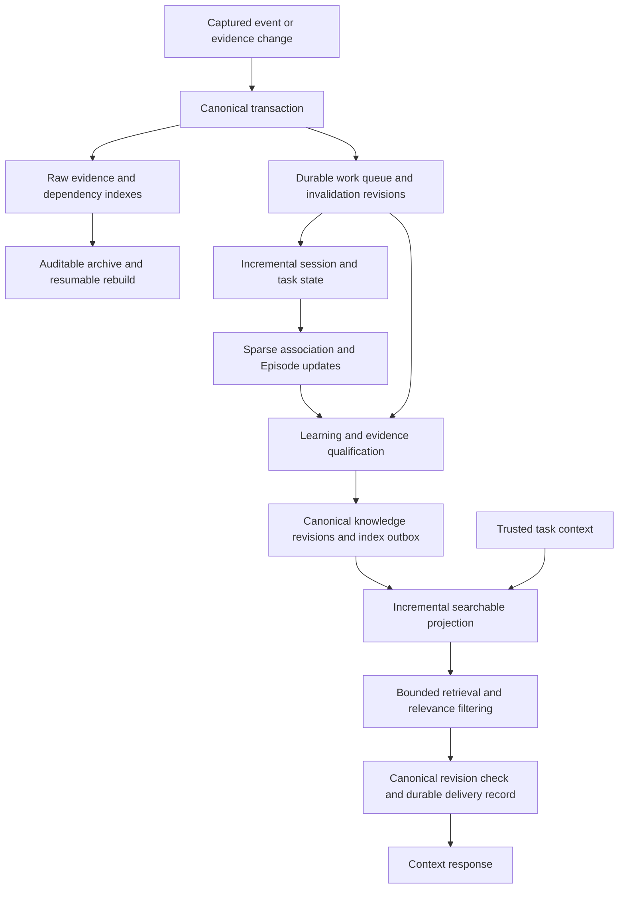

# Scalability review and remediation design

Date: 2026-09-11. Status: first implementation pass in the working tree;
remaining architecture and sustained acceptance are pending. See section 9.
Source review: `798afd7f881f6763d31ef0d035a50f63c185c532`, schema 20. The package
still declares `0.1.0-alpha.0.15`; the published preview and this source revision
have different capability and schema boundaries.

## Decision and scope

ProvenLoop has reproducible paths where accumulated history increases processing
cost, suppresses relevant retrieval, or consumes the context allowance with weak
or duplicate guidance. Treat these findings as blockers to claiming sustained
capacity or expanding the preview on that assumption. Existing preview
observations remain useful, but do not establish a safe maximum collection size.

The scope includes event ingestion, session and Episode construction, evidence
validation, knowledge indexing, retrieval quality, lifecycle management,
concurrency, recovery, and evaluation. A session commonly contains hundreds or
thousands of events in the reported workload. One thousand sessions with one
thousand events each means one million events before counting derived records.
The earlier one-event-per-session probe isolates association cost; it is not a
representative user history.

The proposed operating rule is that ordinary ingestion processes changes and
their dependencies, while retrieval reads a scoped candidate set and current
evidence state. Historical reconstruction runs as resumable maintenance.
SQLite remains the initial storage choice. The measured problems identify work
performed by the application; replacing the database would leave several of
those algorithms unchanged.

Related documents: [architecture](architecture.md), [product validation](product-validation.md),
[agent experience validation](agent-experience-validation.md), and
[implementation blockers](implementation-blockers.md). This document owns the
scale findings, remediation dependencies, and proposed acceptance criteria.

## 1. Evidence and its limits

This section describes the original diagnostic baseline. Section 9 records the
first repairs and their remaining limits. The [evidence manifest](research/scalability-2026-09-11/manifest.json) records
SHA-256 hashes for the retained JSON results. They were copied from isolated
local probes. The original runs used the then-current working tree, including
uncommitted changes, and did not record an immutable source digest. The review
commit above is a code reference, not retroactive version binding for those
timings. Hardware was not recorded. All measurements below are diagnostic,
not production percentiles, release acceptance, or model-quality estimates.

### 1.1 Session growth

Node 22.18.0 on Windows; one prompt per session, one repository, distinct
branches, timestamps one day apart. Each row is the median of three
`WorkEpisodeBuilder.build` calls. Storage reads and projection persistence are
excluded. All sessions remained separate Episodes.

| Sessions | Pair associations | Build median | Process RSS after probes |
|---:|---:|---:|---:|
| 50 | 1,225 | 60.05 ms | 97.26 MiB |
| 100 | 4,950 | 175.33 ms | 104.66 MiB |
| 200 | 19,900 | 618.07 ms | 134.61 MiB |
| 400 | 79,800 | 2,645.63 ms | 256.08 MiB |
| 800 | 319,600 | 16,748.62 ms | 772.12 MiB |

RSS is a process sample, not peak memory or incremental memory per session.
The association count is exactly $S(S-1)/2$. The builder also scans the
association array for each Episode, giving an $O(S^3)$ scan in the case of
separate sessions. These are algorithmic observations, not an extrapolated
runtime forecast for a million-event workload.

### 1.2 Event growth with fixed sessions and knowledge

An in-memory canonical SQLite store contained ten sessions and one knowledge
record. Each session had one prompt followed by small `tool.completed` events.
Public ingestion seeded the fixture outside the timed operations. Three samples
were taken for each operation.

| Total events | Read and parse all supported events | Episode build | Read evidence for one learning-prefixed candidate | Evidence events returned |
|---:|---:|---:|---:|---:|
| 100 | 8.80 ms | 8.72 ms | 2.28 ms | 10 |
| 1,000 | 77.84 ms | 22.97 ms | 8.67 ms | 100 |
| 10,000 | 602.38 ms | 119.82 ms | 80.11 ms | 1,000 |

The candidate referenced one event. Its learning-prefixed ID activates source
session expansion in `knowledgeAdmissionEvidence`. This probe measures that
reader directly; it does not prove the candidate would pass admission or
measure a complete context request. See [event results](research/scalability-2026-09-11/event-results.json).

### 1.3 Knowledge growth

File-backed SQLite; short user-confirmed records with identical search terms.
All but the last-ranked target belonged to another repository. The read worker
was warmed before measurement. Page search medians use five samples; single-row
index medians use three. Each scoped context request is one sample.

| Knowledge records | Search one page | Resubmit one unchanged indexed record | Scoped context result at the default 150 ms budget |
|---:|---:|---:|---|
| 100 | 1.64 ms | 5.50 ms | Target returned |
| 1,000 | 5.46 ms | 20.26 ms | Degraded, no items |
| 5,000 | 28.87 ms | 81.81 ms | Degraded, no items |
| 10,000 | 56.31 ms | 157.13 ms | Degraded, no items |
| 50,000 | 319.79 ms | 956.80 ms | Degraded, no items |

This deliberately unfavorable ranking tests cross-repository interference.
It does not identify 1,000 records as a general capacity ceiling. Search timing
includes the worker's integrity check and cannot isolate FTS ranking cost.
The original single-record script resubmitted identical content. Its old
implementation still rebuilt FTS; after repair, that call can skip the write.
Section 9 includes a separate changed-content measurement. Main database file sizes in [results](research/scalability-2026-09-11/results.json)
exclude WAL and SHM and must not be reported as total storage.

### 1.4 Retrieval and lock counterexamples

The [quality results](research/scalability-2026-09-11/quality-results.json) retain:

- A relevant record returned alone, then disappeared after adding twenty
  higher-ranked records whose exclusions prohibit the requested task.
- Twenty-one identical records with distinct IDs occupied repeated result
  slots; the twenty-first record was never reached in eight requests in one
  session. The first result contained three copies of the same guidance.
- A query, `Run database migration in production.`, returned
  `Run npm test before merging code.` with only the word `Run` in common.

In a separate [lock probe](research/scalability-2026-09-11/lock-results.json), a
connection held `BEGIN IMMEDIATE` on a current-schema database. A direct SQLite
read-only connection could read its schema version, but opening
`CanonicalSqliteStore` with a 25 ms busy timeout failed with
`database is locked`. The measured open took 79.3 ms, including initialization.
This demonstrates an initialization lock dependency, not a complete concurrent
MCP workload.

The earlier review also observed unchanged retrieval after `irrelevant` feedback
and conflicting conventions when a fixture provider omitted a relation and used
different concept keys. Those observations do not have retained executable
counterexamples in this bundle. Their code paths are listed below; dedicated
regressions are required before treating them as reproducible acceptance cases.
They provide no estimate of real model error frequency.

### 1.5 What existing protection establishes

The reviewed source has scope and source-digest checks, evidence admission,
explicit withdrawal and feedback, bounded extraction inputs, incremental
learning work, inferred-candidate expiry, reviewed replacement and renewal,
session suppression, and a limit of three delivered items and 1,200 tokens.
These mechanisms constrain particular failure modes. They do not bound all
historical reads, derived associations, or the fraction of irrelevant content.

The original targeted run passed typecheck and 130 tests in ten files. Its exact
command is retained in `results.json`. Existing scale-related tests cover small
functional boundaries: 300 historical turns for incremental learning, 604
events for long research evidence, and 140 newer lessons for lifecycle lookup.
The FTS multi-record update test uses 30 records; the branch-continuation timing
evaluator uses `emptyKnowledgeBackend`. Neither establishes a growing knowledge
store's latency distribution. [Product validation section 9.8](product-validation.md#98-improvement-as-experience-accumulates)
still proposes the controlled study of improvement over time.

## 2. Failure inventory

P1 means a reproducible correctness or availability problem, or an unbounded
processing path that blocks a sustained-capacity claim. P2 means a required
quality, lifecycle, or operational improvement. Priorities describe this plan;
the original baseline entries are tracked against the changes in section 9.
Source links identify the reviewed implementation,
not proposed APIs.

| ID | Priority | Finding and growth trigger | Evidence and existing mitigation |
|---|---|---|---|
| SC-01 | P1 | Each new capture batch rebuilds Episodes, Branch Context and, when enabled, correction/lifecycle and knowledge projections. Total event count and payload bytes raise the cost of ordinary ingestion. | [run-worker.ts](../packages/cli/src/run-worker.ts), `projectionRequired`; [canonical-store.ts](../packages/storage-sqlite/src/canonical-store.ts), `episodeSourceEnvelopes`. Batch size defaults to 100; this bounds new ingestion, not historical reconstruction. |
| SC-02 | P1 | All session pairs are evaluated and persisted, including rejected pairs. Separate Episodes rescan all pairs. Shared-signal evidence can copy both sessions' full event-ID lists into each association. | [episode-builder.ts](../packages/domain/src/episode-builder.ts), `build`, `episodeFromCluster`, `pairAssociation`; `replaceWorkEpisodeProjection` in canonical store. Internal/empty sessions are excluded, but no history-wide work bound exists. |
| SC-03 | P1 | Evidence admission expands to entire source sessions and reads their context-use history. Long sessions raise foreground parse, validation and memory costs even for few knowledge hits. | Canonical store `knowledgeAdmissionEvidence`; event probe. Full-session context currently protects checks for competing retries, later failures and recalled evidence, so truncation alone is unsafe. |
| SC-04 | P1 | Long projection writes compete with foreground initialization and delivery recording. Context also acquires the same knowledge-projection lease as index writers. | Canonical store `#applyMigrations`, `replaceWorkEpisodeProjection`; [run-mcp-server.ts](../packages/cli/src/run-mcp-server.ts), `#acquireKnowledgeLease`, `#withService`; lock probe. WAL and leases preserve consistency but do not provide independent reader progress. |
| SC-05 | P1 | Search performs `PRAGMA quick_check` on every worker page. Canonical evidence work is synchronous. Timeout rejection alone leaves worker SQL running. | [sqlite-fts-knowledge-backend.ts](../packages/retrieval/src/sqlite-fts-knowledge-backend.ts), `READ_WORKER_SOURCE`, `#runReadWorker`. The search worker limits foreground blocking, but does not itself cancel expired work. The context service skips its separate health call when timed search is available and terms exist; there is still one check per search page. |
| SC-06 | P1 | Updating or removing one knowledge record rebuilds the entire FTS. Ordinary capture also triggers a full knowledge projection. | Backend `index`, `remove`, `#rebuildFts`; single-row index probe. Transactions protect the index while making write cost proportional to its size. |
| SC-07 | P1 | FTS ranks the global collection before canonical scope/state checks; archived, superseded and expired records remain indexed. Rejected hits consume pages and evidence work. | [projection.ts](../packages/retrieval/src/projection.ts), `rebuild`; [retriever.ts](../packages/retrieval/src/retriever.ts), `search`; cross-scope probe. Canonical rechecks prevent many invalid deliveries, but do not bound candidate work or isolate BM25 statistics. |
| SC-08 | P1 | The context service fetches twenty eligible hits before session suppression and task exclusions. It does not refill after these filters. | [context-service.ts](../packages/retrieval/src/context-service.ts), `SEARCH_RESULT_LIMIT`, `#context`; retained quality counterexample. Retriever pagination covers its own filters only. |
| SC-09 | P2 | OR matching and static rank bonuses allow a weak shared word to produce an injected item. There is no calibrated minimum task relevance. | Context service `#search`, `knowledgeRank`, candidate selection; retained `Run` counterexample. Item/token limits cap volume but do not establish precision. |
| SC-10 | P2 | Different IDs or paraphrases can occupy several slots. Relation review depends on bounded comparison input and consistent model output; exact concept-key checks miss differently keyed conflicts. | Context item selection; [learning-coordinator.ts](../packages/host/src/learning-coordinator.ts), proposal identity; canonical store `learningComparisonCandidates`, `commitLearningResult`. Reviewed equivalent/supersedes and same-key conflict stopping already provide partial protection. |
| SC-11 | P2 | `irrelevant` feedback is recorded without changing future contextual ranking. Session-wide ID suppression reads the delivery history and can hide an updated rule, or one lost through host context compaction. | Context service `updatedCandidate`, feedback update predicate, `previouslyReturned`. Wrong/stale/revoke and scope changes provide explicit controls. Updated-rule and host-compaction behavior needs a retained test. |
| SC-12 | P2 | Canonical events and several derived histories have no default automatic retention ceiling. Any knowledge or branch reference can protect a whole session, including references from historical knowledge. Cleanup loads global history and repeats its plan per deletion. | [capture-retention.ts](../packages/host/src/capture-retention.ts), `planCaptureRetention`, `applyCaptureRetention`. Acknowledged queue pruning and suggested 90-day review do not prune canonical history. |
| SC-13 | P2 | Bounded model input and attempt quotas can turn growing work into queue lag or missed evidence; they do not establish sustained throughput. Repeated proposals can consume review and maintenance effort. | Learning coordinator attempt budget and expiry; learning worklist; [worker-circuit-breaker.ts](../packages/host/src/worker-circuit-breaker.ts). Pressure controls exist. Representative arrival-rate, lag, fairness and extraction-quality measurements are missing. |
| SC-14 | P1 | Functional tests and aggregate observation counts cannot establish how quality and cost change with history. A deadline failure or filtered result can look like absent memory. | [branch-continuation-evaluation.ts](../packages/evaluation/src/branch-continuation-evaluation.ts), empty backend; [observation-summary.ts](../packages/cli/src/observation-summary.ts); [CI](../.github/workflows/ci.yml). Current evidence does not include a sustained mixed workload or an independent growing-corpus relevance study. |

These paths interact. Slower reconstruction lengthens writes and index leases.
Foreground requests then lose time before searching. Ineligible historical
hits consume the remaining budget, and the caller sees empty or degraded
context. Duplicate or weak guidance can fill the small output allowance even
when latency is acceptable. A single latency chart would miss these differences.

## 3. Proposed architecture

Keep raw evidence authoritative and projections rebuildable. Introduce
explicit revisions and bounded work at each derived stage. Proposed table and
field names below describe contracts to implement, not existing schema.



### 3.1 Incremental ingestion and projection

Add an independent projection work queue. Reuse the pattern of the existing
learning queue, including generation-based conditional completion, rather than
sharing `learning_event_changes`, whose consumer deletes processed entries.

Each canonical mutation records the affected identity, prior identity when it
changed, a monotonic change sequence, and a generation in the same transaction.
The mutation set includes new events, enrichment, grouping corrections,
feedback, deletion, reset and restore. Event timestamps determine domain order;
they must not serve as the sole ingestion checkpoint because events arrive late.

Workers read bounded pages, coalesce related changes, compute outside the write
transaction, then publish only if the observed generations and dependencies
remain current. Publication and work acknowledgement commit together. A crash
before publication leaves work pending; a crash after publication can safely
replay it. Deletion work must preserve affected scopes even after source rows
are gone; a cascading foreign key must not erase the only pending invalidation.

Persist structured session/task state: ordered task boundaries, repository and
branch identities, current closure, verification references and searchable
features. Normal appends update affected fields. Out-of-order events recompute
the affected task interval and dependent summaries; exceptional whole-session
reconstruction is paged, checkpointed and observable. A first migration may use
dirty-session rebuilding as an intermediate step, but long-session acceptance
requires removing it from the ordinary append path.

Store features separately from their supporting event references. Association
evidence points to actual supporting events. This avoids embedding thousands
of unrelated IDs in every edge. Typed indexes should support session, task,
parent event, operation, verification binding, repository, branch and change
sequence lookups. Validate each hot query plan against its actual predicate.

### 3.2 Session association and Episode updates

Automatic candidate generation first enforces compatible repository identity,
then uses indexed evidence such as explicit continuation, commit ancestry,
issue/PR overlap and selective task features. Explicit user merge/split
corrections retain their existing precedence, including unusual scopes or long
gaps. Unknown repository identity must not merge unrelated work by proximity.

Common branch names, files or error tokens can produce huge posting lists.
Weak candidates based on these features should be computed on demand or handled
by a versioned association policy. Merely indexing all same-branch pairs leaves
quadratic growth. Store accepted relationships and explicit decisions; avoid
persisting an exhaustive set of rejected pairs. On-demand explanations should
identify the policy version and source revisions used.

The current complete-link algorithm can change several Episode memberships when
one edge changes. Recompute the union of affected components from the old and
new association graph, not only the dirty session's current Episode. Maintain
adjacency and session-to-Episode indexes. If a strong-evidence component itself
is large, process it as bounded maintenance and expose the lag; a hard top-K
truncation cannot silently redefine its membership.

Episode IDs depend on membership. Stage new Episode memberships, downstream
source mappings, context-use mappings and branch snapshots under a new
generation in bounded transactions. Readers resolve one published membership
generation. A small final transaction validates source/control revisions and
switches the publication pointer; it must not rewrite all downstream references.
Retain an auditable membership history and garbage-collect old generations after
readers release them. Concurrent changes invalidate or update the staged
generation before publication. Measure this final transaction separately for
large components. Branch Context still belongs to one captured task. Deleting
its current source should select another valid source without importing
unrelated historical constraints.

The current fourteen-day outcome observation window is not an association
expiry. Any time-based restriction on weak association is a product-policy
change requiring labeled continuation tests.

### 3.3 Evidence qualification without full-session scans

Create indexed evidence relationships and a materialized qualification record
for each knowledge revision. It contains the policy version, dependency digest,
reviewed source revisions, applicable evidence ranges, invalidation generation,
expiry and current eligibility. It may authorize search participation; task
scope, tool contract, worktree, head revision and project instructions remain
request-specific checks. Source-backed references and conventions must retain
their existing distinct delivery semantics.

Qualification depends on both present evidence and the absence of conflicting
evidence. Indexing only `sourceEvidenceIds` would miss new competitors. Maintain
subscriptions for operation identity, parent/binding relationships, relevant
task intervals and negative-evidence conditions. A competing retry, later
failure, reversal, recalled-context record, new conflicting receipt or source
enrichment must invalidate the affected qualification. Invalidation is part of
the canonical mutation transaction; requalification can happen afterward.

Pending qualification is ineligible for automatic delivery. If fine-grained
dependency tracking is incomplete during migration, invalidate at a broader
session or task scope. This may temporarily suppress valid knowledge, but
preserves the existing proof rules until a narrower dependency model is tested.
Record this condition separately from a genuine no-match.

Replace whole-session reads with source and ancestor lookups, indexed operation
failure checks, bounded task-range checks for competing retries, and targeted
context-use queries. A dependency set that exceeds the foreground budget goes
to background qualification. Never truncate evidence and interpret the
truncated result as proof that no counterevidence exists.

Cache by knowledge revision, evidence generation, policy version and deletion
epoch. Clock-based expiry remains an immediate read condition. A cache hit
cannot bypass revocation, scope changes, deleted evidence or source-digest
validation. `verifyLearningRecovery` and recalled-evidence regressions define
required behavior; their logic must remain intact through this refactoring.

### 3.4 Query execution, locking and delivery records

Current-schema connections should validate compatibility without obtaining a
migration write lock. Schema changes, rebuilds and restores run behind the
existing maintenance barrier. Reuse bounded reader workers or connections per
MCP process, with invalidation on upgrade, restore and database replacement.
Windows file handles must close before replacing database generations.

Remove per-page integrity checks from search. Run checks at initialization and
scheduled maintenance, record the last result and quarantine a failed index.
SQL errors remain request failures; a cached health result does not make corrupt
data trusted.

Move potentially large synchronous canonical reads and qualification work off
the foreground event loop. Carry one absolute deadline through identity
resolution, lease waits, candidate search, evidence work, result rendering and
delivery recording. Bound worker request queues. On timeout, cancel or
terminate the isolated read operation and recover its worker; a rejected
Promise alone does not stop SQL or prevent a backlog. Bound cleanup latency too.

Removing the migration lock is insufficient: retrieval currently holds the
knowledge-projection lease, and `appendContextUseRecord` still needs a write.
The capture worker updates canonical projections before taking its index lease,
so the existing lease also fails to establish a complete cross-database
snapshot. Replace the long shared lease with a versioned publication protocol
and short canonical transactions. Compute projections outside write
transactions; publish small affected sets.

Before releasing a response, revalidate the selected knowledge and evidence
revisions plus the deletion epoch, and durably record the attempted delivery in
a short canonical transaction. This commit defines the ordering relative to a
concurrent revoke or delete. Requests committed after revocation must exclude
the old revision. Already committed/in-flight delivery cannot be recalled.
Crashes between recording and sending should remain conservatively marked as
possible exposure so the system cannot reuse its own output as independent
evidence. Preserve same-session concurrency control with cross-process durable
identities; do not rely only on an in-memory lock. Maintain an indexed delivery
summary keyed by session, concept, revision and trusted exposure epoch so
suppression does not reload the complete session ledger. Reserve a revision
within that epoch and append its audit record in the final transaction;
concurrent requests must not reserve it twice. An explicit re-delivery request
or trusted host context-reset signal can authorize a new epoch/token while
preserving earlier exposure records. Retain the audit ranges needed for
feedback and learning-contamination checks.

Keep delivery records in canonical storage initially. If short writes still
miss the deadline under measured load, a separate durable delivery journal is
an option, but its visibility to proof checks and its deletion/restore ordering
require a separate protocol. Fire-and-forget observation logging is unsuitable
for records that affect admission.

### 3.5 Search projection and cross-database publication

Add scope, scope ID, source revision, qualification generation, expiry and
delivery eligibility to the search projection. Eligibility includes reviewed
candidate conventions/references that the current product can deliver; simply
filtering to `state = active` would remove valid behavior. Preserve independent
repository, branch, workflow and personal scopes.

Canonical knowledge changes and qualification-only transitions append
idempotent index work in the same transaction as their state update. Give each
knowledge ID a monotonic publication sequence that advances on either change;
bind the sequence to its knowledge revision, qualification generation and
restore epoch. The index worker applies a per-ID upsert or deletion using a
stable row identity, records the complete published version, then acknowledges
the outbox. A crash after index commit but before acknowledgement is safe to
replay. An older outbox entry cannot overwrite a newer version or resurrect a
tombstoned row. Test an unchanged candidate through eligible, pending and
eligible states, including restoration of its search entry. Full FTS
reconstruction becomes maintenance only.

The two SQLite files do not share an atomic commit in this design. The canonical
revision is authoritative. Store a database identity and restore epoch in each
generation so an independently restored or replaced file triggers
reconciliation. A stale indexed hit fails the final canonical check;
a not-yet-indexed new revision can cause temporary under-retrieval, which must
be measured as index lag. Deletion/reset epochs apply to both incremental work
and full rebuild snapshots, including entries whose source rows were removed.

Filter scope and known ineligibility before expensive qualification. Measure
the resulting FTS plan: adding a SQL scope predicate does not by itself prove
that global matching/ranking work or BM25 corpus statistics are isolated. If
unrelated repositories still change cost or ranking materially, partition
search by repository/scope while keeping a bounded connection cache. Merge
personal/workflow results using a calibrated rank fusion method; raw BM25
scores from separate corpora are not directly comparable.

Archive, supersede, revoke and expiry transitions remove records from the
online index. Query-time expiry and canonical checks remain necessary during
index lag. Retention in the evidence store is a separate decision.

### 3.6 Retrieval quality as the corpus grows

Replace the fixed pre-filter set of twenty with one bounded retrieval pipeline.
Apply trusted scope and eligibility, gather candidates, check task exclusions
and previously delivered revisions, then rank and select distinct applicable
items. Refill after rejection while remaining inside explicit candidate, byte
and deadline budgets. Pagination must use a stable snapshot or detect index
revision changes; otherwise concurrent updates can skip or repeat hits.

A bounded candidate set cannot promise the global best result for every broad
query. Record candidate-budget exhaustion separately from no-match. Preserve
already validated results when permitted by the response contract, and expose
that selection was partial. A response-contract change must be versioned; the
current implementation often returns no items on failure.

Introduce a relevance gate before adding scope, freshness, importance or utility
bonuses. Require evidence of the requested task, operation or object rather
than a generic verb alone. Keep bilingual aliases and sparse/short queries in
the evaluation set so stop-word removal or thresholds do not erase useful
recall. Calibrate thresholds on held-out labels; BM25 magnitudes vary with the
collection and cannot serve as an unexplained universal threshold.

At admission, normalized identical content proposes an equivalence check. Merge
only when scope, applicability, exclusions, tool contracts, delivery semantics
and evidence requirements are compatible; identical wording alone is
insufficient. Preserve separate provenance without upgrading its evidence tier.
After eligibility checks, final selection can suppress repeated wording without
merging records or widening scope. Include identical-text tests with different
repositories and exclusions. For paraphrases, use scoped lexical/semantic
candidates followed by explicit relation review;
similarity proposes an equivalence or conflict review, not permission to replace
a rule. Track concept identity separately from the rule text. Query-time checks
should suppress unresolved contradictory guidance and schedule review. Global
semantic contradiction detection remains a quality goal, not a deterministic
guarantee.

Apply `irrelevant` feedback to a scoped task/query feature profile. It should
reduce recurrence in that situation without revoking otherwise valid knowledge.
Support correction and expiry of feedback. Helpful/applied signals cannot
establish independent correctness, and feedback ranking must avoid turning
frequently shown guidance into permanently dominant guidance.

Delivery suppression should track knowledge revision and delivery purpose, not
only ID. A corrected rule may need to be delivered again. Re-delivery after
host context compaction requires a trusted host signal or an explicit request;
elapsed time alone does not prove that context was lost.

### 3.7 Retention, learning throughput and maintenance

Separate the online knowledge index, necessary proof/dependency material, and
historical capture archive. Archive closed work with indexed manifests and
checksums, retaining exact referenced quotations and evidence needed to justify
current knowledge. Summaries aid navigation; they do not replace source proof.
Deletion must propagate to every tier, index, cache and pending rebuild.

Move from whole-session protection to dependency-aware retention. Keep minimal
negative-evidence and invalidation metadata alongside positive sources. If a
dependency has been intentionally deleted, dependent knowledge becomes
unavailable; an orphaned cached qualification cannot keep it alive. Archive
format and retention rules need explicit versioning and user-visible controls.
This plan does not authorize deletion of existing user history.

Plan cleanup through indexed pages, recheck selected dependencies at commit,
and checkpoint progress. Bound maintenance CPU, memory and I/O. Account for
database, WAL, SHM, queue, archives, index copies and temporary rebuild space.
Free-space pressure should produce a visible pause/recovery state. Capture
remains best effort; any lost or omitted range retains gap provenance.

Use a fair durable learning scheduler across repositories and sessions. Coalesce
redundant work, keep exact-source deduplication before model calls, and record
time from evidence arrival to reviewed, usable knowledge. Treat pending work
that expires before processing differently from a reviewed rejected proposal.
Bounded model input needs evidence-selection recall tests; larger history must
not silently displace an early decisive event.

Separate local processing capacity from model-provider quota. If a review needs
$a$ provider attempts and the allowed attempt rate is $q$, its sustained maximum
is at most $q/a$ reviewed proposals per unit time. Arrival above that rate needs
coalescing, an explicit capacity policy or a visible backlog; increasing retry
frequency does not resolve it. Existing daily limits and user opt-outs remain
in force.

## 4. Decisions and tradeoffs

| Decision | Initial choice | Reconsider when |
|---|---|---|
| Storage engine | Keep canonical SQLite and a rebuildable FTS projection; remove global work and long transactions first. | Indexed, bounded paths still fail on the measured workload or multi-writer requirements change. |
| Search partitioning | Add scope/eligibility metadata and verify actual plans; introduce repository partitions if interference remains. | Unrelated corpus growth moves ranking or latency outside the acceptance range. |
| Semantic retrieval | Improve lexical candidate quality and labeling first; evaluate embeddings or a reranker as a separate measured change. | Held-out paraphrase recall remains inadequate within the latency/cost budget. |
| Qualification cache | Cache versioned results with negative-dependency invalidation and final canonical checks. | Invalidation fan-out becomes large; change representation without weakening proof rules. |
| Session work boundary | Use dirty-session updates only as a transition, then task/event reducers. | Long-session appends still parse old bodies or rebuild unchanged evidence. |
| Delivery journal | Retain canonical durable records and shorten competing writes. | Foreground record persistence still misses its measured budget; design an equivalent journal protocol before separation. |
| History policy | Remove ineligible entries from online search and offer audited archive/retention. | Storage exceeds the declared profile; select user-visible retention settings rather than silently deleting proof. |

Larger timeouts, a fixed last-N-events window, a recent-session cutoff, or a
vector database alone do not meet this plan's correctness and cost criteria.
These options can change behavior or capacity, but require their own evidence
and do not replace dependency tracking, incremental writes and relevance tests.

## 5. Work packages and rollout

Each package needs a focused implementation review and retained validation.
The ownership column names code areas, not assigned individuals. No completion
date is inferred from the diagnostic measurements.

| Package | Scope and dependencies | Findings | Exit evidence |
|---|---|---|---|
| WP-0: reproducible baseline | Evaluation/testkit. Preserve these probes; add labeled counterexamples, per-stage metrics and representative fixture generation. Starts first. | SC-01 through SC-14 | Exact source/build/environment manifest; deterministic failures for known counterexamples; isolated test data. |
| WP-1: foreground containment | Storage/retrieval/CLI. Remove redundant initialization locks and per-page checks; bound worker execution/cleanup; refill filtered results and remove identical returned copies. Depends on WP-0. | SC-04, SC-05, SC-08, part of SC-10 | Read-under-write, timeout cleanup, first-twenty exclusion, same-session and duplicate regressions; no weakened admission checks. |
| WP-2: indexed evidence and qualification | Storage/domain. Add relationship indexes, qualification revisions and atomic invalidation for positive and negative dependencies. Depends on WP-0. | SC-03, part of SC-04 | Long-source-session query cost bounded by relevant dependencies; late failure, competing retry, recall, enrichment and delete equivalence tests. |
| WP-3: incremental knowledge publication | Storage/retrieval. Per-ID FTS writes, eligibility/scope projection, outbox and stale-version checks. Depends on qualification contracts in WP-2; independent FTS update work can start earlier. | SC-06, SC-07, part of SC-04 | Crash at each publication boundary; no stale resurrection; bounded single-row writes; cross-repository growth tests. |
| WP-4: incremental history processing | Host/domain/storage. Durable projection work, task/session state, sparse association, component updates, branch and reference remapping. Depends on WP-0 and shared revision contracts. | SC-01, SC-02 | Replay equivalence, explicit continuation preservation, event-count and session-count curves, crash/restart and deletion tests. |
| WP-5: quality and lifecycle | Retrieval/domain/host. Relevance gate, paraphrase/contradiction review, contextual feedback, revised suppression and fair learning scheduling. Depends on WP-0 labels and WP-2/WP-3 revisions. | SC-09, SC-10, SC-11, SC-13 | Frozen growing-corpus precision/recall, duplicate/conflict cases, feedback recurrence and evidence-selection recall. |
| WP-6: archive and sustained acceptance | Storage/operations/evaluation. Dependency-aware retention, resumable rebuild, resource accounting and installed-host soak. Depends on WP-2 through WP-5. | SC-12, SC-13, SC-14 | Archive/restore/delete drills; sustained mixed workload and field comparison; declared supported capacity. |

For new projections, backfill into a separate generation from a recorded
canonical snapshot/change sequence while retaining subsequent outbox entries.
Use a stable key cursor and capture each row's revision. Replay every mutation
after the starting watermark, including deletes and inserts behind that cursor;
revision checks prevent an older backfill row from undoing a newer outbox
update. Do not advance the rebuild consumer's acknowledgement past data it has
not reconciled. Catch up changes, compare outputs, validate indexes, and publish
the generation at a controlled boundary. Do not hold one transaction or a WAL
reader snapshot for the entire history. Use resumable pages and explicit
version checks.

Shadow comparison starts on small histories where the current full rebuild is
affordable. Compare accepted Episode membership, evidence decisions, task
scope, source references and retrieved guidance; a new sparse index will not
contain the old exhaustive rejected-pair list. Any intended association-policy
change gets a version and labeled before/after expectations. Large-history
acceptance must not require running both expensive pipelines on the user's
machine indefinitely.

Roll out with capability controls and per-stage lag visibility. Rollback can
disable a new consumer or select a compatible prior projection only after
applying current deletion/reset epochs. It must not restore revoked evidence
or open a newer schema using an incompatible binary. Preserve maintenance
barriers, durable work and recovery diagnostics across Windows process restarts.

## 6. Acceptance plan

### 6.1 Workload matrix

The following profiles are proposed test inputs, not supported capacities.
Vary dimensions independently before combining them. Fix random seeds and
publish event-type/payload distributions. Use redacted representative sizes,
including larger tool outputs, rather than only the tiny records in these probes.

| Profile | Dimensions and purpose |
|---|---|
| Event growth | Fixed 10 sessions and fixed knowledge; 1,000, 10,000, 100,000 and 1,000,000 events. Measures history scans separately from association count. |
| Long session | One session with 100, 1,000, 10,000 and 100,000 events; append, enrich and insert late events. Measures repeated local reconstruction and proof reads. |
| Session growth | 100, 1,000 and 10,000 sessions, including common branches and distinct repositories; keep total events controlled in the isolated comparison. |
| Knowledge growth | 100, 1,000, 10,000 and 100,000 records; vary active, archived, expired, duplicate, contradictory and unrelated-scope proportions. |
| Primary mixed profile | 1,000 sessions with 1,000 events each and 10,000 knowledge records. Exercise capture, retrieval, feedback, learning and maintenance together. |
| Stress profile | 10,000 sessions with 1,000 events each and 100,000 knowledge records. Discover the capacity limit; passing is required only if this profile is claimed as supported. |
| Concurrent and failure profile | 1, 4 and 8 active sessions; foreground requests during ingestion, expiry, reindex, revoke and delete; worker kills, busy locks, disk pressure and provider unavailability. |

Include sustained low-rate arrivals and bursts. Determine event and proposal
arrival rates from opt-in field measurements, then freeze those rates for the
capacity run. The existing context deadline remains 150 ms; connection
initialization, identity resolution and delivery writes count toward it.

### 6.2 Proposed acceptance criteria

These are recommended starting criteria to freeze before measuring the repair.
Any change to an existing product threshold needs an explicit rationale in the
validation record. Passing tiny fixtures cannot close a mixed-profile item.

| Area | Required result |
|---|---|
| Correctness | Known exclusion, duplicate, stale-scope, competing-retry, late-failure, recalled-evidence and deletion cases all pass. No source or scope check is weakened to meet latency. |
| Foreground latency | On declared Windows hardware, mixed-profile context P95 stays within the existing 150 ms budget. Report P99, maximum completion/cleanup time and timeout rate; a proposed cleanup-overrun ceiling is 50 ms beyond the request deadline. |
| Availability | Proposed normal-load timeout/busy failure rate below 1%, reported across all requests. Count degraded, queued and failed samples; do not compute success-only percentiles. |
| Capture | Preserve the existing proposed added-latency P95 target of 10 ms. Track capture freshness separately, including buffered or omitted events. |
| Local throughput | At the declared sustained event rate, processing completes faster than arrivals and oldest-work age does not trend upward. After a fixed burst, backlog drains within the predeclared recovery budget. |
| Learning freshness | Preserve the proposed 120-second P95 evidence-to-rule target when provider, quota and resources are available. Also report all waiting/paused/expired work and the actual usable-index time. |
| Growth cost | Ordinary append reads no full historical event collection; one knowledge change rewrites only its projection rows. With unrelated history multiplied by ten and relevant work fixed, proposed P95 regression stays within the larger of 20% or 10 ms, as well as the absolute deadline. |
| Retrieval quality | Freeze an independent labeled set. Report Precision@3, Recall@3, wrong-scope/stale/contradictory injection, duplicate slots and correct abstention by query family. Known adversarial cases require zero regressions; proposed overall growth tolerance is at most two percentage points loss in precision or recall, with confidence intervals and enough samples to assess that margin. |
| Persistence | Killing a worker at each transaction/outbox/generation boundary leaves recoverable work, no duplicate effect and no resurrection after delete/reset. Indexed lag may delay new guidance but never authorizes an obsolete revision. |
| Resources | Declare CPU/RSS, storage and maintenance budgets before the run. Record DB/WAL/SHM, queue, archive and temporary space separately. Memory and backlog must settle after load; bounded output alone is insufficient. |
| Sustained operation | Run at least a 24-hour mixed-workload soak after deterministic tests, plus accelerated expiry/renewal/archive cycles. Repeat on supported Node/runtime combinations and the installed Copilot integration before a capacity claim. |

Use paired early/later frozen knowledge collections against the same held-out
tasks. Keep repository start state, model version, native memory, permissions
and instructions comparable. Separate retrieval relevance from actual task
outcomes such as repeated corrections and unnecessary investigation. Model
self-review and an increasing number of stored lessons are not outcome labels.

### 6.3 Required instrumentation

Each request/run should record a versioned, bounded diagnostic entry: corpus
counts by state/scope; index and qualification lag; FTS pages and candidates
examined; rejection counts by reason; evidence rows/bytes read; time in identity,
locks, SQL, validation, rendering and durable recording; output tokens; and
completion status. Distinguish genuine no-match, no applicable item, scope
unknown, pending qualification, index lag, candidate-budget exhaustion, timeout
and busy storage.

Background metrics include events processed, dirty tasks/sessions, association
candidates/edges, projection rows changed, write transaction duration, oldest
pending work, provider attempts and maintenance progress. Retain bounded
histograms or sampled diagnostics so instrumentation does not create another
unbounded history. Avoid storing raw prompts or tool payloads for performance
metrics; approved labeled research fixtures have separate provenance.

## 7. Reproduction and document validation

The diagnostic scripts preserve the earlier fixture logic while writing fresh
outputs beneath `evaluation-output`. They are not CI acceptance tests. Their
full runs can consume substantial CPU, memory and disk; use isolated data and
close other benchmarks when comparing timings. They never target the installed
user data root. Run from the repository root after compiling the current tree:

```powershell
npm run typecheck
$env:PROVENLOOP_SCALE_OUTPUT_DIR = Join-Path (Get-Location) ('evaluation-output/scale-review-' + (Get-Date -Format 'yyyyMMdd-HHmmss'))
node --expose-gc scripts/scale-review/scale-probe.mjs
node scripts/scale-review/scale-probe.mjs quality
node scripts/scale-review/scale-probe.mjs lock
node --expose-gc scripts/scale-review/event-probe.mjs
Remove-Item Env:PROVENLOOP_SCALE_OUTPUT_DIR
```

The scale script runs through 800 one-event sessions and 50,000 knowledge
records. The event script runs through 10,000 events. The proposed million-event
and sustained acceptance profiles are future work. Preserve each new result
with its commit, dirty diff/build digest, runtime, hardware and configuration;
do not overwrite the original retained evidence.

The [document validation record](research/scalability-2026-09-11/document-validation.json)
records typecheck, script lint/syntax checks, local links, evidence hashes and
small diagnostic reproductions. Product tests and larger acceptance runs belong
to the implementation packages. Document validation does not close any SC
finding.

## 8. Remaining decisions before implementation acceptance

- Freeze the supported mixed-load profile and hardware budgets using reported
  session lengths and measured arrival/payload distributions.
- Version the weak-association policy and specify large-component handling
  while preserving explicit continuation and user grouping decisions.
- Define qualification dependencies for every existing proof rule, including
  negative evidence and delivery exposure, before removing whole-session reads.
- Choose physical search partitioning from measured query plans and unrelated
  corpus interference, not from metadata shape alone.
- Freeze relevance labels, feedback scope/retention and statistical tolerances
  before evaluating candidate-generation or model-review changes.
- Specify archive defaults, restore compatibility and deletion propagation
  before moving existing user evidence between storage tiers.

## 9. First implementation pass

Status: local changes and regression validation on 2026-09-11, based on commit
`798afd7`. Canonical schema 21 adds evidence-selection indexes; FTS format 3
adds explicit stable row IDs and retrieval metadata. Existing canonical stores
still require the verified maintenance upgrade path. These changes have not
been published or installed into the user's production profile.

### 9.1 Implemented changes

| Findings | Changes in this pass | Remaining boundary |
|---|---|---|
| SC-01 | The capture worker reads effective source events once and shares them among its four projectors. Enrichment loading is batched instead of issuing metadata/enrichment queries for every event. | The shared input still contains full history. Durable task/event projection work and resumable publication remain unimplemented. |
| SC-02 | Production capture and deletion use a connected association mode. Candidate generation uses repository/features/time indexes and conservative score bounds; only associated edges and explicit merge/split decisions are materialized. Cluster assembly no longer scans all edges for each Episode. Evidence uses actual feature witnesses. Branch Context avoids repeated full-event filtering. | Weak association suggestions are no longer precomputed in production. Explicit all/sparse builder modes remain available. Dense shared-feature postings and genuinely dense accepted relationships can still require quadratic work. |
| SC-03 | Indexed operation, task-range and counterevidence reads replace ordinary full-session evidence materialization. Source ancestors and newly discovered sessions' counterevidence are followed to a fixed point. UTC ranges match the stored ordering column. | Large negative-evidence sets, long ancestor chains and context-use history remain unbounded; versioned qualification materialization is still needed. |
| SC-04 | Opening a current-schema canonical store uses a read transaction, with write locking reserved for actual migration. Existing schema, deletion-key and maintenance validation remain enabled. | Foreground delivery recording, the projection lease and full projection writes still contend. No new cross-database publication protocol is claimed. |
| SC-05 | Search no longer runs a complete integrity check for every page. Pending reads are bounded and a timed-out worker is quarantined until it exits. | Native SQLite work cannot be interrupted immediately by Worker.terminate. Cleanup can exceed the nominal request budget; a hard execution deadline remains open. |
| SC-06 | FTS upsert/remove changes only affected rows, with stable explicit row IDs. Snapshot synchronization skips unchanged projections and removes missing IDs. Capture and automatic-learning publication call synchronization. | Synchronization still reads the complete candidate snapshot and scans index IDs. The durable outbox and bounded snapshot publication are not implemented. Full rebuild remains a costly maintenance operation. |
| SC-07 | Scope, expiry and cheap state eligibility filter before SQL LIMIT. Ineligible records leave FTS but retain inspectable projection bodies. Canonical checks still validate every hit and its metadata. Legacy missing-scope records are excluded without failing the whole projection. | Existing projections without metadata use canonical fallback. Expiry is filtered during queries; expired content may remain in corpus statistics until a state/index update. Global BM25 statistics remain shared. |
| SC-08 | Final exclusions, already-returned IDs, weak-action checks and duplicate selection participate in retrieval acceptance before the candidate quota fills. Rejected hits trigger bounded refill. | Search examines at most 500 candidates by default. Exhaustion with no accepted hits returns a diagnostic; accepted hits survive exhaustion with an explicit partial-results detail. This is not exhaustive global ranking. |
| SC-09, SC-10 | Generic-action-only matches abstain. Identical wording with matching scope, applicability and delivery semantics occupies one result slot. Identifier case and differing exclusions remain distinct. | The relevance rule is a narrow regression fix, not a calibrated semantic classifier. Paraphrases, differently keyed conflicts and repeated equivalent IDs across later calls still need lifecycle work. |
| SC-11 through SC-14 | Added retained post-repair probes and scale regression cases. | Contextual negative feedback, revision/exposure suppression, dependency-aware retention, fair sustained learning scheduling and installed-host capacity acceptance remain open. |

The connected mode preserves Episode grouping under the existing score policy
and explicit corrections. Tests compare it with all-mode grouping, including
all 128 shared-feature combinations, ancestry and threshold boundaries. It
intentionally omits weak candidate suggestions from persisted association
output. Witness changes also change association evidence IDs; deleting the
current witness rebuilds from surviving evidence and blocks replay of deleted
sources.

Narrowed evidence tests include timestamp offsets, differing fractional
precision, competing retries, later failures, cross-session ancestors and
source enrichment. MCP parent traversal now checks scope and chronology before
treating a target reference as a valid causal connection. Raw capture remains
retained; no history is automatically deleted by this pass.

### 9.2 Measured outcomes

Post-repair data are retained in
[repair-pass-1](research/scalability-2026-09-11/repair-pass-1/README.md).
These are local diagnostic samples, with the same limitations as the original
curves. They do not establish production percentiles or the proposed
million-event mixed-load capacity.

| Diagnostic | Original | First repair |
|---|---|---|
| Same 800-session prompt fixture, grouping calculation | 16,748.62 ms median; 319,600 stored associations | Connected mode: 180.08 ms median; 800 Episodes and zero associated edges. This includes stopping weak-suggestion materialization. |
| Read evidence in the 10,000-event fixture | 80.11 ms median; 1,000 returned source-session events | 1.85 ms median; the one referenced event is returned. Negative-evidence fixtures separately verify required additional reads. |
| Scoped context with 50,000 lexical distractors | Degraded, no target | Target returned in a single page; 66.53 ms for the one measured request. |
| Resubmit one unchanged record in a 50,000-record index | 956.80 ms median | 2.85 ms median. This is a no-op resubmission; a separate real content change in 10,000 records measured 4.09 ms. |
| Twenty task-excluded hits ahead of valid guidance | Empty result | Valid guidance returned. |
| One generic shared verb | Unrelated test guidance returned | Empty result. |
| Open current canonical store under another write transaction | Database locked | Open succeeded; 11.61 ms in the one recorded run. |

Some costs remain visible in the measurements. All-mode computation for the
800-session fixture still took 10,172.33 ms, and sparse mode retained its
319,600 weak suggestions. Full rebuilding of the 50,000-record FTS increased
from 1,442.02 ms to 3,241.30 ms in the first rerun, with 2,930.06 ms in a
follow-up after skipping an unnecessary delete for new rows. The shared
per-record helper adds bookkeeping; ordinary synchronization avoids that full
rewrite, but the
maintenance path needs its own bulk implementation before large rebuilds are
claimed efficient. The final 50,000-record follow-up measured a real content
change at 5.69 ms median and one scoped query at 82.98 ms; those are separate
samples, not percentile estimates. The evidence-read improvement also leaves full-history
Episode input reads at 134.23 ms for the small 10,000-event fixture.

### 9.3 Validation and next work

The retained repair validation record identifies the commands, source hashes
and final test counts. Tests cover the repaired behavior, migration, rollback,
source integrity, deletion propagation and real SQLite worker timeout
isolation. Passing those tests does not close the remaining findings above.

The next implementation should add durable task/session projection work with
generation checks, then qualification revisions and an index outbox. Those
changes remove the remaining full-history reads and provide bounded publication
without relying on a global lease. Semantic conflict/feedback and retention
work remain separate packages with their own labeled acceptance criteria.
